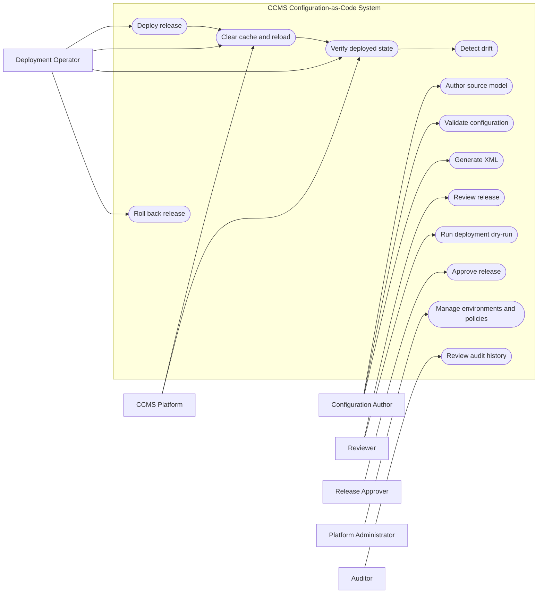
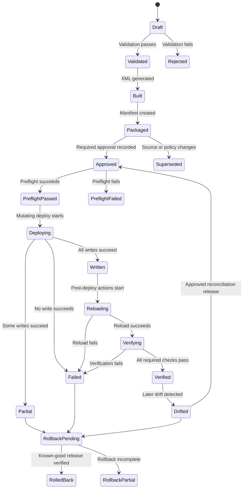
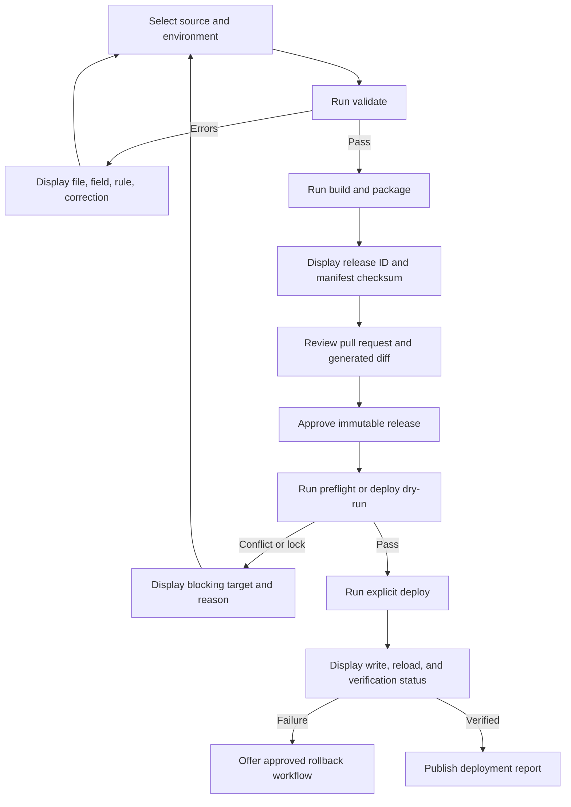
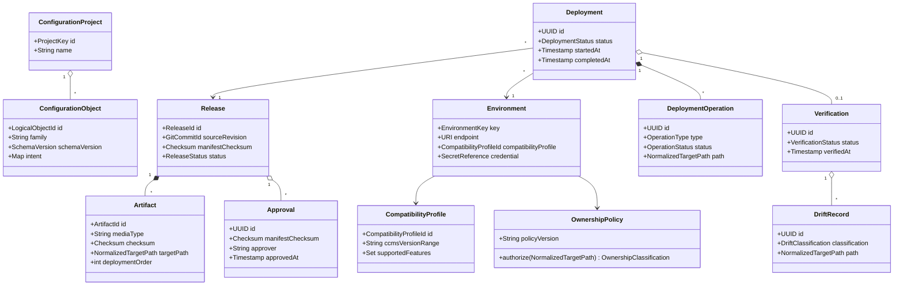
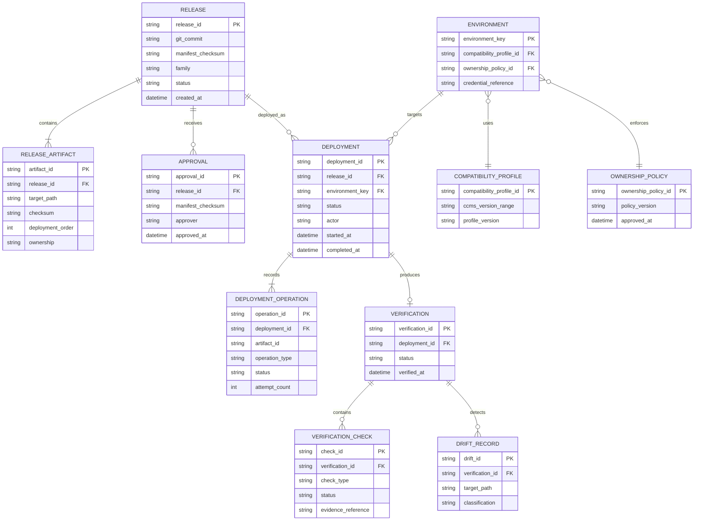
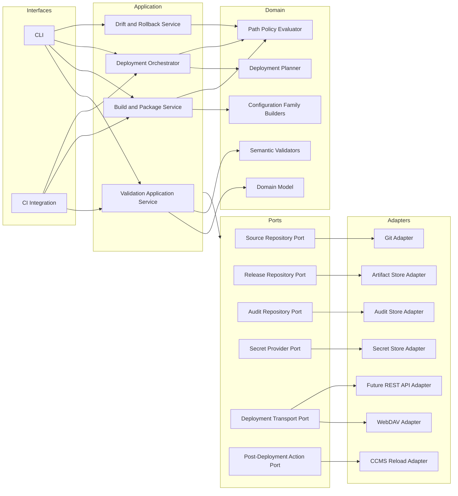
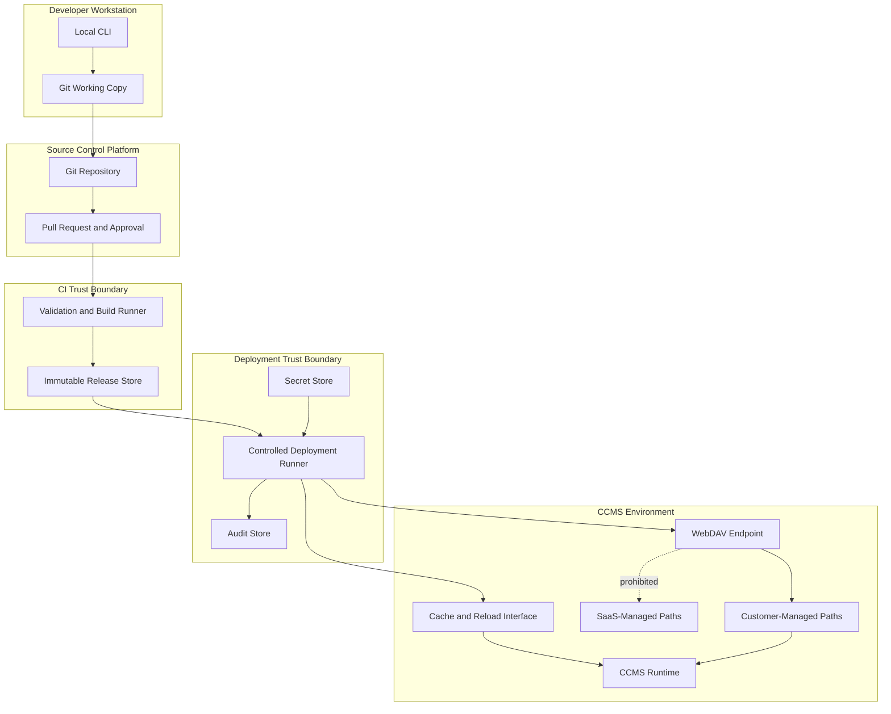
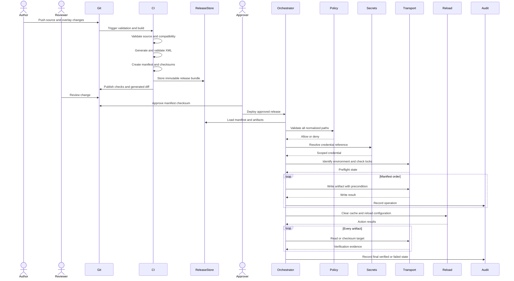
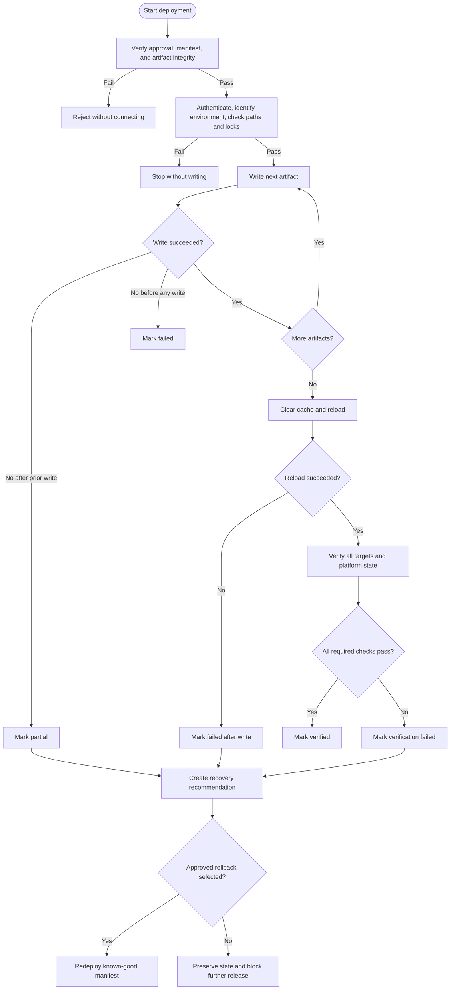

# Software Requirements Specification

## Safe Configuration-as-Code Workflow for CCMS XML

**Document status:** Draft
**Target release:** Pilot
**Primary configuration family:** Workflow configuration
**Architecture style:** Object-oriented modular pipeline with pluggable infrastructure adapters

---

## 1. Introduction

### 1.1 Purpose

This Software Requirements Specification defines a configuration-as-code system for customer-managed CCMS XML configuration.

The system shall enable authorized engineers to:

1. Describe supported CCMS configuration intent in YAML.
2. Validate the source against structural and domain rules.
3. Generate deterministic XML artifacts.
4. package artifacts in a release manifest.
5. Review changes through Git.
6. Deploy approved releases to allowlisted CCMS locations.
7. Reload affected CCMS configuration.
8. Verify the deployed state.
9. Detect configuration drift.
10. Roll back by redeploying a known-good release.

The system addresses recurring problems caused by manual XML editing, ad hoc WebDAV deployment, weak auditability, inconsistent configuration, configuration drift, and fragile rollback. 

### 1.2 Scope

The pilot shall support one narrow, repetitive configuration family, initially workflow configuration.

The system shall manage only content classified as `customer-managed`. It shall treat `saas-managed` content as read-only and outside the automation boundary.

The pilot includes:

* YAML source models.
* Environment overlays.
* JSON Schema validation.
* Semantic validation.
* Deterministic XML generation.
* XML validation.
* Release manifests.
* Git-based approval controls.
* Deployment dry runs.
* WebDAV deployment through a replaceable transport interface.
* WebDAV lock checks.
* Post-deployment cache clearing and configuration reload.
* Deployment verification.
* Audit reports.
* Drift detection.
* Release-based rollback.

The pilot excludes:

* A general-purpose model for every CCMS configuration type.
* Direct deployment from intake forms.
* Automatic recursive deletion.
* Writes to SaaS-managed locations.
* A dedicated graphical administration application.
* Replacement of the CCMS platform or WebDAV protocol.
* Unreviewed production deployment.

### 1.3 Intended Audience

This specification is intended for:

* Implementation engineers.
* Software engineers.
* Reviewers and release approvers.
* Platform administrators.
* Quality engineers.
* Security engineers.
* CCMS configuration owners.
* Operations personnel.

### 1.4 Definitions

| Term                 | Definition                                                                                                                        |
| -------------------- | --------------------------------------------------------------------------------------------------------------------------------- |
| Allowlist            | An approved set of normalized target paths to which the system may write.                                                         |
| Artifact             | A generated XML file or other immutable release output.                                                                           |
| Configuration family | A related group of CCMS configuration objects governed by one source model and generation strategy.                               |
| Customer-managed     | Content owned by the implementing organization and eligible for automated deployment.                                             |
| Deployment adapter   | A replaceable component that transfers artifacts to the CCMS environment.                                                         |
| Drift                | A difference between the expected release state and the content currently deployed.                                               |
| Environment overlay  | Validated environment-specific values merged with a shared source model.                                                          |
| Manifest             | The immutable description of a release, its artifacts, checksums, paths, ordering, and required actions.                          |
| Release              | A versioned, immutable collection of source references, artifacts, and deployment metadata.                                       |
| SaaS-managed         | Content owned or modified by the SaaS platform and excluded from deployment and rollback.                                         |
| Semantic validation  | Validation of references, uniqueness, ownership, compatibility, and other rules not expressible through basic schema constraints. |
| Source model         | The human-authored YAML representation of configuration intent.                                                                   |
| Transport            | The protocol or mechanism used to deploy artifacts, such as WebDAV or a future REST API.                                          |

### 1.5 Source Material

This specification consolidates the proposed configuration lifecycle, safety controls, deployment workflow, technical recommendations, and identified operational gaps from the supplied problem analysis and review documents.   

### 1.6 Requirement Language

The terms **shall**, **should**, and **may** have the following meanings:

* **Shall:** Mandatory for conformance.
* **Should:** Recommended unless a documented exception applies.
* **May:** Optional.

---

## 2. Overall Description

### 2.1 Product Perspective

The system shall sit between human-authored configuration intent and the CCMS deployment endpoint.

Git shall be the authoritative source for:

* Configuration source.
* Environment overlays.
* Schemas.
* Generation templates or builders.
* Ownership policies.
* Release definitions.
* Approval history.

The deployed CCMS environment shall remain the operational runtime state. The system shall compare this state with the expected Git release state instead of assuming that deployment guarantees consistency.

### 2.2 Product Goals

| ID       | Goal                                                                         |
| -------- | ---------------------------------------------------------------------------- |
| GOAL-001 | Reduce repetitive manual XML authoring.                                      |
| GOAL-002 | Prevent writes outside customer-managed paths.                               |
| GOAL-003 | Produce reproducible configuration artifacts.                                |
| GOAL-004 | detect invalid references and dependencies before deployment.                |
| GOAL-005 | Make every deployment reviewable and auditable.                              |
| GOAL-006 | Detect partial deployments and post-deployment drift.                        |
| GOAL-007 | Support controlled recovery to a known-good release.                         |
| GOAL-008 | Isolate the deployment protocol behind a replaceable interface.              |
| GOAL-009 | Support multiple CCMS versions without silently generating incompatible XML. |
| GOAL-010 | Provide a stable future boundary for form-based configuration intake.        |

### 2.3 User Classes

| User class             | Responsibilities                                                                       |
| ---------------------- | -------------------------------------------------------------------------------------- |
| Configuration author   | Creates or updates YAML source and environment overlays.                               |
| Reviewer               | Reviews source changes, generated artifacts, validation results, and release impact.   |
| Release approver       | Authorizes deployment to a controlled environment.                                     |
| Deployment operator    | Executes or monitors an approved deployment.                                           |
| Platform administrator | Defines target environments, credentials, ownership boundaries, and reload procedures. |
| Quality engineer       | Maintains automated tests and confirms acceptance criteria.                            |
| Security administrator | Controls secrets, permissions, and audit access.                                       |
| Auditor                | Reviews release, approval, deployment, and verification history.                       |
| SaaS platform          | Loads deployed configuration and modifies platform-owned content.                      |

### 2.4 Operating Environment

The system shall support execution in:

* A developer workstation for local validation and build.
* A CI environment for authoritative validation and release creation.
* A controlled deployment runner with access to target environments.
* Non-production and production CCMS environments.

The reference implementation may use Python, JSON Schema or typed models, and an XML library such as `lxml`. These technologies are implementation recommendations rather than externally visible contracts.

### 2.5 Assumptions

| ID      | Assumption                                                                                       |
| ------- | ------------------------------------------------------------------------------------------------ |
| ASM-001 | Customer-managed and SaaS-managed content can be distinguished through approved ownership rules. |
| ASM-002 | The deployment runner can access customer-managed target paths.                                  |
| ASM-003 | Credentials can be restricted to the minimum required scope.                                     |
| ASM-004 | Representative known-good XML files are available for pilot comparison.                          |
| ASM-005 | Each target environment has an identifiable CCMS version or compatibility profile.               |
| ASM-006 | The CCMS provides a defined cache-clear and configuration-reload procedure.                      |
| ASM-007 | A failed or partial deployment can be repaired by redeploying a complete known-good manifest.    |
| ASM-008 | Direct edits can be prohibited, discouraged, or detected within customer-managed scope.          |

### 2.6 Dependencies

The pilot depends on:

* An approved inventory of customer-managed paths.
* A source-control repository.
* A CI system.
* A secret-management mechanism.
* Access to at least one non-production CCMS environment.
* A supported deployment transport.
* Documented CCMS reload behavior.
* Version-specific XML rules or known-good fixtures.
* Operational approval for the rollback procedure.

### 2.7 Constraints

1. The system shall not assume that a multi-file WebDAV operation is atomic.
2. The system shall not treat possession of WebDAV access as authorization to modify every visible file.
3. The system shall not store secrets in YAML, generated XML, manifests, logs, or Git.
4. The pilot shall not perform unscoped deletion.
5. Generated XML shall not be manually edited.
6. Production deployment shall require an approved immutable release.
7. The deployment architecture shall remain transport-independent because WebDAV may later be replaced by another supported interface. 
8. The system shall account for CCMS version differences.
9. The system shall fail safely when it cannot establish target ownership, compatibility, or deployment state.

### 2.8 Use Case Model

The diagram shows the primary actors and the system capabilities they use.



---

## 3. System Features

### 3.1 Source Model Management

#### Description

Authors shall express supported configuration intent in YAML. The model shall describe domain concepts rather than reproduce arbitrary XML element structure.

#### Requirements

| ID      | Requirement                                                                                                                                                          |
| ------- | -------------------------------------------------------------------------------------------------------------------------------------------------------------------- |
| REQ-001 | The system shall accept UTF-8 YAML source files for supported configuration families.                                                                                |
| REQ-002 | Each source file shall declare a schema version.                                                                                                                     |
| REQ-003 | Each source file shall declare a configuration family.                                                                                                               |
| REQ-004 | Each configuration object shall have a stable logical identifier.                                                                                                    |
| REQ-005 | The source model shall separate shared values from environment-specific values.                                                                                      |
| REQ-006 | The system shall reject unknown fields unless the active schema explicitly permits them.                                                                             |
| REQ-007 | The system shall support comments in human-authored YAML without including those comments in generated artifacts.                                                    |
| REQ-008 | The system shall prohibit secret values in source fields classified as non-secret references.                                                                        |
| REQ-009 | The system shall support explicit references to externally managed secrets by identifier.                                                                            |
| REQ-010 | The pilot source model shall support workflow configuration.                                                                                                         |
| REQ-011 | The workflow model shall support workflow steps, transitions, role references, and required identifiers needed by the target XML format.                             |
| REQ-012 | The source model shall include an explicit organization identifier or organization-identifier mapping when required by the target configuration.                     |
| REQ-013 | The system shall preserve stable logical identifiers across environments unless an approved mapping overrides them.                                                  |
| REQ-014 | The system shall reject source models that attempt to declare target paths directly unless the active configuration-family policy allows controlled path parameters. |

### 3.2 Environment Overlay Resolution

| ID      | Requirement                                                                                                                                                    |
| ------- | -------------------------------------------------------------------------------------------------------------------------------------------------------------- |
| REQ-015 | The system shall merge a base configuration with at most one selected environment overlay during a build.                                                      |
| REQ-016 | The system shall validate the base configuration before applying an overlay.                                                                                   |
| REQ-017 | The system shall validate the resolved configuration after applying an overlay.                                                                                |
| REQ-018 | The system shall record all applied source and overlay files in the release manifest.                                                                          |
| REQ-019 | The system shall reject overlays that modify fields classified as immutable.                                                                                   |
| REQ-020 | The system shall reject overlays that introduce undeclared fields.                                                                                             |
| REQ-021 | The system shall support environment mappings for organization identifiers, approved paths, endpoint identifiers, and other declared environment-bound values. |
| REQ-022 | The system shall not permit ad hoc modification of generated files to represent environment differences.                                                       |

### 3.3 Structural Validation

| ID      | Requirement                                                                                                                                |
| ------- | ------------------------------------------------------------------------------------------------------------------------------------------ |
| REQ-023 | The system shall validate each YAML source against the schema version declared by that source.                                             |
| REQ-024 | Structural validation shall check required fields, data types, enumerations, collection bounds, string patterns, and nested object shapes. |
| REQ-025 | A structural validation failure shall identify the source file, logical path, violated rule, and human-readable corrective guidance.       |
| REQ-026 | The system shall stop the build when structural validation fails.                                                                          |
| REQ-027 | The system shall produce a machine-readable validation report.                                                                             |
| REQ-028 | The system shall produce a human-readable validation summary.                                                                              |

### 3.4 Semantic and Dependency Validation

| ID      | Requirement                                                                                                                                |
| ------- | ------------------------------------------------------------------------------------------------------------------------------------------ |
| REQ-029 | The system shall verify uniqueness for every identifier whose schema scope requires uniqueness.                                            |
| REQ-030 | The system shall verify that all internal references resolve to compatible objects.                                                        |
| REQ-031 | The system shall detect circular dependencies where the configuration family prohibits them.                                               |
| REQ-032 | The system shall validate naming conventions.                                                                                              |
| REQ-033 | The system shall validate environment-specific restrictions.                                                                               |
| REQ-034 | The system shall validate organization identifiers against the selected environment mapping.                                               |
| REQ-035 | The system shall validate the configuration against the selected CCMS compatibility profile.                                               |
| REQ-036 | The system shall reject a build when the selected CCMS version has no supported compatibility profile.                                     |
| REQ-037 | The system shall compare pilot output with versioned known-good fixtures or equivalent conformance tests.                                  |
| REQ-038 | The system shall report all independent semantic errors discovered in a validation run rather than stop after the first independent error. |
| REQ-039 | The system shall prevent deployment when any semantic validation error remains unresolved.                                                 |

### 3.5 Deterministic XML Generation

| ID      | Requirement                                                                                                                       |
| ------- | --------------------------------------------------------------------------------------------------------------------------------- |
| REQ-040 | The system shall generate XML only from a fully validated resolved source model.                                                  |
| REQ-041 | The same source revision, overlay, schema set, compatibility profile, and builder version shall produce byte-identical artifacts. |
| REQ-042 | The generator shall use stable ordering for collections.                                                                          |
| REQ-043 | The generator shall normalize encoding, indentation, line endings, and namespace declarations.                                    |
| REQ-044 | The generator shall escape XML text and attribute values correctly.                                                               |
| REQ-045 | The generator shall assign artifact filenames through a configuration-family path policy.                                         |
| REQ-046 | The generator shall not derive an unrestricted target path from user-controlled text.                                             |
| REQ-047 | The system shall validate generated XML for well-formedness.                                                                      |
| REQ-048 | The system shall validate generated XML against an applicable XML Schema or versioned equivalent when one is available.           |
| REQ-049 | The build shall fail if any artifact cannot be generated or validated.                                                            |
| REQ-050 | The system shall identify every generated artifact by a SHA-256 checksum.                                                         |
| REQ-051 | The system shall treat generated artifacts as immutable after release creation.                                                   |
| REQ-052 | The system shall detect and reject manual modification of generated artifacts before deployment.                                  |

### 3.6 Release Manifest Creation

| ID      | Requirement                                                                                                                                                                                 |
| ------- | ------------------------------------------------------------------------------------------------------------------------------------------------------------------------------------------- |
| REQ-053 | The system shall create one immutable manifest for each release candidate.                                                                                                                  |
| REQ-054 | Each manifest shall contain a globally unique release identifier.                                                                                                                           |
| REQ-055 | Each manifest shall identify the Git commit from which it was produced.                                                                                                                     |
| REQ-056 | Each manifest shall identify the environment, configuration family, schema versions, builder version, compatibility profile, and creation time.                                             |
| REQ-057 | Each manifest artifact entry shall include its logical identifier, source reference, local artifact path, normalized target path, checksum, deployment order, and ownership classification. |
| REQ-058 | The manifest shall declare all required post-deployment actions.                                                                                                                            |
| REQ-059 | The manifest shall declare the verification method for each artifact.                                                                                                                       |
| REQ-060 | The manifest shall declare whether an artifact is created, replaced, or left unchanged.                                                                                                     |
| REQ-061 | The pilot shall reject delete operations.                                                                                                                                                   |
| REQ-062 | The system shall digitally sign the manifest or protect it through an equivalent CI-controlled integrity mechanism.                                                                         |
| REQ-063 | The system shall reject deployment when the manifest or any referenced artifact has changed after approval.                                                                                 |
| REQ-064 | The system shall support export of an exact release bundle containing the manifest and all referenced artifacts.                                                                            |

### 3.7 Git Review and Approval

| ID      | Requirement                                                                                                                                                          |
| ------- | -------------------------------------------------------------------------------------------------------------------------------------------------------------------- |
| REQ-065 | Every production release shall originate from a reviewed Git commit.                                                                                                 |
| REQ-066 | CI shall run structural validation, semantic validation, generation, XML validation, path-policy validation, and automated tests before marking a change releasable. |
| REQ-067 | Reviewers shall be able to inspect source diffs, resolved model summaries, generated XML diffs, target-path changes, and validation results.                         |
| REQ-068 | The system shall distinguish the author, reviewer, approver, and deployment identity in the audit record.                                                            |
| REQ-069 | A production release shall require approval from an authorized release approver.                                                                                     |
| REQ-070 | Approval shall apply to one immutable manifest checksum.                                                                                                             |
| REQ-071 | Any source, artifact, manifest, policy, schema, or builder change after approval shall invalidate that approval.                                                     |
| REQ-072 | The system shall prevent self-approval where organizational policy requires separation of duties.                                                                    |

### 3.8 Deployment Preflight and Dry Run

| ID      | Requirement                                                                                                                                           |
| ------- | ----------------------------------------------------------------------------------------------------------------------------------------------------- |
| REQ-073 | The deployment command shall default to dry-run mode.                                                                                                 |
| REQ-074 | A mutating deployment shall require an explicit deployment option and an approved release.                                                            |
| REQ-075 | Preflight shall authenticate without writing content.                                                                                                 |
| REQ-076 | Preflight shall confirm the target environment identity.                                                                                              |
| REQ-077 | Preflight shall confirm the target CCMS compatibility profile.                                                                                        |
| REQ-078 | Preflight shall normalize every target path before policy evaluation.                                                                                 |
| REQ-079 | Preflight shall reject path traversal, ambiguous encoding, duplicate separators, unsupported URI forms, and symbolic path aliases that bypass policy. |
| REQ-080 | Preflight shall confirm that every target path is inside an approved customer-managed directory.                                                      |
| REQ-081 | Preflight shall reject every artifact classified as `saas-managed` or `unknown`.                                                                      |
| REQ-082 | Preflight shall verify that no undeclared artifact will be written.                                                                                   |
| REQ-083 | Preflight shall check for active WebDAV locks or equivalent transport-level write locks on every target.                                              |
| REQ-084 | Preflight shall fail when any target is locked unless a documented policy explicitly permits deployment.                                              |
| REQ-085 | Preflight shall read the current target state when permissions and transport capabilities permit.                                                     |
| REQ-086 | Preflight shall identify creates, replacements, unchanged files, detected drift, and conflicts.                                                       |
| REQ-087 | Dry-run output shall list the ordered operations, target paths, checksums, post-deployment actions, and expected verification steps.                  |
| REQ-088 | Dry-run shall not mutate the target environment.                                                                                                      |
| REQ-089 | The system shall not clear caches or reload configuration during dry-run.                                                                             |
| REQ-090 | The system shall require an explicit conflict policy when deployed content differs from both the release artifact and the recorded prior release.     |
| REQ-091 | The default conflict policy shall be to stop without writing.                                                                                         |

### 3.9 Deployment Execution

| ID      | Requirement                                                                                                                                                     |
| ------- | --------------------------------------------------------------------------------------------------------------------------------------------------------------- |
| REQ-092 | The deployment service shall process artifacts in manifest order.                                                                                               |
| REQ-093 | The deployment service shall deploy only artifacts declared in the approved manifest.                                                                           |
| REQ-094 | The deployment service shall verify each artifact checksum immediately before transfer.                                                                         |
| REQ-095 | The deployment service shall enforce the path allowlist immediately before each write.                                                                          |
| REQ-096 | The deployment service shall use configurable connection, read, and write timeouts.                                                                             |
| REQ-097 | The deployment service shall use bounded retries only for operations classified as transient and safe to retry.                                                 |
| REQ-098 | The deployment service shall not retry an operation when the outcome is ambiguous unless it can first determine the target state.                               |
| REQ-099 | The deployment service shall record the start and outcome of every attempted operation.                                                                         |
| REQ-100 | A write failure shall stop later write operations unless the manifest declares a tested recovery-safe continuation rule.                                        |
| REQ-101 | The deployment service shall classify a stopped multi-file deployment as `PARTIAL` when at least one write succeeded and the complete release was not verified. |
| REQ-102 | The deployment service shall not report a release as successful until all required post-deployment actions and verification checks pass.                        |
| REQ-103 | The WebDAV deployment adapter shall implement the common deployment transport interface.                                                                        |
| REQ-104 | A future deployment adapter shall be replaceable without changing source, validation, generation, or manifest contracts.                                        |

### 3.10 Cache Clear and Configuration Reload

The CCMS deployment process requires post-deployment cache and reload operations. These actions shall be part of the controlled deployment rather than an undocumented manual step. 

| ID      | Requirement                                                                                                                                                       |
| ------- | ----------------------------------------------------------------------------------------------------------------------------------------------------------------- |
| REQ-105 | Each environment profile shall define the required post-deployment action sequence.                                                                               |
| REQ-106 | The manifest shall include the applicable post-deployment action identifiers.                                                                                     |
| REQ-107 | The deployment workflow shall perform cache clearing and configuration reload only after all artifact writes succeed.                                             |
| REQ-108 | The system shall authenticate post-deployment actions through environment-specific credentials or delegated service identities.                                   |
| REQ-109 | The system shall record the request, result, duration, and response classification for each post-deployment action.                                               |
| REQ-110 | The system shall treat a required cache-clear or configuration-reload failure as a deployment failure.                                                            |
| REQ-111 | The system shall not mark a release `VERIFIED` until the reload has completed successfully.                                                                       |
| REQ-112 | The environment profile shall support a manual post-deployment action only when automation is unavailable and an authorized operator records completion evidence. |
| REQ-113 | The system shall warn when a manual post-deployment action weakens end-to-end verification.                                                                       |

### 3.11 Deployment Verification

| ID      | Requirement                                                                                                                |
| ------- | -------------------------------------------------------------------------------------------------------------------------- |
| REQ-114 | The system shall verify that every expected target exists after deployment.                                                |
| REQ-115 | The system shall verify the path of every deployed artifact.                                                               |
| REQ-116 | The system shall compare deployed content with the manifest checksum where exact read-back is supported.                   |
| REQ-117 | When exact read-back is unavailable, the system shall use a documented alternative verification method.                    |
| REQ-118 | The system shall verify that the CCMS accepted or loaded the configuration when the platform exposes an observable status. |
| REQ-119 | The system shall verify that no manifest-external target was intentionally written by the deployment process.              |
| REQ-120 | The verification report shall identify successful, failed, skipped, and unavailable checks.                                |
| REQ-121 | Any failed required check shall prevent the release from reaching `VERIFIED`.                                              |
| REQ-122 | The system shall preserve verification evidence with the release audit record.                                             |

### 3.12 Drift Detection

| ID      | Requirement                                                                                                   |
| ------- | ------------------------------------------------------------------------------------------------------------- |
| REQ-123 | The system shall support on-demand comparison of a target environment with a selected release manifest.       |
| REQ-124 | The system should support scheduled drift detection.                                                          |
| REQ-125 | Drift detection shall examine only paths declared in the selected release or approved managed-path inventory. |
| REQ-126 | Drift detection shall classify a target as `MATCH`, `MISSING`, `MODIFIED`, `UNEXPECTED`, or `UNVERIFIABLE`.   |
| REQ-127 | Drift detection shall not modify the target environment.                                                      |
| REQ-128 | The system shall record the time, environment, expected release, and comparison result.                       |
| REQ-129 | The system shall require review before reconciling drift.                                                     |
| REQ-130 | The system shall not automatically import deployed XML as authoritative source.                               |

### 3.13 Rollback

| ID      | Requirement                                                                                                                                        |
| ------- | -------------------------------------------------------------------------------------------------------------------------------------------------- |
| REQ-131 | Rollback shall use a previously created immutable release manifest.                                                                                |
| REQ-132 | Rollback shall use the same validation, path-policy, preflight, lock-check, deployment, reload, and verification controls as a forward deployment. |
| REQ-133 | Rollback shall write only artifacts declared in the selected historical manifest.                                                                  |
| REQ-134 | Rollback shall not restore or modify SaaS-managed content.                                                                                         |
| REQ-135 | Rollback shall require approval appropriate to the target environment.                                                                             |
| REQ-136 | The rollback dry-run shall identify every target whose current content would be replaced.                                                          |
| REQ-137 | The system shall classify an incomplete rollback as `ROLLBACK_PARTIAL`.                                                                            |
| REQ-138 | The system shall preserve the failed release, rollback release, reason, operator, and results in the audit record.                                 |
| REQ-139 | The pilot shall demonstrate rollback in a non-production environment before production deployment is enabled.                                      |

### 3.14 Audit and Reporting

| ID      | Requirement                                                                                                                                                                          |
| ------- | ------------------------------------------------------------------------------------------------------------------------------------------------------------------------------------ |
| REQ-140 | The system shall create a deployment report for every dry-run and mutating deployment.                                                                                               |
| REQ-141 | The report shall include the release identifier, manifest checksum, source revision, environment, actor, timestamps, operation outcomes, reload outcomes, and verification outcomes. |
| REQ-142 | The report shall omit secret values and sensitive credential material.                                                                                                               |
| REQ-143 | Audit events shall be append-only for ordinary users.                                                                                                                                |
| REQ-144 | Authorized users shall be able to retrieve audit records by release, environment, date, actor, and outcome.                                                                          |
| REQ-145 | The system shall record policy rejections, validation failures, lock conflicts, and authentication failures.                                                                         |
| REQ-146 | The system shall use machine-readable status and error codes.                                                                                                                        |
| REQ-147 | The system shall produce a concise human-readable summary suitable for CI and pull-request review.                                                                                   |

### 3.15 Administrative Policy Management

| ID      | Requirement                                                                                                                                                                 |
| ------- | --------------------------------------------------------------------------------------------------------------------------------------------------------------------------- |
| REQ-148 | An environment profile shall identify its environment key, endpoint, ownership policy, compatibility profile, credential reference, reload policy, and verification policy. |
| REQ-149 | Ownership policies shall classify approved path prefixes as `customer-managed`.                                                                                             |
| REQ-150 | Any path not matched by an active approved ownership rule shall be classified as `unknown`.                                                                                 |
| REQ-151 | The deployment service shall treat `unknown` ownership as non-writable.                                                                                                     |
| REQ-152 | Changes to ownership policies shall require code review and automated negative tests.                                                                                       |
| REQ-153 | The system shall validate that allowlisted paths do not overlap prohibited paths.                                                                                           |
| REQ-154 | The system shall support separate policies for development, test, staging, and production.                                                                                  |
| REQ-155 | Environment definitions shall reference secrets by identifier rather than contain secret values.                                                                            |
| REQ-156 | The system shall provide a policy-check command that validates manifests without connecting to a target environment.                                                        |

### 3.16 Command Model

The reference command interface shall expose the following commands or equivalent API operations.

| Command     | Purpose                                                   |
| ----------- | --------------------------------------------------------- |
| `validate`  | Validate source, overlays, references, and compatibility. |
| `build`     | Generate deterministic artifacts.                         |
| `package`   | Create and protect a release manifest and bundle.         |
| `diff`      | Compare a release with another release or target state.   |
| `preflight` | Run non-mutating environment checks.                      |
| `deploy`    | Deploy an approved release.                               |
| `verify`    | Verify target state against a release.                    |
| `drift`     | Detect changes from an expected release.                  |
| `rollback`  | Redeploy a historical known-good release.                 |

| ID      | Requirement                                                                          |
| ------- | ------------------------------------------------------------------------------------ |
| REQ-157 | Every command shall return a nonzero process status when a required operation fails. |
| REQ-158 | Every command shall support machine-readable output.                                 |
| REQ-159 | Mutating commands shall require explicit environment and release identifiers.        |
| REQ-160 | Mutating commands shall display or log the immutable manifest checksum used.         |
| REQ-161 | The command interface shall not accept raw credentials as command-line arguments.    |

### 3.17 Release State Model

The diagram defines valid release states and prevents a partial deployment from being represented as successful.



---

## 4. External Interface Requirements

### 4.1 User Interface

The pilot shall use command-line and CI interfaces. It shall not require a dedicated GUI.

The CI interface should present:

* Validation status.
* Source and generated-artifact changes.
* Target-path changes.
* Compatibility status.
* Dry-run summary.
* Approval state.
* Deployment and verification status.

#### CLI Interaction Sketch

The diagram illustrates the expected operator flow.



### 4.2 Git Interface

| ID     | Requirement                                                                                                |
| ------ | ---------------------------------------------------------------------------------------------------------- |
| IF-001 | The system shall read source, schema, policy, and builder content from a specific Git revision.            |
| IF-002 | CI status shall be associated with the reviewed commit.                                                    |
| IF-003 | Release metadata shall include the full commit identifier.                                                 |
| IF-004 | A Git tag may identify a verified release, but the manifest release identifier shall remain authoritative. |
| IF-005 | The system shall not deploy uncommitted local changes to production.                                       |

### 4.3 Deployment Transport Interface

The deployment layer shall expose a protocol-neutral interface.

```text
interface DeploymentTransport:
    identify_environment() -> EnvironmentIdentity
    authenticate(credential_ref) -> AuthContext
    stat(path) -> RemoteObjectState
    list_locks(paths) -> LockState[]
    read(path) -> bytes
    write(path, content, precondition) -> WriteResult
    checksum(path) -> ChecksumResult
    invoke_action(action) -> ActionResult
```

| ID     | Requirement                                                                                         |
| ------ | --------------------------------------------------------------------------------------------------- |
| IF-006 | The WebDAV adapter shall implement `DeploymentTransport`.                                           |
| IF-007 | Transport responses shall be mapped to common domain result and error types.                        |
| IF-008 | Transport-specific status codes shall be retained as diagnostic metadata.                           |
| IF-009 | The domain layer shall not depend on WebDAV-specific classes.                                       |
| IF-010 | Transport adapters shall support request correlation identifiers.                                   |
| IF-011 | Transport adapters shall expose whether exact read-back and remote checksums are supported.         |
| IF-012 | Write operations shall support a precondition when the transport can prevent unintended overwrites. |

### 4.4 CCMS Reload Interface

```text
interface PostDeploymentActionExecutor:
    execute(
        environment: EnvironmentProfile,
        action: PostDeploymentAction,
        release: ReleaseId
    ) -> ActionResult
```

| ID     | Requirement                                                                                                                           |
| ------ | ------------------------------------------------------------------------------------------------------------------------------------- |
| IF-013 | Reload actions shall be defined by environment profile rather than hardcoded in the deployment workflow.                              |
| IF-014 | The interface shall support ordered actions such as cache clear followed by configuration reload.                                     |
| IF-015 | Each action shall define success, retry, timeout, and failure classification rules.                                                   |
| IF-016 | The system shall reject an environment profile whose mandatory reload actions have no executable or documented manual implementation. |

### 4.5 Secret Management Interface

| ID     | Requirement                                                                  |
| ------ | ---------------------------------------------------------------------------- |
| IF-017 | The system shall retrieve credentials through a secret reference.            |
| IF-018 | Secret values shall exist in memory only for the minimum execution duration. |
| IF-019 | Logs and reports shall redact recognized secret values.                      |
| IF-020 | Missing or inaccessible secret references shall fail before any write.       |

### 4.6 File Interfaces

| File type               | Format                                    | Direction |
| ----------------------- | ----------------------------------------- | --------- |
| Source model            | YAML                                      | Input     |
| Environment overlay     | YAML                                      | Input     |
| Structural schema       | JSON Schema                               | Input     |
| Compatibility profile   | YAML or JSON                              | Input     |
| Ownership policy        | YAML or JSON                              | Input     |
| Generated configuration | XML                                       | Output    |
| Release manifest        | JSON or YAML with canonical serialization | Output    |
| Validation report       | JSON and text                             | Output    |
| Deployment report       | JSON and text                             | Output    |
| Verification report     | JSON and text                             | Output    |

### 4.7 API Error Contract

All machine-readable operations shall return an error object equivalent to:

```yaml
error:
  code: PATH_OUTSIDE_ALLOWLIST
  category: POLICY
  message: Target path is outside customer-managed scope.
  retryable: false
  release_id: rel-2026-0042
  environment: test
  artifact_id: workflow.customer-review
  source:
    file: config/workflows/customer-review.yaml
    path: $.workflows[0]
  target_path: /config/saas/internal.xml
  details: {}
  correlation_id: 9cf30f64-48ad-4d76-a1bc-7fcb34e5af25
```

| ID     | Requirement                                                                                          |
| ------ | ---------------------------------------------------------------------------------------------------- |
| IF-021 | Error codes shall remain stable across patch releases.                                               |
| IF-022 | Error messages shall not expose credentials or sensitive transport details.                          |
| IF-023 | Every deployment-stage error shall include a correlation identifier.                                 |
| IF-024 | Retryable errors shall be explicitly classified.                                                     |
| IF-025 | Policy and validation errors shall never be classified as retryable without changed input or policy. |

---

## 5. Nonfunctional Requirements

### 5.1 Security

| ID      | Requirement                                                                                                                                   |
| ------- | --------------------------------------------------------------------------------------------------------------------------------------------- |
| NFR-001 | The deployment identity shall have write permission only to approved customer-managed locations where the platform supports such restriction. |
| NFR-002 | The system shall deny writes by default.                                                                                                      |
| NFR-003 | The system shall evaluate normalized paths against the allowlist before every mutation.                                                       |
| NFR-004 | The system shall encrypt network communication using protocols approved by organizational policy.                                             |
| NFR-005 | The system shall not store plaintext credentials in Git or release bundles.                                                                   |
| NFR-006 | Production deployment shall require authenticated and authorized identities.                                                                  |
| NFR-007 | Audit records shall identify the initiating human or service identity.                                                                        |
| NFR-008 | The system shall support credential rotation without modifying source models.                                                                 |
| NFR-009 | Generated reports shall redact secrets and authentication tokens.                                                                             |
| NFR-010 | Dependencies used to build or deploy releases shall be version-pinned in authoritative CI.                                                    |
| NFR-011 | The release process shall produce a dependency inventory or equivalent software bill of materials when organizational policy requires one.    |
| NFR-012 | Manifest and artifact integrity shall be verified before deployment.                                                                          |

### 5.2 Reliability and Recoverability

| ID      | Requirement                                                                                                   |
| ------- | ------------------------------------------------------------------------------------------------------------- |
| NFR-013 | The system shall never classify an unverified release as successful.                                          |
| NFR-014 | A process interruption shall leave sufficient audit data to determine which operations started and completed. |
| NFR-015 | Deployment operations shall be idempotent where the target state already matches the release artifact.        |
| NFR-016 | Re-executing a verified release shall not change byte-identical target content unnecessarily.                 |
| NFR-017 | The system shall detect ambiguous write outcomes and require state inspection before retry.                   |
| NFR-018 | The pilot shall include a documented recovery procedure for every deployment state.                           |
| NFR-019 | A known-good release bundle shall remain deployable without rebuilding from mutable external dependencies.    |
| NFR-020 | The system shall retain enough data to reproduce the generated artifacts for the retention period.            |

### 5.3 Performance

| ID      | Requirement                                                                                                                                                             |
| ------- | ----------------------------------------------------------------------------------------------------------------------------------------------------------------------- |
| NFR-021 | Validation of a pilot release containing up to 100 configuration objects shall complete within 30 seconds on the standard CI runner, excluding dependency installation. |
| NFR-022 | Deterministic generation of up to 100 XML artifacts shall complete within 60 seconds on the standard CI runner.                                                         |
| NFR-023 | Dry-run shall begin reporting discovered blocking errors without waiting for unrelated remote reads to finish.                                                          |
| NFR-024 | Deployment shall support configurable concurrency, but the pilot default shall preserve manifest order and use one write at a time.                                     |
| NFR-025 | Performance optimization shall not bypass validation, path checks, lock checks, or verification.                                                                        |

### 5.4 Scalability

| ID      | Requirement                                                                                                             |
| ------- | ----------------------------------------------------------------------------------------------------------------------- |
| NFR-026 | Configuration-family builders shall be independently registered.                                                        |
| NFR-027 | Adding a configuration family shall not require changes to transport adapters.                                          |
| NFR-028 | Adding a transport adapter shall not require changes to source schemas.                                                 |
| NFR-029 | Compatibility profiles shall be versioned independently of source files.                                                |
| NFR-030 | The manifest model shall support at least 10,000 artifact entries, although the pilot may use lower operational limits. |

### 5.5 Maintainability

| ID      | Requirement                                                                                         |
| ------- | --------------------------------------------------------------------------------------------------- |
| NFR-031 | Domain logic shall be separated from Git, file-system, secret-store, and transport implementations. |
| NFR-032 | Public interfaces shall use typed inputs and outputs.                                               |
| NFR-033 | Every requirement affecting safety shall have at least one automated test.                          |
| NFR-034 | Builders shall have fixture-based generation tests.                                                 |
| NFR-035 | Path-policy tests shall include positive and negative cases.                                        |
| NFR-036 | Compatibility-profile changes shall require regression tests.                                       |
| NFR-037 | The codebase shall use consistent terminology from this specification.                              |
| NFR-038 | Operational procedures shall not depend on knowledge held by one maintainer.                        |

### 5.6 Usability

| ID      | Requirement                                                                                             |
| ------- | ------------------------------------------------------------------------------------------------------- |
| NFR-039 | Validation messages shall identify what failed, where it failed, and how the author can correct it.     |
| NFR-040 | Dry-run output shall distinguish blocking errors from warnings.                                         |
| NFR-041 | Command output shall use consistent release, environment, artifact, and status terminology.             |
| NFR-042 | The CLI shall support a noninteractive mode for CI.                                                     |
| NFR-043 | The CLI shall not require users to inspect raw stack traces for expected validation or policy failures. |
| NFR-044 | Generated diffs shall avoid nondeterministic ordering and formatting noise.                             |

### 5.7 Observability

| ID      | Requirement                                                                                                                           |
| ------- | ------------------------------------------------------------------------------------------------------------------------------------- |
| NFR-045 | Logs shall use structured fields for release, environment, operation, artifact, target, duration, status, and correlation identifier. |
| NFR-046 | The system shall expose counts of successful, failed, skipped, retried, and unverified operations.                                    |
| NFR-047 | The system shall measure deployment and verification duration.                                                                        |
| NFR-048 | The system shall preserve transport diagnostics needed for troubleshooting without exposing secrets.                                  |
| NFR-049 | Audit and operational logs shall use synchronized timestamps.                                                                         |

### 5.8 Portability

| ID      | Requirement                                                                                                                  |
| ------- | ---------------------------------------------------------------------------------------------------------------------------- |
| NFR-050 | The authoritative build shall run in a documented container or equivalently reproducible environment.                        |
| NFR-051 | The system shall use platform-independent path representations internally and explicit URI handling at transport boundaries. |
| NFR-052 | Local validation and build shall not require write access to a CCMS environment.                                             |

### 5.9 Compliance and Retention

| ID      | Requirement                                                                                                   |
| ------- | ------------------------------------------------------------------------------------------------------------- |
| NFR-053 | Release, approval, deployment, and verification records shall be retained according to organizational policy. |
| NFR-054 | Audit records shall be protected from ordinary modification and deletion.                                     |
| NFR-055 | The system shall support export of records needed for an implementation or security review.                   |
| NFR-056 | Configuration containing sensitive customer data shall follow repository access and retention policy.         |

---

## 6. Domain Model

### 6.1 Domain Concepts

#### Entities

| Entity               | Identity               | Responsibility                                        |
| -------------------- | ---------------------- | ----------------------------------------------------- |
| ConfigurationProject | Project key            | Groups configuration families and policies.           |
| ConfigurationObject  | Logical object ID      | Represents one user-authored configuration concept.   |
| Environment          | Environment key        | Represents one deployment target.                     |
| CompatibilityProfile | Profile ID and version | Defines supported CCMS capabilities and XML rules.    |
| Artifact             | Artifact ID            | Represents one generated immutable file.              |
| Release              | Release ID             | Aggregates a manifest and immutable artifacts.        |
| Deployment           | Deployment ID          | Tracks one release attempt against one environment.   |
| Verification         | Verification ID        | Records comparison of expected and actual state.      |
| Approval             | Approval ID            | Authorizes one manifest checksum.                     |
| DriftRecord          | Drift ID               | Records a target difference from an expected release. |

#### Value Objects

* `ReleaseId`
* `ArtifactId`
* `LogicalObjectId`
* `EnvironmentKey`
* `NormalizedTargetPath`
* `Checksum`
* `GitCommitId`
* `SchemaVersion`
* `BuilderVersion`
* `CompatibilityProfileId`
* `OwnershipClassification`
* `DeploymentOrder`
* `CorrelationId`
* `SecretReference`
* `Timestamp`
* `ErrorCode`

#### Domain Services

| Service                | Responsibility                                           |
| ---------------------- | -------------------------------------------------------- |
| OverlayResolver        | Merges base configuration and environment overlay.       |
| ConfigurationValidator | Executes structural and semantic validation.             |
| CompatibilityValidator | Verifies support for the selected CCMS version.          |
| ArtifactBuilder        | Generates deterministic XML.                             |
| PathPolicyEvaluator    | Normalizes and authorizes target paths.                  |
| ReleasePackager        | Creates immutable manifests and bundles.                 |
| DeploymentPlanner      | Creates ordered deployment operations.                   |
| DeploymentOrchestrator | Coordinates preflight, writes, reload, and verification. |
| DriftDetector          | Compares target state with a release.                    |
| RollbackPlanner        | Creates a deployment plan from a historical release.     |

#### Repositories

| Repository             | Stored aggregate                                      |
| ---------------------- | ----------------------------------------------------- |
| SourceRepository       | Source models, overlays, schemas, builders, policies. |
| ReleaseRepository      | Immutable release manifests and bundles.              |
| DeploymentRepository   | Deployment state and reports.                         |
| VerificationRepository | Verification and drift results.                       |
| ApprovalRepository     | Approval records.                                     |
| EnvironmentRepository  | Environment profiles and compatibility mappings.      |

#### Commands

* `ValidateConfiguration`
* `BuildArtifacts`
* `PackageRelease`
* `ApproveRelease`
* `RunPreflight`
* `DeployRelease`
* `ExecutePostDeploymentActions`
* `VerifyRelease`
* `DetectDrift`
* `RollbackRelease`

#### Domain Events

* `ConfigurationValidated`
* `ConfigurationRejected`
* `ArtifactsBuilt`
* `ReleasePackaged`
* `ReleaseApproved`
* `ApprovalInvalidated`
* `PreflightPassed`
* `PreflightFailed`
* `DeploymentStarted`
* `ArtifactWritten`
* `DeploymentBecamePartial`
* `PostDeploymentActionCompleted`
* `ReleaseVerified`
* `ReleaseVerificationFailed`
* `DriftDetected`
* `RollbackStarted`
* `RollbackCompleted`
* `RollbackFailed`

### 6.2 Class Diagram

The diagram shows the principal domain objects and their relationships.



### 6.3 Aggregate Boundaries

#### Release Aggregate

The `Release` aggregate owns:

* Manifest identity.
* Source revision.
* Artifact metadata.
* Manifest checksum.
* Compatibility profile.
* Required actions.
* Release state.

Invariant: A packaged release shall be immutable.

#### Deployment Aggregate

The `Deployment` aggregate owns:

* Target environment.
* Release reference.
* Operation state.
* Reload results.
* Verification result.
* Failure classification.

Invariant: A deployment shall not enter `VERIFIED` unless every required write, post-deployment action, and verification check succeeds.

#### Environment Aggregate

The `Environment` aggregate owns:

* Endpoint identity.
* Credential reference.
* Ownership policy.
* Compatibility profile.
* Reload policy.
* Verification policy.

Invariant: An enabled deployment environment shall have an active ownership policy and compatibility profile.

### 6.4 Entity Relationship Diagram

The diagram describes the persisted audit and release records.



---

## 7. Architecture and Design Constraints

### 7.1 Architecture Style

The pilot shall use a modular monolith or equivalent cohesive application divided into domain, application, and adapter layers.

The system shall not require independent microservices for the pilot. Deployment, validation, generation, and verification are parts of one controlled release transaction and benefit from a shared domain model.

### 7.2 Component Architecture

The diagram shows ownership and contract boundaries among system components.



### 7.3 Deployment Architecture

The diagram shows the expected execution environment and network boundaries.



### 7.4 Deployment Sequence

The sequence diagram covers approval, preflight, deployment, reload, and verification.



### 7.5 Activity Flow and Failure Handling

The diagram shows failure decisions for non-atomic multi-file deployment.



### 7.6 Design Patterns

The implementation should use the following patterns where they clarify responsibilities:

* **Ports and adapters:** Isolate Git, secrets, WebDAV, future APIs, and audit storage.
* **Strategy:** Select configuration-family builders and transport adapters.
* **Repository:** Abstract release, approval, deployment, and environment persistence.
* **Command:** Represent validation, build, deployment, verification, and rollback requests.
* **State machine:** Enforce release and deployment transitions.
* **Specification:** Compose semantic validation and path-policy rules.
* **Factory:** Select a builder and compatibility profile from declared versions.

### 7.7 Design Constraints

| ID      | Constraint                                                                                                              |
| ------- | ----------------------------------------------------------------------------------------------------------------------- |
| ARC-001 | Domain services shall not perform direct network or file-system access.                                                 |
| ARC-002 | Generated XML shall be created through an XML-safe builder or a template system with mandatory escaping and validation. |
| ARC-003 | Source-to-target mappings shall be persisted in the manifest.                                                           |
| ARC-004 | Target paths shall not be reconstructed from uncontrolled remote directory listings.                                    |
| ARC-005 | Build-time and deployment-time policy checks shall both be required.                                                    |
| ARC-006 | Production release bundles shall be immutable.                                                                          |
| ARC-007 | Deployment transport implementations shall be replaceable.                                                              |
| ARC-008 | Configuration-family schemas shall evolve through explicit versions.                                                    |
| ARC-009 | Backward-incompatible schema changes shall require a new major schema version or migration.                             |
| ARC-010 | The pilot shall not automatically delete remote artifacts.                                                              |
| ARC-011 | No component shall assume all content beneath the WebDAV root is customer-managed.                                      |
| ARC-012 | Manual XML changes inside the generated artifact area shall be unsupported.                                             |

---

## 8. Data and Validation Contracts

### 8.1 Workflow Source Contract

The following schema is illustrative. The authoritative schema shall be version-controlled.

```yaml
schema_version: "1.0"
configuration_family: workflow

metadata:
  project_id: acme-ccms
  owner: implementation-team
  description: Review and approval workflow

organization:
  org_id_ref: primary_org

workflows:
  - id: customer-review
    name: Customer Review
    enabled: true
    initial_step: draft

    steps:
      - id: draft
        name: Draft
        assigned_role: author

      - id: review
        name: Review
        assigned_role: reviewer

      - id: approved
        name: Approved
        terminal: true

    transitions:
      - id: submit
        from: draft
        to: review
        permitted_roles:
          - author

      - id: approve
        from: review
        to: approved
        permitted_roles:
          - reviewer
```

### 8.2 Environment Overlay Contract

```yaml
schema_version: "1.0"
environment: test

organization_mappings:
  primary_org: "test-org-123"

target_mappings:
  workflow_root: "/config/customer/workflows"

compatibility_profile: "ccms-2026.1"

credential_ref: "secret://ccms/test/deployer"
```

### 8.3 Release Manifest Contract

```yaml
manifest_version: "1.0"
release_id: "rel-2026-0042"
source_revision: "4b10f2e4d7f5..."
created_at: "2026-07-17T18:42:00Z"

configuration_family: workflow
environment: test
builder_version: "1.3.0"
compatibility_profile: "ccms-2026.1"
ownership_policy_version: "test-paths-4"

source_files:
  - path: "config/workflows/customer-review.yaml"
    checksum: "sha256:..."
  - path: "environments/test.yaml"
    checksum: "sha256:..."

artifacts:
  - artifact_id: "workflow.customer-review"
    logical_object_id: "customer-review"
    local_path: "generated/workflows/customer-review.xml"
    target_path: "/config/customer/workflows/customer-review.xml"
    checksum: "sha256:..."
    ownership: customer-managed
    operation: replace
    deployment_order: 10
    verification:
      method: exact_checksum
      required: true

post_deployment_actions:
  - id: clear_org_cache
    order: 10
    required: true
  - id: reload_configuration
    order: 20
    required: true
```

### 8.4 Manifest Invariants

| ID      | Invariant                                                                                                      |
| ------- | -------------------------------------------------------------------------------------------------------------- |
| DAT-001 | `release_id` shall be unique.                                                                                  |
| DAT-002 | `source_revision` shall be a full immutable revision identifier.                                               |
| DAT-003 | Every source file and artifact shall have a checksum.                                                          |
| DAT-004 | Every artifact ID shall be unique within a release.                                                            |
| DAT-005 | Every normalized target path shall be unique within a release unless an explicit merge operation is supported. |
| DAT-006 | Every artifact shall have exactly one ownership classification.                                                |
| DAT-007 | Only `customer-managed` artifacts may have a mutating operation.                                               |
| DAT-008 | The pilot shall allow only `create` and `replace` operations.                                                  |
| DAT-009 | Deployment order shall be deterministic.                                                                       |
| DAT-010 | Every required post-deployment action shall have a unique order.                                               |
| DAT-011 | A production manifest shall identify an approved compatibility profile.                                        |
| DAT-012 | Manifest canonical serialization shall produce a stable checksum.                                              |

### 8.5 Path Contract

A valid target path shall:

1. Be an absolute path in the target transport namespace.
2. Use canonical separators.
3. Contain no `.` or `..` path segments after normalization.
4. Contain no unsupported encoded path traversal.
5. Match an approved customer-managed path prefix.
6. Not match a prohibited path rule.
7. Not be derived from a secret.
8. Be associated with exactly one artifact in the release.

```text
normalize(path) -> NormalizedTargetPath | PathValidationError
authorize(environment, normalizedPath) ->
    CUSTOMER_MANAGED | SAAS_MANAGED | UNKNOWN
```

Precondition for write:

```text
authorize(environment, normalize(targetPath)) == CUSTOMER_MANAGED
```

Postcondition for successful write:

```text
remoteContent(targetPath) matches artifact checksum
or
the declared alternative verification method succeeds
```

### 8.6 Compatibility Profile Contract

```yaml
profile_id: "ccms-2026.1"
profile_version: "3"
supported_ccms_versions:
  - "2026.1.x"

configuration_families:
  workflow:
    schema_versions:
      - "1.0"
    xml_schema_ref: "schemas/xml/ccms-2026.1/workflow.xsd"
    required_features:
      - workflow-transitions
      - role-assignment
    prohibited_fields: []
```

| ID      | Requirement                                                                                  |
| ------- | -------------------------------------------------------------------------------------------- |
| DAT-013 | A compatibility profile shall list supported CCMS versions.                                  |
| DAT-014 | A compatibility profile shall list supported source schema versions by configuration family. |
| DAT-015 | A profile shall identify XML validation assets when available.                               |
| DAT-016 | A profile shall declare unsupported or changed capabilities explicitly.                      |
| DAT-017 | The system shall reject ambiguous compatibility-profile selection.                           |
| DAT-018 | The selected compatibility profile shall be recorded in the manifest.                        |

### 8.7 Validation Boundaries

| Boundary                | Input                    | Required validation                                       | Output                    |
| ----------------------- | ------------------------ | --------------------------------------------------------- | ------------------------- |
| YAML parser             | Source bytes             | Syntax and duplicate-key checks                           | Parsed document           |
| Structural validator    | Parsed document          | JSON Schema or typed model                                | Structurally valid source |
| Overlay resolver        | Base and overlay         | Allowed overrides and environment identity                | Resolved model            |
| Semantic validator      | Resolved model           | References, uniqueness, cycles, naming, environment rules | Valid domain model        |
| Compatibility validator | Domain model and profile | Supported version and features                            | Compatible model          |
| Artifact builder        | Compatible model         | Builder preconditions                                     | Generated XML             |
| XML validator           | XML bytes                | Well-formedness and applicable schema                     | Valid artifact            |
| Manifest packager       | Artifacts and policies   | Checksums, paths, ownership, ordering                     | Immutable release         |
| Preflight               | Release and target       | Identity, access, locks, drift, policy                    | Deployment plan           |
| Deployment              | Approved plan            | Integrity and write preconditions                         | Remote mutations          |
| Verification            | Release and target state | Existence, checksum, reload, platform state               | Verification report       |

### 8.8 Workflow Domain Invariants

| ID      | Invariant                                                                                          |
| ------- | -------------------------------------------------------------------------------------------------- |
| DAT-019 | Workflow IDs shall be unique within the project scope.                                             |
| DAT-020 | Step IDs shall be unique within a workflow.                                                        |
| DAT-021 | Transition IDs shall be unique within a workflow.                                                  |
| DAT-022 | `initial_step` shall reference an existing nonterminal step.                                       |
| DAT-023 | Every transition source and destination shall reference an existing step.                          |
| DAT-024 | Every role reference shall resolve to an allowed role or external role mapping.                    |
| DAT-025 | A terminal step shall not have outgoing transitions unless the compatibility profile permits them. |
| DAT-026 | Every enabled workflow shall contain at least one reachable terminal state.                        |
| DAT-027 | Every noninitial, nonisolated step shall be reachable from the initial step.                       |
| DAT-028 | A transition shall not have identical source and destination steps unless explicitly supported.    |
| DAT-029 | XML identifiers generated from logical IDs shall satisfy the target CCMS naming rules.             |

### 8.9 Error States

| Code                        | Category      | Meaning                                                       |
| --------------------------- | ------------- | ------------------------------------------------------------- |
| `SOURCE_PARSE_FAILED`       | Validation    | YAML could not be parsed.                                     |
| `SCHEMA_VALIDATION_FAILED`  | Validation    | Source does not satisfy structural rules.                     |
| `REFERENCE_UNRESOLVED`      | Validation    | A logical reference has no valid target.                      |
| `COMPATIBILITY_UNSUPPORTED` | Compatibility | The selected CCMS profile does not support the configuration. |
| `XML_GENERATION_FAILED`     | Build         | The builder could not create an artifact.                     |
| `XML_VALIDATION_FAILED`     | Build         | Generated XML is invalid.                                     |
| `MANIFEST_INTEGRITY_FAILED` | Integrity     | The manifest or artifact checksum differs.                    |
| `PATH_OUTSIDE_ALLOWLIST`    | Policy        | A target is outside customer-managed scope.                   |
| `OWNERSHIP_UNKNOWN`         | Policy        | The system cannot establish ownership.                        |
| `TARGET_LOCKED`             | Preflight     | A target has an active write lock.                            |
| `TARGET_DRIFT_CONFLICT`     | Preflight     | Remote content conflicts with expected state.                 |
| `AUTHENTICATION_FAILED`     | Security      | Credentials were rejected.                                    |
| `WRITE_FAILED`              | Deployment    | A target write failed.                                        |
| `WRITE_OUTCOME_AMBIGUOUS`   | Deployment    | The system cannot determine whether a write completed.        |
| `DEPLOYMENT_PARTIAL`        | Deployment    | Some but not all writes succeeded.                            |
| `RELOAD_FAILED`             | Platform      | A required post-deployment action failed.                     |
| `VERIFICATION_FAILED`       | Verification  | Expected target state was not confirmed.                      |
| `ROLLBACK_PARTIAL`          | Recovery      | A rollback did not complete successfully.                     |

---

## 9. Acceptance Criteria

### 9.1 Pilot Entry Criteria

| ID     | Acceptance criterion                                                                                            |
| ------ | --------------------------------------------------------------------------------------------------------------- |
| AC-001 | An approved inventory identifies every pilot target directory as customer-managed, SaaS-managed, or prohibited. |
| AC-002 | At least two representative known-good workflow XML examples are available.                                     |
| AC-003 | A non-production CCMS environment and scoped deployment identity are available.                                 |
| AC-004 | The target CCMS version and required cache-clear and reload procedure are documented.                           |
| AC-005 | A known-good release is available for rollback testing.                                                         |

### 9.2 Source and Validation

| ID     | Acceptance criterion                                                                                                    |
| ------ | ----------------------------------------------------------------------------------------------------------------------- |
| AC-006 | Given valid pilot YAML, `validate` completes successfully and produces machine-readable and human-readable reports.     |
| AC-007 | Given YAML with a missing required field, validation fails and identifies the exact source path.                        |
| AC-008 | Given an unknown field, validation fails unless the schema explicitly permits it.                                       |
| AC-009 | Given a duplicate workflow step ID, validation fails with `SCHEMA_VALIDATION_FAILED` or an equivalent semantic error.   |
| AC-010 | Given a transition that references a missing step, validation fails with `REFERENCE_UNRESOLVED`.                        |
| AC-011 | Given an unsupported CCMS version, validation fails with `COMPATIBILITY_UNSUPPORTED`.                                   |
| AC-012 | Given an environment overlay that changes an immutable field, resolution fails before generation.                       |
| AC-013 | Given a required organization mapping, the generated model uses the environment-specific organization identifier.       |
| AC-014 | No secret value appears in source, generated artifacts, manifests, or reports during an automated secret-scanning test. |

### 9.3 Deterministic Generation

| ID     | Acceptance criterion                                                                                                                                           |
| ------ | -------------------------------------------------------------------------------------------------------------------------------------------------------------- |
| AC-015 | Two clean builds from identical inputs produce byte-identical XML and identical manifest content except for fields explicitly excluded from canonical content. |
| AC-016 | Reordering source mappings that have no semantic order does not change generated artifact order.                                                               |
| AC-017 | Special XML characters in source values are escaped correctly.                                                                                                 |
| AC-018 | Invalid generated XML causes the build to fail before packaging.                                                                                               |
| AC-019 | Generated workflow XML matches approved pilot fixtures or passes an equivalent semantic comparison.                                                            |
| AC-020 | Manual modification of a packaged artifact causes integrity validation to fail.                                                                                |

### 9.4 Path and Ownership Safety

| ID     | Acceptance criterion                                                                                                |
| ------ | ------------------------------------------------------------------------------------------------------------------- |
| AC-021 | A target inside an approved customer-managed directory passes policy validation.                                    |
| AC-022 | A target inside a SaaS-managed directory fails with `PATH_OUTSIDE_ALLOWLIST` or an equivalent policy error.         |
| AC-023 | A target outside every known directory fails with `OWNERSHIP_UNKNOWN`.                                              |
| AC-024 | Paths containing `..`, encoded traversal, duplicate separators, or ambiguous encodings cannot bypass the allowlist. |
| AC-025 | A manifest containing one valid target and one prohibited target is rejected in full before any write occurs.       |
| AC-026 | Rollback to a historical release does not write any path absent from that release manifest.                         |
| AC-027 | The pilot deployment identity cannot write to at least one representative SaaS-managed path.                        |

### 9.5 Dry Run and Preflight

| ID     | Acceptance criterion                                                                                        |
| ------ | ----------------------------------------------------------------------------------------------------------- |
| AC-028 | Running `deploy` without an explicit mutating option performs no write.                                     |
| AC-029 | Dry-run lists every planned operation, target path, checksum, deployment order, and post-deployment action. |
| AC-030 | Dry-run does not clear caches or reload configuration.                                                      |
| AC-031 | An active WebDAV lock causes preflight to fail before any write.                                            |
| AC-032 | An environment-identity mismatch causes preflight to fail.                                                  |
| AC-033 | A manifest changed after approval is rejected before connection to the target.                              |
| AC-034 | Detected drift is shown as unchanged, expected replacement, or conflict according to the configured policy. |
| AC-035 | The default policy stops deployment when a target contains an unrecognized direct edit.                     |

### 9.6 Deployment and Verification

| ID     | Acceptance criterion                                                                                                                             |
| ------ | ------------------------------------------------------------------------------------------------------------------------------------------------ |
| AC-036 | An approved pilot release deploys only the artifacts listed in its manifest.                                                                     |
| AC-037 | Artifacts are written in manifest order.                                                                                                         |
| AC-038 | Each successful write produces an audit operation record.                                                                                        |
| AC-039 | After all writes succeed, the configured cache-clear and configuration-reload sequence runs in order.                                            |
| AC-040 | A reload failure prevents the deployment from reaching `VERIFIED`.                                                                               |
| AC-041 | Verification confirms target existence and content for every required artifact.                                                                  |
| AC-042 | A checksum mismatch produces `VERIFICATION_FAILED`.                                                                                              |
| AC-043 | A successful deployment report identifies the release, environment, actor, source revision, artifacts, reload actions, and verification results. |
| AC-044 | No report or log contains a plaintext deployment credential.                                                                                     |

### 9.7 Partial Failure and Recovery

| ID     | Acceptance criterion                                                                                 |
| ------ | ---------------------------------------------------------------------------------------------------- |
| AC-045 | A simulated failure before the first write produces `FAILED`, not `PARTIAL`.                         |
| AC-046 | A simulated failure after at least one successful write produces `PARTIAL`.                          |
| AC-047 | The partial-deployment report identifies every succeeded, failed, and unattempted operation.         |
| AC-048 | Retrying after an ambiguous write first reads or otherwise determines the target state.              |
| AC-049 | A previous known-good release can be redeployed through the same policy and verification controls.   |
| AC-050 | A successful rollback reaches `ROLLED_BACK` only after required reload and verification checks pass. |
| AC-051 | A simulated rollback failure produces `ROLLBACK_PARTIAL` and preserves recovery evidence.            |

### 9.8 Drift Detection

| ID     | Acceptance criterion                                                                                                |
| ------ | ------------------------------------------------------------------------------------------------------------------- |
| AC-052 | Changing a deployed customer-managed file outside the pipeline causes drift detection to classify it as `MODIFIED`. |
| AC-053 | Removing an expected target causes drift detection to classify it as `MISSING`.                                     |
| AC-054 | Drift detection does not modify any remote file.                                                                    |
| AC-055 | Drift results identify the expected release and environment.                                                        |
| AC-056 | Drift reconciliation requires a reviewed release or approved rollback.                                              |

### 9.9 Transport Independence

| ID     | Acceptance criterion                                                                               |
| ------ | -------------------------------------------------------------------------------------------------- |
| AC-057 | The WebDAV adapter passes the common transport contract test suite.                                |
| AC-058 | Validation, generation, and packaging tests run without loading the WebDAV adapter.                |
| AC-059 | A mock transport can execute complete preflight, deployment, and verification scenarios.           |
| AC-060 | Adding a second transport implementation does not require modification of workflow source schemas. |

### 9.10 Pilot Exit Criteria

The pilot is successful when:

1. One workflow configuration family can be authored in YAML.
2. The source passes structural, semantic, and compatibility validation.
3. The build produces deterministic XML and an immutable release manifest.
4. Reviewers can inspect source and generated-artifact changes.
5. Dry-run proves that all proposed targets are within the approved allowlist.
6. The system rejects representative prohibited and traversal paths.
7. The release deploys to a non-production environment.
8. The system performs the required cache-clear and configuration reload.
9. Verification confirms the deployed state.
10. Drift detection identifies a simulated direct edit.
11. A previous tagged release can be safely redeployed.
12. No pilot action modifies a SaaS-managed location.
13. The team records delivery time, validation defects, deployment failures, review effort, and rollback results for comparison with the current process.

---

## 10. Open Questions

| ID     | Question                                                                                                 | Decision impact                                                                           |
| ------ | -------------------------------------------------------------------------------------------------------- | ----------------------------------------------------------------------------------------- |
| OQ-001 | Which exact WebDAV directories are contractually and operationally customer-managed?                     | Blocks final ownership policy and deployment enablement.                                  |
| OQ-002 | Can deployment credentials be technically restricted to those directories?                               | Determines whether least privilege is enforced by the platform, the application, or both. |
| OQ-003 | Is workflow configuration confirmed as the pilot family?                                                 | Determines the first source schema and builder.                                           |
| OQ-004 | Which workflow XML examples represent the supported baseline?                                            | Determines fixture coverage and compatibility rules.                                      |
| OQ-005 | What CCMS versions must the pilot support?                                                               | Determines compatibility-profile scope.                                                   |
| OQ-006 | Does the CCMS provide authoritative XML Schemas for supported configurations?                            | Determines XML validation depth.                                                          |
| OQ-007 | What exact cache-clear and reload actions are required for each environment and CCMS version?            | Determines post-deployment action contracts.                                              |
| OQ-008 | Can reload status be verified automatically?                                                             | Determines whether release verification is fully automated.                               |
| OQ-009 | How shall stale Oxygen or WebDAV locks be identified and cleared?                                        | Determines lock preflight and operator recovery procedures.                               |
| OQ-010 | Should generated XML be committed to Git or retained only in an immutable release store?                 | Affects review, repository size, and rollback packaging.                                  |
| OQ-011 | Which storage system shall retain manifests, artifacts, reports, and approval evidence?                  | Determines repository adapters and retention controls.                                    |
| OQ-012 | What approval roles and separation-of-duties rules apply to each environment?                            | Determines authorization policy.                                                          |
| OQ-013 | Is direct WebDAV editing prohibited, or only detected and reconciled?                                    | Determines operational policy and drift response.                                         |
| OQ-014 | What conflict policy applies when remote content differs from the last known release?                    | Determines whether deployment stops, replaces, or requires escalation.                    |
| OQ-015 | Are remote ETags, conditional writes, or equivalent preconditions available?                             | Determines overwrite protection.                                                          |
| OQ-016 | What recovery procedure is required after partial deployment when rollback also fails?                   | Determines incident and manual-repair procedures.                                         |
| OQ-017 | Which environment-specific values belong in overlays, secret references, or external mappings?           | Determines data classification and schema design.                                         |
| OQ-018 | How long must release and deployment evidence be retained?                                               | Determines storage and compliance requirements.                                           |
| OQ-019 | Which metrics define pilot success compared with the current process?                                    | Determines pilot evaluation.                                                              |
| OQ-020 | Is a future REST API expected to replace WebDAV, and what contract is currently stable enough to target? | Influences transport roadmap without changing the domain architecture.                    |
| OQ-021 | Should the system support managed deletion after the pilot?                                              | Requires explicit lifecycle ownership, tombstone, and recovery semantics.                 |
| OQ-022 | Who owns long-term schema, compatibility-profile, builder, and path-policy evolution?                    | Determines governance and support responsibility.                                         |
