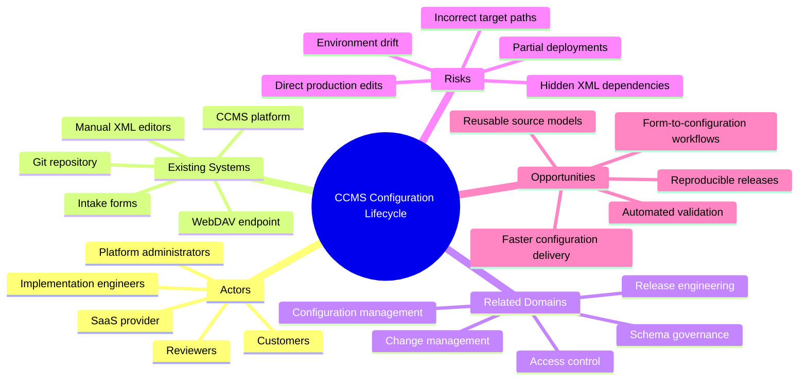
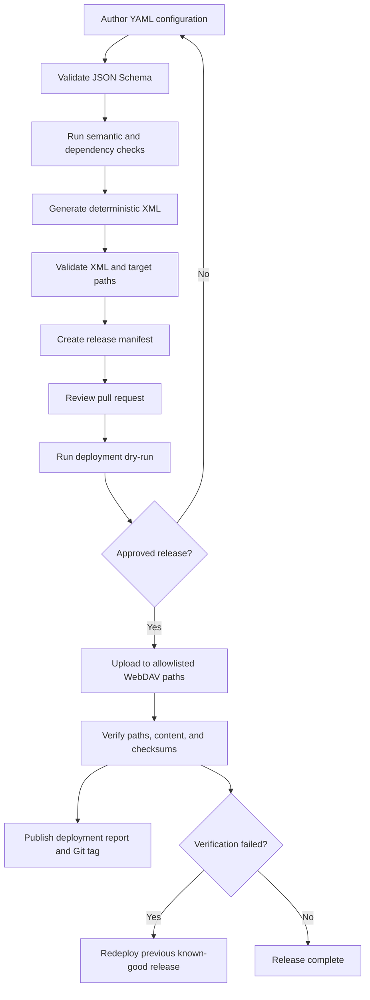

# Safe Configuration-as-Code Workflow for CCMS XML

## 1. Problem

The current CCMS configuration process relies on manual or semi-manual editing of recurring XML structures, followed by deployment through WebDAV. This creates inconsistent implementations, weak auditability, fragile rollback, duplicated effort, and avoidable mistakes in paths, names, and dependencies. The source material proposes treating customer-managed configuration as code while explicitly excluding SaaS-managed content from automation. 

### Five Whys Analysis

1. **Why?** Configuration changes are slow and error-prone because engineers repeatedly edit and transfer similar XML files.
2. **Why?** The configuration intent is not represented in a structured, reusable source model.
3. **Why?** XML files function simultaneously as authoring inputs, deployment artifacts, and operational records.
4. **Why?** The workflow lacks a controlled build, validation, release, and verification pipeline.
5. **Why?** Ownership boundaries, deployment rules, and source-of-truth policies have not been enforced through tooling.

### Condensed Problem Analysis

The underlying problem is not XML itself. The problem is that configuration intent, generated artifacts, deployment state, and platform-owned content are not clearly separated.

A reliable solution requires more than converting YAML into XML. It must establish Git as the source of truth, generate deterministic artifacts, validate dependencies, restrict deployment to approved locations, verify results, and prevent automation from affecting SaaS-managed files.

### Problem Statement

The system of interest is the end-to-end lifecycle for customer-managed CCMS configuration, including authors, reviewers, Git, validation tools, XML generation, release management, WebDAV deployment, and the SaaS platform. The primary friction is an uncontrolled transition from configuration intent to deployed XML. This affects implementation engineers, reviewers, platform administrators, and customers. Without intervention, configuration work will remain difficult to reproduce, review, scale, and recover.

## 2. Context

### Context Analysis

The workflow crosses several ownership domains. The team controls customer-managed configuration, while the SaaS platform modifies other files in separate directories. This separation makes automation feasible, but only when the boundary is represented as an enforceable policy rather than informal knowledge.

Git can provide review history, release tags, and recoverable milestones, but it cannot guarantee that deployed configuration matches repository state. Direct WebDAV edits would create drift unless they are prohibited, detected, or reconciled.

The source model must balance usability and fidelity. YAML can make common configuration intent easier to review, but a model that merely reproduces XML element by element offers little simplification. Conversely, an overly abstract model may hide platform behavior and become difficult to maintain.

Deployment also has transactional concerns. Related XML files may need to be loaded in a specific order or changed as a unit. WebDAV uploads may not provide atomic multi-file transactions, so the workflow must detect partial completion and define recovery behavior.

Environment differences introduce another design pressure. Development, test, and production may use different identifiers, paths, permissions, or supported values. These differences should be represented through explicit overlays or environment mappings, not last-minute edits to generated files.

This analysis follows a system-of-interest approach: the configuration problem is treated as an interaction among actors, tools, workflows, data, constraints, and governance rather than as an isolated XML-generation task. 

## 3. Solution

### Proposed Solution

Create a configuration-as-code pipeline in which engineers describe supported CCMS configurations in validated YAML, generate deterministic XML and a deployment manifest, review the resulting change in Git, and deploy only to allowlisted customer-managed WebDAV paths.

The first release should support one narrow, repetitive configuration family. It should run in dry-run mode by default, verify deployed content, and support rollback by redeploying a previously tagged release.

### Solution Principles

* **Separate intent from artifacts:** Humans edit YAML; the build process produces XML.
* **Enforce ownership boundaries:** Code must prevent writes outside approved customer-managed paths.
* **Make releases reproducible:** A source revision must always generate the same files, paths, and manifest.
* **Validate before mutation:** Structural, semantic, XML, and deployment checks must pass before upload.
* **Prefer narrow models:** Add configuration families incrementally rather than designing a universal abstraction.
* **Treat deployment as a controlled release:** Record what changed, where it changed, and how it was verified.

### Expected Benefits

* Faster creation of recurring configurations.
* Consistent naming, structure, formatting, and path selection.
* Reviewable changes through source and generated-artifact diffs.
* Earlier detection of invalid references and missing dependencies.
* Reproducible deployment and rollback.
* A stable integration point for future form-based intake automation.

### Tradeoffs

* The team must maintain schemas, templates, validation rules, and deployment tooling.
* YAML introduces another representation that must remain aligned with CCMS capabilities.
* Committing generated XML improves artifact visibility but increases repository size and merge noise.
* Strict controls may initially slow exceptional or poorly understood changes.
* Some failures cannot be made fully atomic if WebDAV updates multiple dependent files individually.

## 4. Implementation

### Implementation Overview

Implement the solution as a staged pipeline with explicit artifacts at each boundary: source YAML, validation results, generated XML, release manifest, deployment report, and verification report.

The pilot should initially target a non-production environment and one configuration family whose files remain entirely within customer-managed directories.

### Suggested Architecture or Workflow

### Implementation Steps

1. **Establish the ownership boundary.** Inventory WebDAV directories, classify each as customer-managed or SaaS-managed, and obtain operational approval for the allowlist.
2. **Select the pilot configuration family.** Choose a common, repetitive, well-understood set of XML files with limited dependencies and no SaaS-owned targets.
3. **Create the source and validation model.** Define YAML examples, JSON Schema rules, naming standards, uniqueness checks, references, and environment constraints.
4. **Build deterministic generation.** Implement templates and a Python builder that normalizes ordering, formatting, filenames, and target-path mappings.
5. **Introduce manifest-driven deployment.** Produce a manifest containing source files, generated artifacts, checksums, target paths, ordering, environment, and release ID.
6. **Add deployment safeguards.** Implement dry-run output, path resolution checks, authentication controls, timeouts, retry limits, and refusal to perform unscoped deletion.
7. **Verify and rehearse rollback.** Confirm uploaded content, simulate interrupted deployments, and prove that a tagged release can be safely redeployed.
8. **Define operating policy.** Decide whether generated XML is committed, who approves releases, how direct edits are handled, and who owns schemas and templates.
9. **Evaluate the pilot.** Compare delivery time, defect rate, review effort, drift, and rollback performance against the existing process.
10. **Expand incrementally.** Add adjacent configuration types only after the pilot model and controls prove stable.

### Technical Notes

* Use Python with `pydantic` or `jsonschema` for source validation and `lxml` for XML creation and schema checks.
* Generate XML through an XML library where practical; use Jinja templates only when they remain easy to validate and escape correctly.
* Resolve and normalize every WebDAV target path before comparing it with the allowlist.
* Store path mappings in the release manifest rather than deriving them only during deployment.
* Sort generated collections and normalize whitespace to ensure stable diffs.
* Keep secrets outside Git and issue deployment credentials with write access only to approved directories.
* Record deployment inputs, target environment, timestamps, checksums, results, and operator or CI identity.
* Treat generated XML as immutable output. Never allow manual changes inside the generated directory.
* Model environment differences through validated overlays, such as `base + test` and `base + production`.
* Avoid automatic deletion during the pilot. Add managed deletion only after ownership and lifecycle semantics are proven.

### Risks and Mitigations

| Risk                                           | Impact | Mitigation                                                                                                                   |
| ---------------------------------------------- | ------ | ---------------------------------------------------------------------------------------------------------------------------- |
| Deployment writes to a SaaS-managed path       | High   | Use a code-enforced allowlist, least-privilege credentials, path normalization, and negative tests.                          |
| Direct XML edits create drift                  | High   | Restrict direct access, publish repository policy, and add read-back comparison or drift detection.                          |
| Hidden XML dependencies cause invalid behavior | High   | Compare generated output with known-good examples and add semantic rules as dependencies are discovered.                     |
| Upload fails after only some files change      | High   | Use ordered manifests, pre-deployment backups where supported, verification checkpoints, and tested redeployment procedures. |
| YAML model becomes more complex than XML       | Medium | Keep the pilot narrow and represent user intent rather than every XML implementation detail.                                 |
| Environment-specific edits bypass generation   | Medium | Use explicit validated overlays and prohibit edits to generated artifacts.                                                   |
| Templates produce nondeterministic output      | Medium | Fix ordering, formatting, defaults, and test output against versioned fixtures.                                              |
| Rollback overwrites platform-owned changes     | High   | Limit rollback to files declared in the historical customer-managed release manifest.                                        |
| Git contains secrets or sensitive user data    | High   | Reference secret identifiers, encrypt sensitive configuration where required, and apply repository access controls.          |
| Tooling becomes dependent on one maintainer    | Medium | Document architecture, require code review, add tests, and assign shared ownership.                                          |

## 5. Discussion

### Interpretation

This initiative is primarily a governance and release-engineering change, not a file-conversion project. YAML-to-XML generation is the simplest component. The durable value comes from defining ownership, creating a source of truth, making releases reproducible, and preventing unsafe mutations.

The proposal also exposes a useful boundary for future automation. Intake forms could eventually create configuration proposals, but they should enter the same validation and review workflow rather than deploy directly. This preserves human review while reducing repetitive translation work.

### Challenge the Frame

| Challenge Question                                                                               | Why It Matters                                                                                                                                      |
| ------------------------------------------------------------------------------------------------ | --------------------------------------------------------------------------------------------------------------------------------------------------- |
| What assumption would most change the solution if false?                                         | The design depends on customer-managed and SaaS-managed files being reliably separable by path and ownership.                                       |
| What has the analysis made seem inevitable?                                                      | It may make YAML appear necessary when a typed Python model, database, or XML-native editor could be more suitable for some configuration families. |
| What alternative problem definition might produce a different solution?                          | The primary problem may be uncontrolled deployment and weak rollback rather than manual XML authoring.                                              |
| What constraint is binding: money, time, labor, risk, knowledge, authority, tools, or attention? | Undocumented CCMS behavior and limited authority over the target environment may be more restrictive than development capacity.                     |
| What would make the solution fail in practice?                                                   | Continued direct editing, unclear ownership, weak tests, excessive abstraction, or rollback procedures that are never rehearsed.                    |
| What is the smallest useful version of success?                                                  | One configuration family can be generated, reviewed, dry-run, deployed to test, verified, and rolled back without touching out-of-scope paths.      |

The solution still appears strong, but its safety depends on proving the ownership boundary and deployment behavior before expanding the source model. A pilot focused on controlled deployment may deliver value even before YAML supports many configuration types.

### Alternatives Considered

| Alternative                                  | Strength                                                                                 | Weakness                                                                                                 |
| -------------------------------------------- | ---------------------------------------------------------------------------------------- | -------------------------------------------------------------------------------------------------------- |
| Keep XML as the canonical Git source         | Avoids maintaining two representations and supports exact artifact review.               | Retains repetitive authoring and provides limited abstraction or validation of intent.                   |
| Automate deployment only                     | Addresses path safety, auditability, verification, and rollback with less initial scope. | Does not reduce repeated XML authoring or improve reuse as much.                                         |
| Build a form-based configuration application | Provides a guided user experience and may suit nontechnical users.                       | Adds interface, state, access-control, and maintenance complexity before the underlying model is proven. |

### Open Questions

* Which WebDAV directories are contractually and operationally customer-managed?
* Can deployment credentials be restricted to only those directories?
* Which configuration family has the highest repetition and lowest dependency risk?
* Does the CCMS provide XML schemas, import validation, versioning, or transactional APIs?
* Must generated XML be reviewed and committed, or can it remain an immutable CI artifact?
* How should the pipeline detect and handle direct changes made after deployment?
* What recovery behavior is required when a deployment stops midway?
* Which environment differences belong in overlays, secrets, or external mappings?
* Who approves configuration releases and owns long-term schema evolution?

### Recommended Next Step

Run a discovery-and-proof pilot for one configuration family. First, produce an approved directory ownership map and two representative known-good XML examples. Then build a minimal Python pipeline that validates one YAML model, generates deterministic XML and a release manifest, performs a non-mutating WebDAV dry-run, and proves that every proposed target remains inside the approved allowlist.
