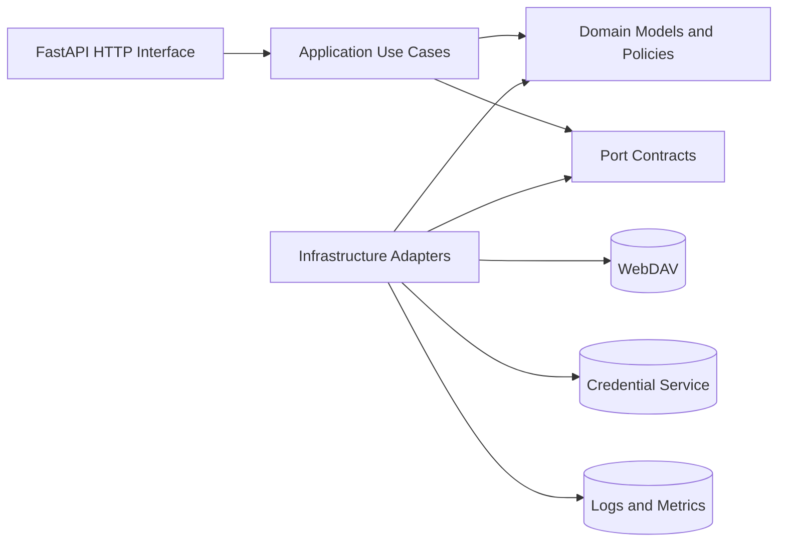
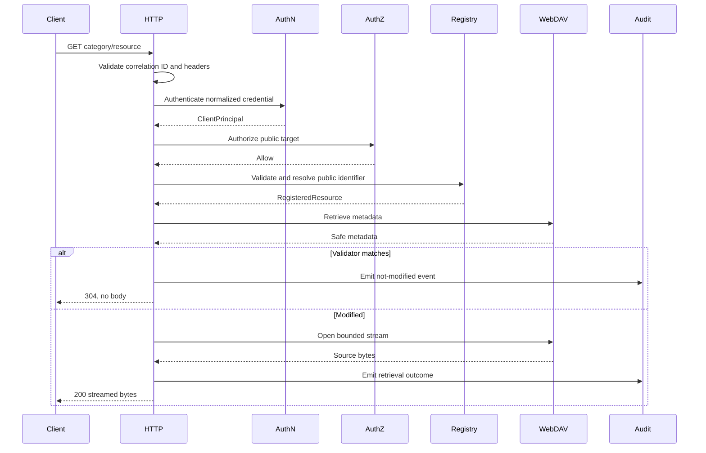
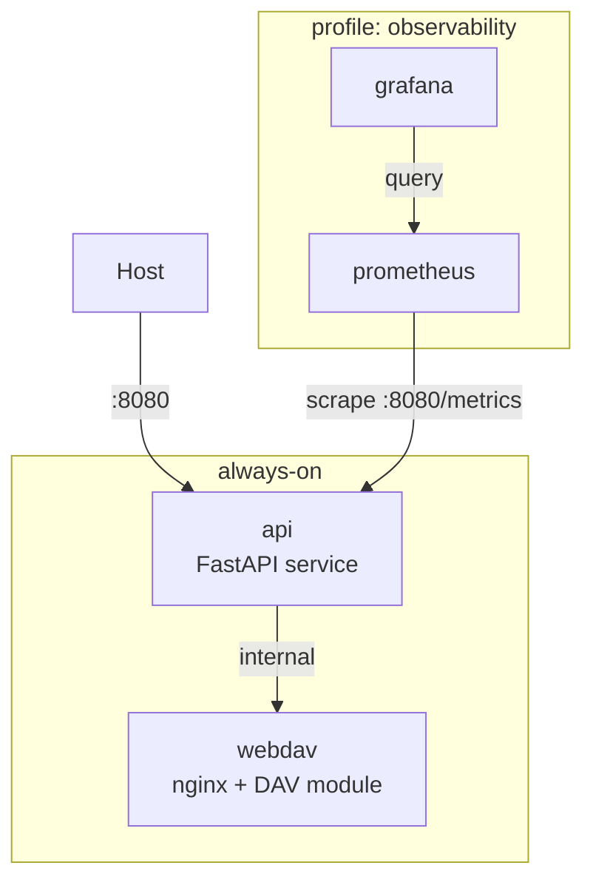

# Content Resource API — Python Implementation Plan

Source: [Scoped Content Resource Middleware API SRS](sandbox:/mnt/data/middle-api-srs.md)

## 1. Implementation Strategy

### 1.1 Delivery approach

Implement one independently deployable Python microservice using a layered ports-and-adapters architecture.

The implementation will proceed as vertical, testable slices:

1. Resolve production-blocking architecture decisions.
2. Establish the Python project, quality gates, and dependency injection.
3. Implement immutable domain contracts and validation.
4. Implement registry loading and atomic snapshots.
5. Implement authentication and authorization.
6. Implement the WebDAV repository adapter.
7. Implement listing, retrieval, conditional requests, and health use cases.
8. Expose the FastAPI HTTP contract.
9. Add audit logging, metrics, security hardening, and deployment assets.
10. Execute acceptance, security, performance, and release-readiness testing.

Every phase must leave the repository in a passing state.

### 1.2 Technology baseline

| Concern             | Selection                                                              |
| ------------------- | ---------------------------------------------------------------------- |
| Runtime             | Python 3.12 or later organization-supported release                    |
| Environment         | `.venv` created with `python -m venv .venv`                            |
| Packaging           | `pyproject.toml`, installable `src/` package                           |
| Web framework       | FastAPI with an ASGI server                                            |
| Contract validation | Pydantic v2 and `pydantic-settings`                                    |
| Async HTTP          | `httpx.AsyncClient` with connection pooling                            |
| Structured logging  | `structlog` or organization-approved JSON logging adapter              |
| Metrics             | Prometheus-compatible adapter or organization-supported replacement    |
| Unit testing        | `pytest`, `pytest-asyncio`, `pytest-mock`                              |
| HTTP testing        | FastAPI `TestClient` and `httpx.ASGITransport`                         |
| Property testing    | Hypothesis for filenames, headers, registry paths, and validators      |
| Coverage            | `coverage.py` through `pytest-cov`, including branch coverage          |
| Static analysis     | Ruff and strict mypy or pyright                                        |
| Security checks     | Bandit, dependency audit, secret scanning, container scanning          |
| Documentation       | MkDocs Material, mkdocstrings, Mermaid.js                              |
| Containers          | Multi-stage Dockerfile; Docker Compose with named service profiles for development, integration testing, and observability |
| CI                  | Lint, type-check, test, coverage, docs, image build, and security jobs |

Exact package versions should be locked when implementation begins rather than copied from this plan.

### 1.3 Reference implementation assumptions

These assumptions make development concrete but require approval before production:

| Area                  | Planning assumption                                                                                                                           |
| --------------------- | --------------------------------------------------------------------------------------------------------------------------------------------- |
| Registry              | Version-controlled YAML loaded into a validated, immutable in-memory snapshot                                                                 |
| Authentication        | API-key adapter implemented first; OAuth adapter remains behind the same port and can be enabled by decision                                  |
| Multiple credentials  | Reject requests containing conflicting authentication mechanisms                                                                              |
| Listing metadata      | Retrieve metadata for explicitly registered resources only; never enumerate an upstream directory                                             |
| Cache                 | No last-known-good content cache in v1                                                                                                        |
| Rate limiting         | Disabled in application code until an approved policy exists; ingress controls may still apply                                                |
| TLS                   | Terminated and enforced by the approved ingress                                                                                               |
| Secrets               | Injected at runtime from the platform secrets mechanism                                                                                       |
| WebDAV writes         | No write methods or write-capable repository interface                                                                                        |
| Readiness             | Policy-driven check of configuration, secrets, and optional WebDAV availability                                                               |
| Audit optional fields | Omit unavailable optional values rather than serializing them as `null`                                                                       |
| Streaming failure     | Validate metadata before streaming; terminate an interrupted response and record transfer failure rather than recording a successful transfer |

### 1.4 Blocking decisions and ADRs

Production implementation must not silently decide the open governance issues listed in the SRS. The specification identifies authentication, registry ownership, ETag behavior, stale content, upstream failure mapping, audit behavior, service objectives, and live WebDAV versus object storage as release blockers.

Create these architecture decision records before production release:

| ADR     | Decision                                                              |
| ------- | --------------------------------------------------------------------- |
| ADR-001 | API key, OAuth bearer token, or both                                  |
| ADR-002 | Category versus resource-level authorization and concealment behavior |
| ADR-003 | Registry storage, approval, ownership, and atomic reload process      |
| ADR-004 | ETag source and behavior for same-name replacement                    |
| ADR-005 | Cache-Control values and last-known-good policy                       |
| ADR-006 | WebDAV timeout, retry, and concurrency limits                         |
| ADR-007 | `502` versus `503`, `Retry-After`, and streaming-failure semantics    |
| ADR-008 | Mandatory audit sink failure behavior                                 |
| ADR-009 | Readiness dependency policy and availability objective                |
| ADR-010 | Compatibility, deprecation, and resource-removal policy               |
| ADR-011 | Live WebDAV proxy versus publication to object storage                |
| ADR-012 | Telemetry platforms, retention, access, and sensitive-data controls   |

---

## 2. Proposed Project Structure

```text
content-resource-api/
├── pyproject.toml
├── README.md
├── LICENSE
├── .python-version
├── .env.example
├── .gitignore
├── .dockerignore
├── Dockerfile
├── compose.yaml
├── compose.override.yaml
├── Makefile
├── mkdocs.yml
├── ruff.toml
├── mypy.ini
├── pytest.ini
├── coverage.toml
├── bandit.yaml
│
├── config/
│   ├── registry.example.yaml
│   ├── registry.test.yaml
│   └── logging.example.yaml
│
├── src/
│   └── content_resource_api/
│       ├── __init__.py
│       ├── __main__.py
│       ├── bootstrap.py
│       │
│       ├── domain/
│       │   ├── __init__.py
│       │   ├── enums.py
│       │   ├── errors.py
│       │   ├── models.py
│       │   ├── values.py
│       │   ├── validators.py
│       │   ├── authorization.py
│       │   ├── conditional_requests.py
│       │   └── content_types.py
│       │
│       ├── application/
│       │   ├── __init__.py
│       │   ├── commands.py
│       │   ├── results.py
│       │   ├── list_resources.py
│       │   ├── get_resource.py
│       │   ├── evaluate_health.py
│       │   ├── reload_registry.py
│       │   └── audit_factory.py
│       │
│       ├── ports/
│       │   ├── __init__.py
│       │   ├── authentication.py
│       │   ├── registry.py
│       │   ├── content_repository.py
│       │   ├── secrets.py
│       │   ├── audit.py
│       │   ├── metrics.py
│       │   ├── clock.py
│       │   └── identifiers.py
│       │
│       ├── adapters/
│       │   ├── __init__.py
│       │   ├── authentication/
│       │   │   ├── api_key.py
│       │   │   ├── api_key_repository.py
│       │   │   ├── oauth.py
│       │   │   └── composite.py
│       │   ├── registry/
│       │   │   ├── yaml_loader.py
│       │   │   ├── snapshot.py
│       │   │   └── reloader.py
│       │   ├── webdav/
│       │   │   ├── client.py
│       │   │   ├── repository.py
│       │   │   ├── mapping.py
│       │   │   └── streaming.py
│       │   ├── secrets/
│       │   │   ├── environment.py
│       │   │   └── platform.py
│       │   └── telemetry/
│       │       ├── logging.py
│       │       ├── audit.py
│       │       ├── metrics.py
│       │       └── redaction.py
│       │
│       ├── interface/
│       │   └── http/
│       │       ├── app.py
│       │       ├── dependencies.py
│       │       ├── schemas.py
│       │       ├── error_handlers.py
│       │       ├── headers.py
│       │       ├── middleware/
│       │       │   ├── correlation.py
│       │       │   ├── request_context.py
│       │       │   ├── logging.py
│       │       │   └── metrics.py
│       │       └── routes/
│       │           ├── schematron.py
│       │           ├── taxonomy.py
│       │           └── health.py
│       │
│       └── config/
│           ├── settings.py
│           ├── registry_models.py
│           └── constants.py
│
├── tests/
│   ├── conftest.py
│   ├── factories/
│   ├── fixtures/
│   │   ├── registries/
│   │   ├── resources/
│   │   ├── credentials/
│   │   └── certificates/
│   ├── doubles/
│   │   ├── authentication.py
│   │   ├── content_repository.py
│   │   ├── audit.py
│   │   ├── metrics.py
│   │   ├── clock.py
│   │   └── identifiers.py
│   ├── unit/
│   │   ├── domain/
│   │   ├── application/
│   │   ├── config/
│   │   └── adapters/
│   ├── contract/
│   │   ├── test_openapi.py
│   │   ├── test_error_schema.py
│   │   ├── test_listing_schema.py
│   │   ├── test_audit_schema.py
│   │   └── test_content_repository_port.py
│   ├── integration/
│   │   ├── test_http_api.py
│   │   ├── test_webdav_adapter.py
│   │   ├── test_registry_reload.py
│   │   └── test_telemetry.py
│   ├── acceptance/
│   │   ├── test_authentication.py
│   │   ├── test_registry_and_paths.py
│   │   ├── test_listing.py
│   │   ├── test_retrieval.py
│   │   ├── test_conditional_requests.py
│   │   ├── test_upstream_failures.py
│   │   ├── test_health.py
│   │   ├── test_observability.py
│   │   └── test_read_only_boundary.py
│   ├── security/
│   │   ├── test_traversal.py
│   │   ├── test_header_injection.py
│   │   ├── test_log_redaction.py
│   │   ├── test_credential_conflicts.py
│   │   └── test_oversized_inputs.py
│   └── performance/
│       ├── locustfile.py
│       └── test_benchmarks.py
│
├── docs/
│   ├── index.md
│   ├── getting-started.md
│   ├── development.md
│   ├── api/
│   │   ├── overview.md
│   │   ├── authentication.md
│   │   ├── listing.md
│   │   ├── retrieval.md
│   │   ├── conditional-requests.md
│   │   ├── errors.md
│   │   └── examples.md
│   ├── architecture/
│   │   ├── context.md
│   │   ├── containers.md
│   │   ├── components.md
│   │   ├── contracts.md
│   │   ├── request-flow.md
│   │   ├── deployment.md
│   │   └── threat-model.md
│   ├── design/
│   │   ├── domain-model.md
│   │   ├── registry.md
│   │   ├── authentication.md
│   │   ├── etags-and-caching.md
│   │   ├── streaming.md
│   │   ├── errors.md
│   │   └── observability.md
│   ├── operations/
│   │   ├── configuration.md
│   │   ├── deployment.md
│   │   ├── rollback.md
│   │   ├── secret-rotation.md
│   │   ├── registry-change.md
│   │   ├── incident-response.md
│   │   └── dashboards-and-alerts.md
│   ├── reference/
│   │   ├── configuration.md
│   │   ├── environment-variables.md
│   │   ├── audit-schema.md
│   │   ├── error-codes.md
│   │   ├── requirements-traceability.md
│   │   └── api-reference.md
│   └── adr/
│       ├── index.md
│       └── 000-template.md
│
├── scripts/
│   ├── export_openapi.py
│   ├── validate_registry.py
│   ├── verify_redaction.py
│   ├── run_acceptance.py
│   └── check_requirements_traceability.py
│
└── deploy/
    ├── kubernetes/
    │   ├── deployment.yaml
    │   ├── service.yaml
    │   ├── configmap.yaml
    │   ├── network-policy.yaml
    │   └── pod-disruption-budget.yaml
    └── examples/
        ├── ingress.yaml
        └── secret-provider.yaml
```

---

## 3. Layer and Contract Model

### 3.1 Dependency rule

Dependencies point inward:



The domain and application layers must not import FastAPI, HTTPX, WebDAV response types, Prometheus types, or platform secret-provider types.

### 3.2 Domain models

Use frozen Pydantic models where validation or serialization is valuable:

* `ClientPrincipal`
* `CredentialInput`
* `ResourceCategory`
* `RegisteredResource`
* `ResourceId`
* `ResourceMetadata`
* `ResourceRepresentationMetadata`
* `RequestValidators`
* `CacheDecision`
* `AuthorizationDecision`
* `AuditEventV1`
* `DependencyStatus`
* `HealthResult`
* `ErrorDetail`
* `CorrelationId`

The byte stream itself remains an `AsyncIterator[bytes]` or explicit `AsyncByteStream` protocol rather than a Pydantic field.

### 3.3 Commands and results

| Command/query                 | Handler                       | Result                                        |
| ----------------------------- | ----------------------------- | --------------------------------------------- |
| `ListResourcesCommand`        | `ListResourcesHandler`        | `ResourceListResult`                          |
| `GetResourceCommand`          | `GetResourceHandler`          | `ResourceStreamResult` or `NotModifiedResult` |
| `EvaluateHealthQuery`         | `EvaluateHealthHandler`       | `HealthResult`                                |
| `ReloadRegistryCommand`       | `ReloadRegistryHandler`       | `RegistryReloadResult`                        |
| `InvalidateCacheEntryCommand` | Deferred until cache approval | `CacheInvalidationResult`                     |

Commands contain public category, public filename, request validators, principal, correlation ID, and request timing context. They must never contain private WebDAV URLs supplied by clients.

### 3.4 Ports

```python
class AuthenticationPort(Protocol):
    async def authenticate(
        self,
        credential: CredentialInput,
    ) -> ClientPrincipal:
        """Authenticate one normalized credential."""


class ResourceRegistryPort(Protocol):
    def get_category(self, name: CategoryName) -> ResourceCategory: ...
    def get_resource(self, resource_id: ResourceId) -> RegisteredResource: ...
    def list_resources(
        self,
        category: CategoryName,
    ) -> tuple[RegisteredResource, ...]: ...


class ContentRepositoryPort(Protocol):
    async def get_metadata(
        self,
        resource_ref: UpstreamResourceRef,
    ) -> ResourceMetadata: ...

    async def open_stream(
        self,
        resource_ref: UpstreamResourceRef,
    ) -> AsyncByteStream: ...

    async def check_availability(self) -> DependencyStatus: ...


class AuditSinkPort(Protocol):
    async def emit(self, event: AuditEventV1) -> None: ...


class MetricsPort(Protocol):
    def observe(self, measurement: MetricMeasurement) -> None: ...
```

Additional testability ports:

* `ClockPort`
* `IdentifierGeneratorPort`
* `SecretProviderPort`
* `CredentialRepositoryPort`
* optional `CacheRepositoryPort`

### 3.5 Service responsibilities

| Service                     | Responsibility                                                  |
| --------------------------- | --------------------------------------------------------------- |
| `AuthenticationService`     | Normalize selected credential mechanism and return a principal  |
| `AuthorizationService`      | Evaluate category scope and resource restrictions               |
| `ResourceResolutionService` | Resolve validated public IDs through the registry               |
| `FilenameValidationService` | Apply bounded, non-normalizing filename checks                  |
| `ConditionalRequestService` | Apply ETag precedence and HTTP-date rules                       |
| `ContentTypeService`        | Validate configured or upstream content type                    |
| `AuditEventFactory`         | Produce schema-valid audit events                               |
| `HealthService`             | Evaluate process, configuration, secrets, and dependency policy |
| `RegistrySnapshotManager`   | Atomically replace immutable validated registry snapshots       |

### 3.6 Error hierarchy

```text
ContentResourceError
├── AuthenticationError
│   ├── MissingCredential
│   ├── MalformedCredential
│   ├── InvalidCredential
│   ├── ExpiredCredential
│   ├── RevokedCredential
│   └── AuthenticationServiceUnavailable
├── AuthorizationError
├── InvalidResourceIdentifier
├── CategoryNotFound
├── ResourceNotRegistered
├── RegistryValidationError
├── UpstreamError
│   ├── UpstreamResourceMissing
│   ├── UpstreamTimeout
│   ├── UpstreamUnavailable
│   ├── UpstreamProtocolError
│   └── UpstreamTransferError
├── ResourceTooLarge
├── AuditUnavailable
└── InternalError
```

The HTTP error mapper owns conversion to status codes and safe `ErrorResponse` objects. Infrastructure exceptions must never cross into route handlers.

### 3.7 Validation rules

#### Filename

* Decode at most the explicitly tested number of passes needed to detect encoded and double-encoded traversal.
* Reject empty names, overlength names, `.`, `..`, `/`, `\`, null bytes, encoded separators, and traversal tokens.
* Do not normalize invalid input into valid input.
* Compare extensions according to category policy.
* Perform registry lookup only after syntactic validation.

The SRS acceptance suite explicitly requires plain, encoded, and double-encoded traversal to be rejected before WebDAV access.

#### Registry

* Validate schema version.
* Require category and resource owners.
* Reject duplicate category names and duplicate public filenames.
* Require positive size limits and approved scopes.
* Reject absolute upstream object references.
* Canonically prove every object remains within its category root.
* Reject mismatched file extensions.
* Build an immutable snapshot before activation.
* Swap the active snapshot atomically.

#### Authentication and headers

* Accept credentials only from approved headers.
* Reject query-string credentials.
* Bound credential and correlation-ID lengths.
* Reject conflicting credentials.
* Validate caller correlation IDs against a conservative character set.
* Redact authorization, API-key, cookie, and configured sensitive headers.

#### Metadata and content

* Normalize timestamps to UTC.
* Reject negative or inconsistent size metadata.
* Validate media type against registry policy.
* Stop transfer when the configured byte limit is exceeded.
* Never report an incomplete stream as a completed success.

---

## 4. Design Patterns Used

| Pattern               | Use                                                  | Reason                                                                          |
| --------------------- | ---------------------------------------------------- | ------------------------------------------------------------------------------- |
| Ports and adapters    | Authentication, WebDAV, secrets, registry, telemetry | Prevent infrastructure protocols from entering business logic                   |
| Repository            | Registry and authoritative content access            | Provides stable, replaceable data-access contracts                              |
| Strategy              | Authentication mechanism and ETag generation         | Supports approved alternatives without conditional logic throughout the service |
| Policy object         | Authorization, filename, caching, size, readiness    | Keeps configurable decisions explicit and independently testable                |
| Command handler       | Listing, retrieval, health, registry reload          | Makes request orchestration deterministic and unit-testable                     |
| Anti-corruption layer | WebDAV adapter and error translator                  | Hides paths, credentials, response types, and protocol behavior                 |
| Immutable snapshot    | Runtime registry                                     | Provides atomic reload and request-level consistency                            |
| Dependency injection  | Application composition in `bootstrap.py`            | Allows deterministic doubles and replacement of adapters                        |
| Factory               | Audit events and public errors                       | Enforces versioned schemas and consistent safe fields                           |

Patterns not required for a clear responsibility should not be added. In particular, there is no need for a generic event bus, ORM, unit-of-work abstraction, service mesh abstraction, or plugin framework in v1.

---

## 5. Service Architecture

### 5.1 Runtime components

The first release has no GUI. All consumer behavior is exposed through authenticated HTTP, consistent with the SRS. The service exposes only:

```text
GET /api/resources/v1/schematron
GET /api/resources/v1/schematron/{filename}
GET /api/resources/v1/taxonomy
GET /api/resources/v1/taxonomy/{filename}
GET /api/resources/v1/health/live
GET /api/resources/v1/health/ready
```

An optional `/health` compatibility alias should be added only when approved.

### 5.2 Request flow



No WebDAV call is permitted before successful authentication, authorization, validation, and registry resolution.

### 5.3 WebDAV adapter

The adapter will:

* Use one long-lived, pooled `httpx.AsyncClient`.
* Retrieve metadata for one registered object at a time.
* Stream bytes without content transformation.
* Apply connect, read, write, and pool timeouts.
* Enforce a bounded semaphore for upstream concurrency.
* Retry only classified transient, idempotent operations.
* Close response streams in success, cancellation, limit-exceeded, and error paths.
* Map WebDAV and network errors into domain errors.
* Never expose upstream bodies or private URLs.
* Propagate the approved correlation header.
* Support deterministic fake and HTTP simulation adapters in tests.

The adapter contract remains unchanged if a future object-storage repository replaces WebDAV.

### 5.4 Docker and Compose

#### Dockerfile stages

| Stage | Base | Purpose |
| ------- | ---------------------- | ----------------------------------------------------- |
| `deps` | `python:3.12-slim` | Compile and cache wheels for production dependencies |
| `test` | `deps` | Add dev/test extras; used in CI test jobs |
| `runtime` | `python:3.12-slim` | Copy installed wheels only; non-root user; no secrets |

Requirements for the final `runtime` image:

* Non-root user (`appuser`), UID 1000.
* Read-only root filesystem with `/tmp` and `/app/logs` as `tmpfs` mounts.
* No secret in any image layer; all sensitive values injected at runtime.
* ASGI graceful shutdown on `SIGTERM` with a configurable drain timeout.
* Liveness and readiness probes wired to `/api/resources/v1/health/live` and `/api/resources/v1/health/ready`.
* SBOM generated in CI via `syft` and attached to the container image digest.

#### Compose service topology



| Service | Image | Profile | Purpose |
| ------------ | -------------------------------- | ------------- | ---------------------------------------------------------- |
| `api` | local build (`runtime` stage) | always | Content Resource API under development |
| `webdav` | `nginx` with `ngx_http_dav_module` | always | Deterministic test upstream; fixtures mounted read-only |
| `prometheus` | `prom/prometheus:latest` | `observability` | Scrapes `/metrics`; enables latency and error-rate dashboards |
| `grafana` | `grafana/grafana:latest` | `observability` | Pre-provisioned dashboards for local development |

#### Networks and volumes

```yaml
networks:
  internal:          # api <-> webdav; no host exposure
  external:          # host -> api:8080 only

volumes:
  webdav_fixtures:   # read-only: tests/fixtures/resources/ -> WebDAV root
  prometheus_data:
  grafana_data:
```

The API service joins both networks. WebDAV, Prometheus, and Grafana join only `internal`. No upstream host or port is reachable from outside the `internal` network.

#### Compose profiles

| Profile | Services started | Use |
| --------------- | -------------------------------- | -------------------------------------------- |
| *(none)* | `api`, `webdav` | Fast inner development loop |
| `observability` | `api`, `webdav`, `prometheus`, `grafana` | Dashboard-level validation of metrics output |
| `test` | `api`, `webdav` with test env overrides | Acceptance and integration test execution |

`compose.override.yaml` holds developer-local overrides (hot-reload volume mounts, debug log levels, exposed Prometheus port). It is git-ignored and never merged into `compose.yaml`.

#### Common workflows

```bash
# Bring up default stack (api + webdav)
docker compose up --build

# Run acceptance and integration tests against live stack
docker compose --profile test run --rm api \
  pytest tests/integration/ tests/acceptance/ -v

# Validate registry before starting
docker compose run --rm api python -m scripts.validate_registry

# Start with full observability (Grafana at http://localhost:3000)
docker compose --profile observability up --build

# Tear down and remove volumes
docker compose down -v
```

#### Early adoption — Phase 1

The `Dockerfile` (all stages) and `compose.yaml` (core services) are created in Phase 1 alongside the project skeleton, not deferred to Phase 12. Every subsequent phase develops and tests against the running Compose stack. This eliminates environment drift and lets integration tests execute from Phase 6 onward without a separate infrastructure setup step. Phase 12 becomes a hardening and production-readiness pass on assets that already exist and are in daily use.

### 5.5 Environment configuration

`Settings` will be a Pydantic settings model with fields such as:

```text
APP_ENVIRONMENT
APP_LOG_LEVEL
APP_REGISTRY_PATH
APP_FILENAME_MAX_LENGTH
APP_CORRELATION_ID_MAX_LENGTH
APP_WEBDAV_BASE_URL
APP_WEBDAV_USERNAME
APP_WEBDAV_PASSWORD
APP_WEBDAV_CONNECT_TIMEOUT_SECONDS
APP_WEBDAV_READ_TIMEOUT_SECONDS
APP_WEBDAV_MAX_RETRIES
APP_WEBDAV_MAX_CONCURRENCY
APP_READINESS_REQUIRES_WEBDAV
APP_AUTH_API_KEY_ENABLED
APP_AUTH_OAUTH_ENABLED
APP_AUDIT_REQUIRED
APP_RETRY_AFTER_SECONDS
APP_METRICS_ENABLED
```

Sensitive settings must use secret types and custom representations that cannot print their values.

### 5.6 Failure behavior

| Failure                             | Behavior                                                            |
| ----------------------------------- | ------------------------------------------------------------------- |
| Missing or invalid credential       | `401`; bearer mode includes `WWW-Authenticate`; no upstream call    |
| Insufficient scope                  | `403` or approved concealed `404`; no upstream call                 |
| Invalid filename                    | Approved safe `400` or `404`; no registry-derived path disclosure   |
| Unknown or disabled resource        | `404`; no arbitrary upstream lookup                                 |
| Oversized resource                  | `413`; stop transfer; never complete as `200`                       |
| WebDAV object missing               | `404` after all access checks                                       |
| Upstream protocol failure           | `502` with safe error body                                          |
| Timeout or temporary unavailability | `503`, optionally with `Retry-After`                                |
| Audit sink failure                  | Apply ADR-008; never leak telemetry diagnostics                     |
| Stream interruption after headers   | Terminate response, close upstream stream, record failed transfer   |
| Invalid registry at startup         | Readiness `503`; application must not activate the invalid snapshot |
| Failed registry hot reload          | Retain previous valid snapshot and emit a failure event             |

---

## 6. Documentation Plan

### 6.1 README.md

The README must include:

* Purpose and scope.
* Supported routes.
* Explicit read-only and no-arbitrary-path guarantees.
* Prerequisites.
* Virtual-environment setup.
* Installation from `pyproject.toml`.
* Local configuration.
* Registry validation.
* Running the API.
* Running all quality checks.
* Docker Compose usage.
* Documentation build.
* Security disclosure guidance.
* Links to architecture, operations, and API documentation.

Example setup commands:

```bash
python -m venv .venv
source .venv/bin/activate
python -m pip install --upgrade pip
python -m pip install -e ".[dev,docs]"
pytest
mkdocs serve
```

### 6.2 MkDocs Material

`mkdocs.yml` will configure:

* Material theme.
* Mermaid rendering.
* Search and keyboard-accessible navigation.
* `mkdocstrings` API generation.
* Sphinx/reStructuredText docstring parsing.
* OpenAPI rendering or a link to exported `openapi.json`.
* Strict build mode in CI.
* Link checking.
* Accessible diagram descriptions adjacent to Mermaid diagrams.

### 6.3 Docstring standard

All public modules, classes, protocols, Pydantic models, handlers, adapters, errors, and public functions require Sphinx-compatible docstrings documenting:

* Purpose and architectural role.
* Expected caller.
* Preconditions and caller contract.
* Parameters.
* Return values.
* Raised domain errors.
* Side effects.
* Cancellation and resource-release behavior.
* Security and redaction considerations.
* Framework integration.
* Replacement and extension points.
* Requirement IDs where the relationship is important.

Example:

```python
async def get_metadata(
    self,
    resource_ref: UpstreamResourceRef,
) -> ResourceMetadata:
    """Retrieve validated metadata for one registered upstream resource.

    This method is called by application retrieval and listing handlers only
    after authentication, authorization, public-identifier validation, and
    registry resolution have succeeded. Callers must not construct
    ``resource_ref`` from request path text.

    :param resource_ref:
        Registry-originated reference whose canonical path has already been
        proven to remain under an approved category root.
    :returns:
        UTC-normalized metadata suitable for size enforcement, content-type
        validation, and conditional-request evaluation.
    :raises UpstreamResourceMissing:
        The registered object no longer exists upstream.
    :raises UpstreamTimeout:
        The configured upstream deadline was exceeded.
    :raises UpstreamProtocolError:
        The upstream response could not be safely interpreted.
    :side-effects:
        Performs one authenticated, read-only upstream request and records
        upstream latency through the configured telemetry adapter.
    :security:
        Upstream URLs, credentials, and response bodies must not be included
        in raised error messages.
    """
```

### 6.4 Documentation deliverables

| Documentation type | Deliverables                                                                              |
| ------------------ | ----------------------------------------------------------------------------------------- |
| API                | Authentication, scopes, endpoints, headers, errors, content types, 304 behavior, examples |
| Context            | Actors, external systems, trust boundaries, public/private identifiers                    |
| Design             | Domain model, contracts, request ordering, registry, WebDAV, auth, ETag, streaming        |
| Operations         | Deployment, rollback, health, secret rotation, registry changes, incidents                |
| Security           | Threat model, traversal protection, redaction, least privilege, dependency policy         |
| Reference          | Environment variables, registry schema, audit schema, error codes                         |
| Traceability       | Requirement-to-code, requirement-to-test, acceptance-to-test matrix                       |
| Decisions          | ADRs for all unresolved production choices                                                |
| Generated          | Python API reference and exported OpenAPI document                                        |

---

## 7. Testing and Coverage Plan

### 7.1 Test layers

| Layer               | Scope                                                                                    |
| ------------------- | ---------------------------------------------------------------------------------------- |
| Unit                | Domain policies, Pydantic validation, handlers, mapping, redaction, retry classification |
| Contract            | Pydantic schemas, port behavior, OpenAPI, error body, listing, audit event               |
| Adapter integration | HTTP-simulated WebDAV, authentication repositories, registry reload, telemetry           |
| HTTP integration    | ASGI request/response behavior with real routing and middleware                          |
| Acceptance          | SRS AC-001 through AC-041                                                                |
| Security            | Traversal, injection, secret leakage, oversized input, conflict handling                 |
| Performance         | Registry rejections, 304 latency, streaming first byte, memory bounds                    |
| Deployment          | Container startup, non-root execution, health probes, graceful shutdown                  |

The SRS already defines acceptance behavior for authentication, traversal, listing, byte integrity, streaming, validators, dependency failures, health, observability, read-only boundaries, and horizontal consistency.

### 7.2 Unit-test requirements

Full unit tests means:

* Every domain branch has direct tests.
* Every application handler is tested with deterministic ports.
* Every public error mapping has a test.
* Every registry validation rule has positive and negative tests.
* Every retry classification has an exact attempt-count test.
* Every redaction rule has a known-secret canary test.
* Every adapter mapping function is tested without requiring a live production dependency.
* Time and generated identifiers use injected deterministic doubles.

### 7.3 Critical test scenarios

#### Authentication and authorization

* Valid API key.
* Missing, malformed, expired, revoked, and invalid credentials.
* Invalid OAuth issuer, audience, signature, and timing when OAuth is enabled.
* Conflicting API-key and bearer-token headers.
* Category scope allowed and denied.
* Resource-level restriction.
* No upstream call after authentication or authorization failure.

#### Registry and path safety

* Valid category and resource.
* Unknown and disabled category.
* Unknown and disabled resource.
* Duplicate category or filename.
* Absolute upstream reference.
* Root escape after canonical evaluation.
* Plain, encoded, mixed-case encoded, and double-encoded traversal.
* Slash, backslash, null byte, `.`, `..`, overlength, and extension mismatch.
* Atomic reload under concurrent requests.

#### Listing and retrieval

* Deterministic filename ordering.
* Disabled and restricted resources omitted.
* Empty list.
* Metadata schema.
* Exact raw XML and JSON bytes.
* Correct content type and length.
* Streaming without whole-object buffering.
* Pre-transfer and mid-transfer size enforcement.
* Interrupted upstream response.

#### Conditional requests

* Matching and nonmatching `If-None-Match`.
* Multiple ETags and wildcard behavior according to selected policy.
* ETag precedence over date.
* Valid, invalid, and precision-limited HTTP dates.
* No body for `304`.
* Same filename with changed bytes gets a different ETag.
* Replacement, deletion, and recreation.

#### Telemetry and errors

* One effective correlation ID across response, log, audit, and upstream call.
* Audit event schema validation.
* Credential and sensitive-header absence from all outputs.
* No private path, host, or raw upstream body in errors.
* Metrics use bounded labels.
* Audit sink failure follows ADR-008.

### 7.4 Coverage targets

| Scope                                   | Line coverage | Branch coverage |
| --------------------------------------- | ------------: | --------------: |
| Overall production package              |          ≥95% |            ≥92% |
| Domain layer                            |          100% |            100% |
| Application handlers                    |          100% |            100% |
| Filename and registry validation        |          100% |            100% |
| Authentication and authorization policy |          100% |            100% |
| Conditional-request logic               |          100% |            100% |
| Error mapping and redaction             |          100% |            100% |
| Infrastructure adapters                 |          ≥90% |            ≥85% |
| HTTP interface                          |          ≥95% |            ≥90% |

Coverage exclusions are limited to:

* `if TYPE_CHECKING` branches.
* Defensive platform-specific branches that cannot execute in CI, with written justification.
* The generated OpenAPI export entry point.
* Abstract protocol ellipses.

### 7.5 Measurement

Run:

```bash
pytest \
  --cov=content_resource_api \
  --cov-branch \
  --cov-report=term-missing \
  --cov-report=xml:build/coverage.xml \
  --cov-report=html:build/coverage-html \
  --cov-fail-under=95
```

CI must:

1. Fail when the overall threshold is missed.
2. Publish XML and HTML reports.
3. Compare changed-file coverage against a 95% threshold.
4. Record separate results for unit, integration, and acceptance suites.
5. Reject unexplained coverage exclusions.
6. Run mutation testing against filename validation, authorization, conditional requests, redaction, and upstream error mapping before release.
7. Treat passing coverage as necessary but not sufficient; every acceptance criterion must have explicit evidence.

### 7.6 Performance verification

Use representative small, median, p95, and maximum-approved resource fixtures.

Verify:

* Registry-only rejection p95 ≤100 ms.
* Metadata-only `304` p95 ≤250 ms.
* Middleware retrieval overhead p95 ≤100 ms under the reference upstream.
* First byte p95 ≤500 ms when the upstream meets its response target.
* Bounded memory growth during maximum-size streams.
* Bounded concurrency with multiple application instances.
* No session affinity requirement.

---

## 8. Implementation Plan Table

| Phase | Task                                                          | Files                                                                                  | Contracts                                                          | Tests                                                                                     | Docs                                           | Dependencies                            | Completion criteria                                                                                                                    |
| ----- | ------------------------------------------------------------- | -------------------------------------------------------------------------------------- | ------------------------------------------------------------------ | ----------------------------------------------------------------------------------------- | ---------------------------------------------- | --------------------------------------- | -------------------------------------------------------------------------------------------------------------------------------------- |
| 0     | Resolve release blockers and record assumptions               | `docs/adr/*`, `docs/reference/requirements-traceability.md`                            | Authentication, ETag, registry, audit, readiness, caching policies | ADR validation checklist                                                                  | ADR index and decision records                 | Security, platform, content owners      | All blocking decisions have owner, status, selected option, consequences, and approval; unresolved choices are feature-disabled        |
| 1     | Establish project, quality gates, and container scaffold      | `pyproject.toml`, `bootstrap.py`, tool configs, CI workflow, `README.md`, `Dockerfile` (all stages), `compose.yaml` (api + webdav services), `.dockerignore` | Package metadata, application factory, Compose service topology | Import, startup, lint, typing, empty test harness; `docker compose up --build` succeeds; `docker compose run --rm api pytest` exits clean | Development, setup, and Docker Compose usage guides | Python runtime, CI, Docker Engine | Clean clone can create `.venv`, install, lint, type-check, test, build docs, and start the application via `docker compose up` |
| 2     | Implement configuration contracts                             | `config/settings.py`, `config/registry_models.py`, `.env.example`                      | `Settings`, `RegistryConfig`, secret fields                        | Valid and invalid environment configurations; secret representation                       | Configuration and environment reference        | Pydantic settings                       | Invalid mandatory configuration prevents readiness; secrets never appear in repr or validation output                                  |
| 3     | Implement domain models and errors                            | `domain/models.py`, `values.py`, `enums.py`, `errors.py`                               | Principal, resource, metadata, audit, health, error types          | Model invariants, serialization, frozen behavior                                          | Domain model and terminology                   | Pydantic                                | All public domain contracts validate, serialize deterministically, and have Sphinx docstrings                                          |
| 4     | Implement filename, path, content-type, and registry policies | `validators.py`, `content_types.py`, registry adapter files                            | `PublicFilename`, `ResourceId`, `RegistrySnapshot`                 | AC-006–AC-012; property tests; atomic reload                                              | Registry design and change runbook             | YAML parser, immutable snapshot manager | Traversal variants cannot reach registry mapping or WebDAV; invalid reload retains previous snapshot; readiness reflects validity      |
| 5     | Implement authentication and authorization ports              | `ports/authentication.py`, `adapters/authentication/*`, `domain/authorization.py`      | `CredentialInput`, `ClientPrincipal`, `AuthorizationDecision`      | AC-001–AC-005; revocation; expiration; conflicts; redaction                               | Authentication, scopes, credential operations  | Credential infrastructure decision      | Protected routes reject invalid callers; no upstream call occurs on denied requests; raw credentials are absent from telemetry         |
| 6     | Implement WebDAV content repository                           | `ports/content_repository.py`, `adapters/webdav/*`                                     | Metadata, stream, availability, domain upstream errors             | Metadata, pooling, timeout, bounded retry, missing object, partial transfer, cancellation | WebDAV integration and failure behavior        | WebDAV test endpoint, secret provider   | Adapter performs read-only exact-object operations, closes resources, enforces limits, and leaks no private data                       |
| 7     | Implement application use cases                               | `application/list_resources.py`, `get_resource.py`, `evaluate_health.py`, `results.py` | Commands, list result, stream result, not-modified result          | Handler unit tests; no-infrastructure deterministic tests                                 | Use-case and request-flow design               | Domain and ports                        | Listing, retrieval, and health behavior run entirely against test doubles and enforce security-sensitive operation ordering            |
| 8     | Implement conditional requests and ETag strategy              | `conditional_requests.py`, ETag strategy adapter                                       | `RequestValidators`, `CacheDecision`, `ETagStrategy`               | AC-022–AC-025; replacement, deletion, precision cases                                     | ETags and caching ADR/design                   | ADR-004, metadata capability            | ETag precedence is correct; `304` has no body; changed bytes under the same name cannot validate against an old ETag                   |
| 9     | Implement FastAPI boundary                                    | `interface/http/*`                                                                     | OpenAPI, listing schema, error schema, headers                     | Route, method, status, header, content-type, raw-byte tests                               | Public API pages and examples                  | FastAPI, handlers                       | Required routes conform to v1 contract; write methods return `405`; errors are safe and schema-valid                                   |
| 10    | Implement correlation, audit, logging, and metrics            | Middleware and `adapters/telemetry/*`                                                  | `AuditEventV1`, metric measurement, request context                | AC-033–AC-036; canary-secret redaction; label cardinality                                 | Audit schema, dashboards, alert guide          | Telemetry platform decision             | Every protected operation produces required telemetry; correlation IDs agree; no secrets or private paths appear                       |
| 11    | Implement health and lifecycle behavior                       | `evaluate_health.py`, health routes, app lifespan                                      | `HealthResult`, `DependencyStatus`                                 | AC-030–AC-032; startup, shutdown, readiness policies                                      | Health, troubleshooting, deployment            | Readiness ADR                           | Liveness is independent of WebDAV; readiness follows approved policy; responses expose no sensitive diagnostics                        |
| 12    | Harden container image and finalize deployment assets         | `Dockerfile` (runtime stage hardening), `compose.yaml` (observability profile), `compose.override.yaml`, `deploy/*`, CI image-build and scan jobs | Hardened runtime image, SBOM, Kubernetes manifests | Container security scan (no critical/high findings), non-root execution, read-only filesystem, graceful shutdown, two-instance horizontal consistency test, SBOM attached to digest | Deployment, rollback, secret rotation runbooks | Container runtime, ingress, SBOM tooling | Image passes scanning, runs non-root, receives all configuration externally, and scales without session affinity; Compose stack used throughout prior phases remains the authoritative local environment |
| 13    | Complete API and architecture documentation                   | `mkdocs.yml`, `docs/*`, `scripts/export_openapi.py`                                    | Published OpenAPI, generated API reference                         | Strict docs build, links, OpenAPI snapshot                                                | All required documentation sets                | MkDocs Material, mkdocstrings           | Documentation builds without warnings; examples execute; diagrams have explanatory text; no credentials or private paths are published |
| 14    | Execute security verification                                 | `tests/security/*`, security CI jobs                                                   | Threat-model controls                                              | Traversal, injection, oversized input, leakage, dependency and secret scans               | Threat model and remediation record            | Security tooling                        | No critical/high unresolved security findings; security acceptance tests pass; redaction canary absent from all artifacts              |
| 15    | Execute performance and reliability verification              | `tests/performance/*`, load-test profiles                                              | Performance evidence schema                                        | Latency, first-byte, memory, concurrency, retry-storm tests                               | Capacity and benchmark report                  | Representative workload and targets     | Approved p95 targets pass or documented variance is accepted; concurrency and memory remain bounded                                    |
| 16    | Execute acceptance and traceability review                    | `tests/acceptance/*`, traceability script                                              | AC-001–AC-041 mapping                                              | Full acceptance suite                                                                     | Verification report and requirements matrix    | All implementation phases               | Every applicable requirement maps to code, test, or documented operational verification; all acceptance tests pass                     |
| 17    | Release readiness and completion report                       | Release checklist, changelog, coverage reports                                         | Version and compatibility commitments                              | Clean-environment installation and smoke test                                             | Release notes, known issues, completion report | Stakeholder approvals                   | All mandatory rows are complete; coverage thresholds pass; documentation is complete; no open release-blocking defect remains          |

---

## 9. Acceptance Criteria

The implementation is release-eligible only when these testable conditions hold:

1. Every protected list or retrieval request is authenticated and authorized before any WebDAV call.
2. No public input can cause arbitrary upstream path access or repository browsing.
3. Plain, encoded, and double-encoded traversal attempts produce safe errors and zero upstream calls.
4. Listings contain only enabled, registered, authorized resources in deterministic order.
5. Retrieved bytes exactly match the authoritative source.
6. XML and JSON media types follow registry policy.
7. Approved large resources stream without whole-file buffering.
8. Oversized and interrupted transfers are never recorded as successful complete responses.
9. ETag validation precedes modification-date validation.
10. A matching validator returns `304` with no body.
11. Replacing bytes under the same filename invalidates the previous ETag.
12. Upstream missing, timeout, unavailability, and protocol failures map to the approved public errors.
13. Liveness remains healthy without WebDAV; readiness follows the approved dependency policy.
14. Correlation IDs agree across responses, logs, audit events, and approved upstream headers.
15. Logs, metrics, traces, errors, and audit events contain no raw credential, authorization header, private path, internal URL, or resource body.
16. Unsupported write methods return `405` and cannot invoke a WebDAV write.
17. Invalid registry configuration cannot become active or report readiness.
18. Multiple instances behave consistently without session affinity.
19. Performance targets pass against the approved reference workload.
20. All SRS acceptance tests, security tests, contract tests, and documentation checks pass.

---

## 10. Completion Report Template

# Content Resource API Completion Report

## Release identification

| Field                   | Value               |
| ----------------------- | ------------------- |
| Release version         |                     |
| Commit SHA              |                     |
| Container digest        |                     |
| Build date              |                     |
| Environment validated   |                     |
| SRS revision            | July 17, 2026 draft |
| OpenAPI version         |                     |
| Registry schema version |                     |
| Audit schema version    |                     |

## Decision status

| ADR                          | Status | Approved option | Approver | Evidence |
| ---------------------------- | ------ | --------------- | -------- | -------- |
| ADR-001 Authentication       |        |                 |          |          |
| ADR-002 Authorization        |        |                 |          |          |
| ADR-003 Registry             |        |                 |          |          |
| ADR-004 ETag                 |        |                 |          |          |
| ADR-005 Cache policy         |        |                 |          |          |
| ADR-006 WebDAV reliability   |        |                 |          |          |
| ADR-007 Error semantics      |        |                 |          |          |
| ADR-008 Audit failure        |        |                 |          |          |
| ADR-009 Readiness and SLO    |        |                 |          |          |
| ADR-010 Compatibility        |        |                 |          |          |
| ADR-011 Storage architecture |        |                 |          |          |
| ADR-012 Telemetry            |        |                 |          |          |

## Implementation-plan status

| Phase                               | Status      | Completed files or artifact | Verification evidence | Remaining issue |
| ----------------------------------- | ----------- | --------------------------- | --------------------- | --------------- |
| 0. Decisions                        | Not started |                             |                       |                 |
| 1. Foundation                       | Not started |                             |                       |                 |
| 2. Configuration                    | Not started |                             |                       |                 |
| 3. Domain                           | Not started |                             |                       |                 |
| 4. Registry and validation          | Not started |                             |                       |                 |
| 5. Authentication and authorization | Not started |                             |                       |                 |
| 6. WebDAV adapter                   | Not started |                             |                       |                 |
| 7. Application use cases            | Not started |                             |                       |                 |
| 8. Conditional requests             | Not started |                             |                       |                 |
| 9. HTTP interface                   | Not started |                             |                       |                 |
| 10. Telemetry                       | Not started |                             |                       |                 |
| 11. Health                          | Not started |                             |                       |                 |
| 12. Deployment                      | Not started |                             |                       |                 |
| 13. Documentation                   | Not started |                             |                       |                 |
| 14. Security                        | Not started |                             |                       |                 |
| 15. Performance                     | Not started |                             |                       |                 |
| 16. Acceptance                      | Not started |                             |                       |                 |
| 17. Release                         | Not started |                             |                       |                 |

Permitted status values: `Not started`, `In progress`, `Blocked`, `Complete`, `Accepted exception`.

## Test summary

| Suite                | Passed | Failed | Skipped | Evidence |
| -------------------- | -----: | -----: | ------: | -------- |
| Unit                 |        |        |         |          |
| Contract             |        |        |         |          |
| Adapter integration  |        |        |         |          |
| HTTP integration     |        |        |         |          |
| Acceptance           |        |        |         |          |
| Security             |        |        |         |          |
| Performance          |        |        |         |          |
| Container/deployment |        |        |         |          |
| Documentation        |        |        |         |          |

## Coverage report

| Scope                   | Line result | Target | Branch result | Target | Status |
| ----------------------- | ----------: | -----: | ------------: | -----: | ------ |
| Overall                 |             |    95% |               |    92% |        |
| Domain                  |             |   100% |               |   100% |        |
| Application             |             |   100% |               |   100% |        |
| Validation and security |             |   100% |               |   100% |        |
| Conditional requests    |             |   100% |               |   100% |        |
| Infrastructure          |             |    90% |               |    85% |        |
| HTTP interface          |             |    95% |               |    90% |        |

Coverage command:

```bash
pytest --cov=content_resource_api --cov-branch \
  --cov-report=term-missing \
  --cov-report=xml:build/coverage.xml \
  --cov-report=html:build/coverage-html \
  --cov-fail-under=95
```

## Acceptance status

| Acceptance area                  | Result | Evidence | Exceptions |
| -------------------------------- | ------ | -------- | ---------- |
| Authentication and authorization |        |          |            |
| Registry and validation          |        |          |            |
| Listing                          |        |          |            |
| Retrieval and integrity          |        |          |            |
| Conditional requests             |        |          |            |
| Upstream failure behavior        |        |          |            |
| Health                           |        |          |            |
| Audit and telemetry              |        |          |            |
| Read-only boundary               |        |          |            |
| Performance and scaling          |        |          |            |

## Security status

* Critical findings:
* High findings:
* Dependency vulnerabilities:
* Secret-scan findings:
* Container-scan findings:
* Redaction canary result:
* Accepted security exceptions:

## Documentation status

| Deliverable                    | Status | Location |
| ------------------------------ | ------ | -------- |
| README                         |        |          |
| Public API guide               |        |          |
| OpenAPI document               |        |          |
| Generated Python API reference |        |          |
| Architecture documentation     |        |          |
| Design documentation           |        |          |
| Operations runbooks            |        |          |
| Threat model                   |        |          |
| Requirements traceability      |        |          |
| ADR set                        |        |          |

## Performance result

| Measurement                | Result |          Target | Status |
| -------------------------- | -----: | --------------: | ------ |
| Registry rejection p95     |        |         ≤100 ms |        |
| Conditional `304` p95      |        |         ≤250 ms |        |
| Middleware overhead p95    |        |         ≤100 ms |        |
| First response byte p95    |        |         ≤500 ms |        |
| Peak per-request memory    |        |  Approved bound |        |
| Maximum tested concurrency |        | Approved target |        |

## Remaining risks and known issues

| ID | Severity | Description | Owner | Planned resolution |
| -- | -------- | ----------- | ----- | ------------------ |

## Final release decision

* Functional completeness: `Pass / Fail`
* Coverage thresholds: `Pass / Fail`
* Acceptance suite: `Pass / Fail`
* Security review: `Pass / Fail`
* Performance validation: `Pass / Fail`
* Documentation completeness: `Pass / Fail`
* Production-blocking decisions resolved: `Pass / Fail`
* Final status: `Ready / Conditionally ready / Not ready`
* Approver:
* Approval date:
