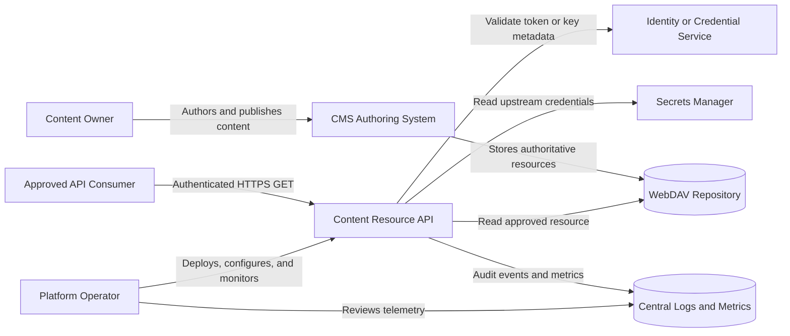
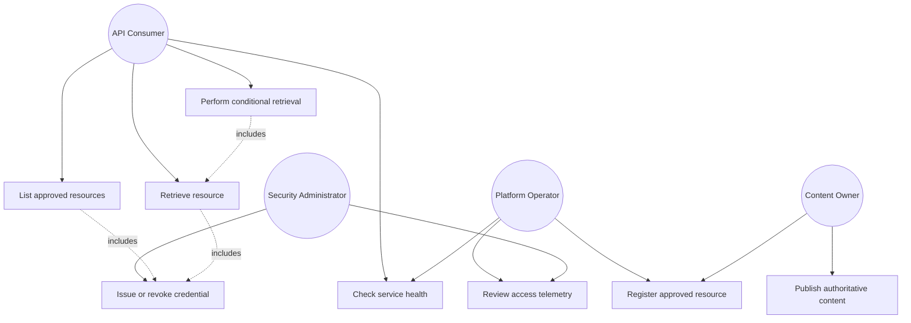
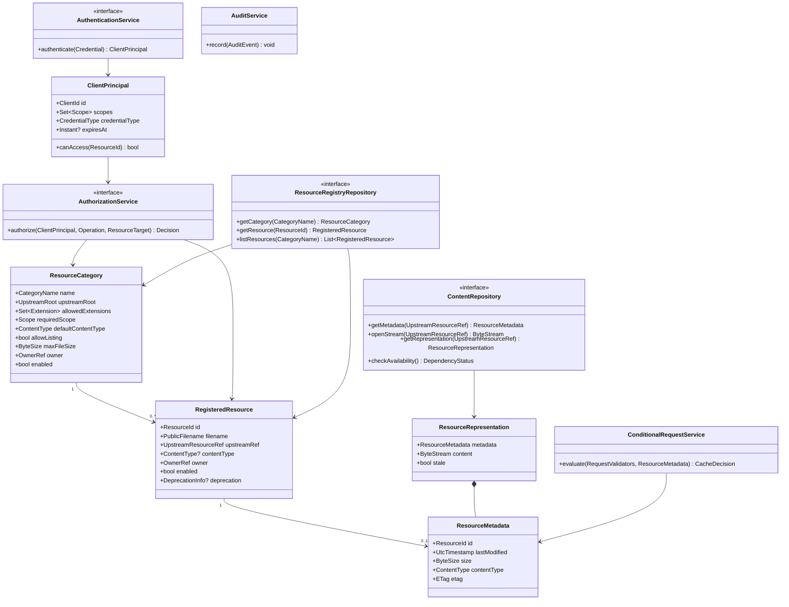
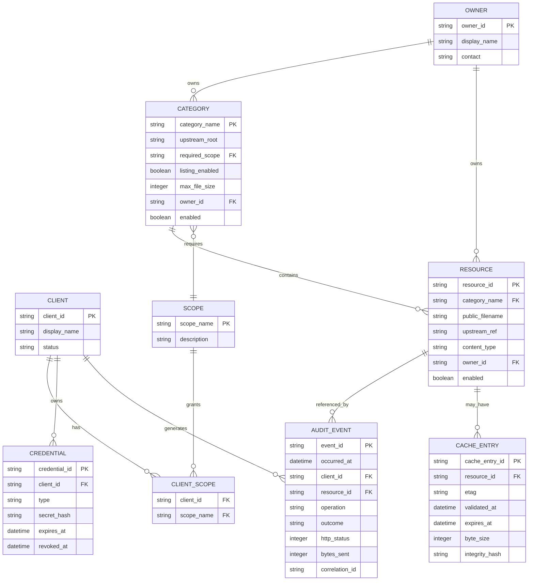
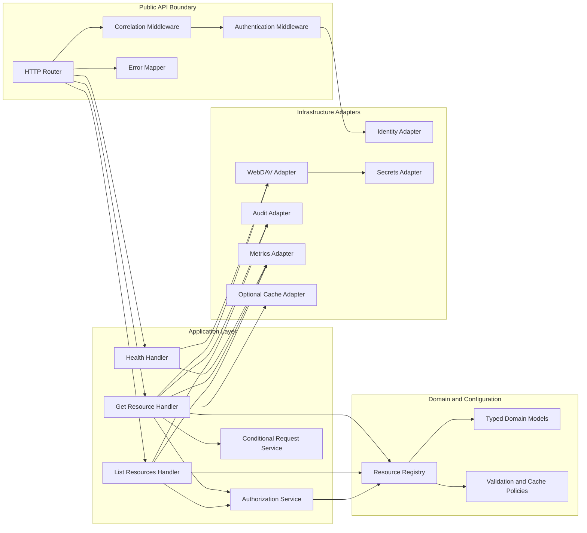
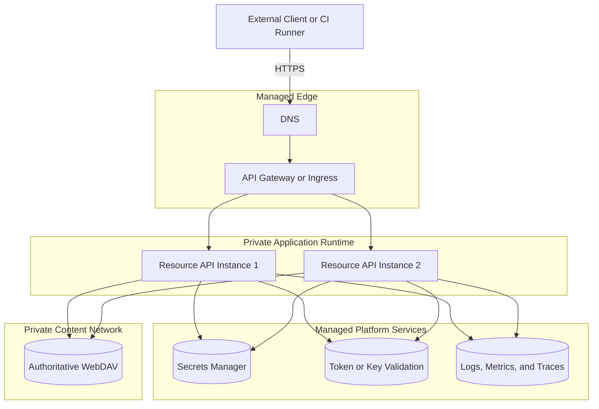
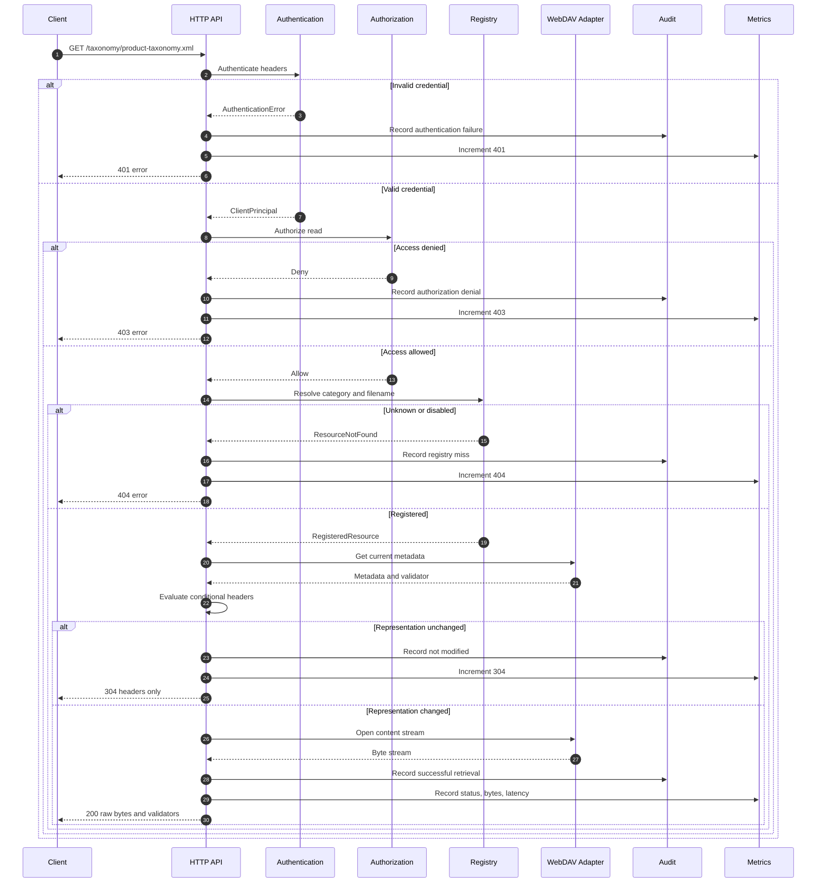
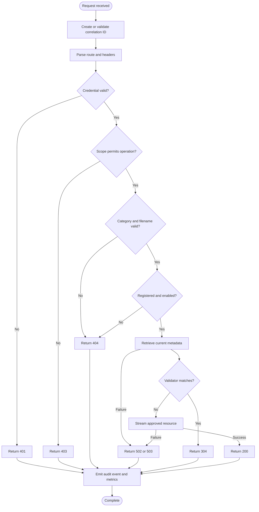
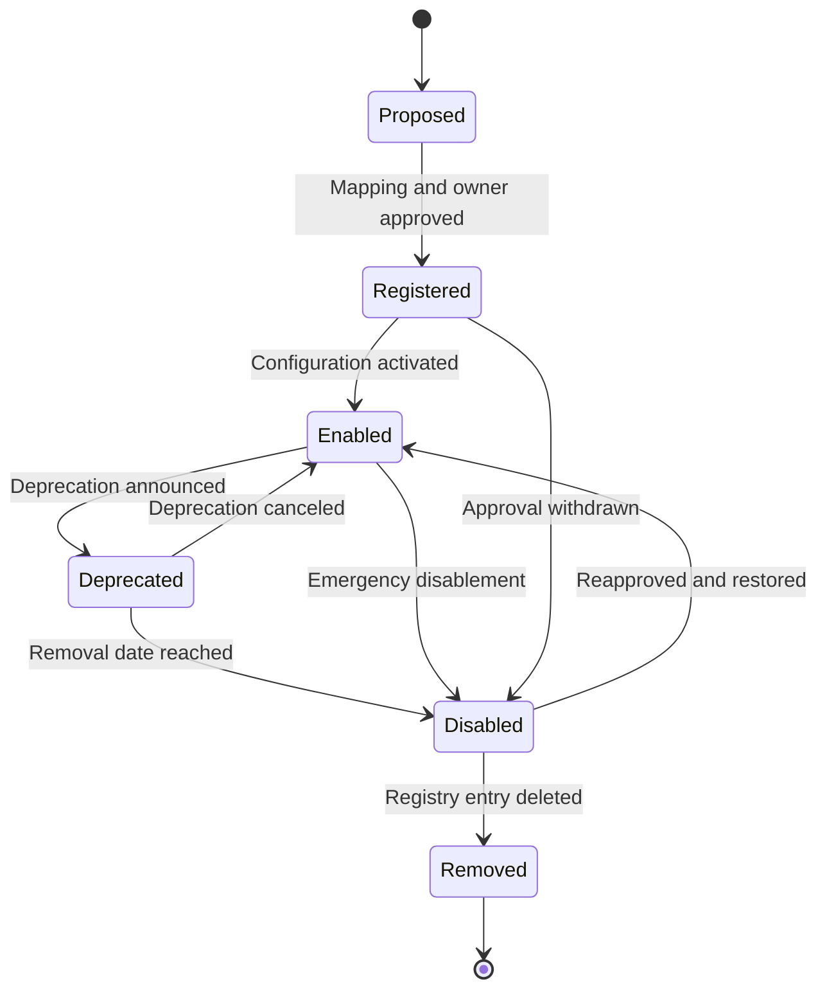

# Software Requirements Specification

## Scoped Content Resource Middleware API

**Document status:** Draft
**API name:** Content Resource API
**API version:** v1
**Specification style:** IEEE 830-derived
**Last updated:** July 17, 2026

---

# 1. Introduction

## 1.1 Purpose

This Software Requirements Specification defines the functional, interface, data, security, operational, and quality requirements for the Content Resource API.

The Content Resource API is a lightweight, read-only middleware service that provides authenticated machine access to approved content resources stored in an internal WebDAV repository. The service exposes selected Schematron rules, taxonomy files, and future approved resource categories without exposing WebDAV credentials, repository paths, directory-browsing capabilities, or content-management operations.

This specification is based on the provided problem analysis and draft endpoint design.

## 1.2 Scope

The system provides:

* Authenticated HTTP `GET` endpoints.
* Authorization by client scope and approved resource.
* Listing of approved resources when listing is enabled.
* Retrieval of raw resource bytes.
* Conditional request support through `ETag` and `Last-Modified`.
* Safe translation from public resource identifiers to private WebDAV objects.
* Structured audit logging and operational metrics.
* Separate liveness and readiness health checks.
* Consistent error responses.
* Environment-specific configuration.

The first release does not provide:

* Content creation, editing, deletion, renaming, or moving.
* Arbitrary WebDAV path access.
* General repository browsing.
* Resource search.
* Content transformation.
* Historical version retrieval unless a historical version is registered as a distinct public resource.
* A graphical user interface.
* Consumer self-service credential provisioning.
* CMS or WebDAV administration.

## 1.3 Intended Audience

This specification is intended for:

* API developers.
* Platform engineers.
* Security engineers.
* Quality-assurance engineers.
* Site reliability engineers.
* Content owners.
* API consumers.
* Technical writers.
* Architecture and governance reviewers.

## 1.4 Definitions and Acronyms

| Term                       | Definition                                                                                          |
| -------------------------- | --------------------------------------------------------------------------------------------------- |
| API                        | Application programming interface.                                                                  |
| API key                    | A client credential supplied through the `X-API-Key` request header.                                |
| Audit event                | A structured record of a security-relevant or resource-access operation.                            |
| Bearer token               | An OAuth 2.0 access token supplied through the `Authorization` header.                              |
| Category                   | A public resource grouping, such as `schematron` or `taxonomy`.                                     |
| Client                     | A script, build pipeline, service, or approved integration that calls the API.                      |
| Conditional request        | An HTTP request that uses a validator such as `If-None-Match` or `If-Modified-Since`.               |
| Content owner              | The person or team accountable for a published resource.                                            |
| ETag                       | An HTTP entity tag that identifies a specific representation of a resource.                         |
| Last-known-good cache      | An optional governed cache that may serve a previously verified resource during an upstream outage. |
| Public resource identifier | The category and filename used in the public API contract.                                          |
| Registry                   | Configuration that maps approved public resources to private upstream objects.                      |
| Resource                   | A file that the API is authorized to list or return.                                                |
| Scope                      | An authorization permission associated with a credential.                                           |
| Schematron                 | An XML-based rule language used to validate structured documents.                                   |
| WebDAV                     | The internal protocol and repository used as the authoritative content source.                      |

## 1.5 Document Conventions

The terms **must**, **must not**, **should**, and **may** indicate requirement strength:

* **Must** and **must not** identify mandatory behavior.
* **Should** identifies recommended behavior that requires justification when omitted.
* **May** identifies optional behavior.

Each normative requirement has a stable identifier in the form `REQ-nnn`.

## 1.6 References

The design assumes compatibility with these standards and conventions:

* HTTP semantics and conditional requests.
* OAuth 2.0 bearer-token usage.
* JSON data interchange.
* RFC 3339 timestamps in UTC.
* MIME media types.
* OpenAPI 3.x for machine-readable API documentation.
* Organization-approved security, secrets-management, logging, and retention policies.

---

# 2. Overall Description

## 2.1 Product Perspective

The Content Resource API is an anti-corruption layer between machine consumers and an internal WebDAV repository.

Consumers interact with a small, versioned HTTP contract. The middleware handles authentication, authorization, resource resolution, upstream communication, conditional request evaluation, error translation, logging, and metrics.

WebDAV remains the authoritative source. The CMS remains the content-authoring and governance interface.

### Context Diagram

**Purpose and coverage:** This diagram shows the system boundary, primary actors, external dependencies, and the direction of resource access. It excludes implementation details inside the middleware.



## 2.2 Business Objectives

The system must:

1. Reduce the permissions granted to machine consumers.
2. Remove direct client dependency on WebDAV.
3. provide stable, documented resource URLs.
4. Centralize authentication and authorization.
5. Record resource-level access.
6. support efficient polling through HTTP caching.
7. Preserve the CMS and WebDAV repository as the source of truth.
8. Maintain a small operational and security footprint.

## 2.3 Product Functions

The system performs these primary functions:

* Authenticate every protected request.
* Resolve the caller’s client identity and scopes.
* Authorize category-level or resource-level access.
* List registered resources in an authorized category.
* Retrieve a registered resource from WebDAV.
* Stream resource bytes without transformation.
* Generate or propagate HTTP validators.
* Return `304 Not Modified` for unchanged resources.
* Translate upstream failures into safe public errors.
* Emit audit events, metrics, and correlation identifiers.
* Report process liveness and service readiness.

## 2.4 User Classes and Characteristics

### 2.4.1 Integration Developer

An integration developer configures scripts, validation tools, or pipelines to retrieve resources. The developer requires stable URLs, predictable authentication, clear errors, and standard HTTP caching.

### 2.4.2 Automated Client

An automated client calls the API without interactive input. It must securely store credentials, handle retryable failures, honor cache validators, and process raw XML or JSON content.

### 2.4.3 Content Owner

A content owner manages resources through the existing CMS process. The owner approves publication, naming, compatibility, replacement, and removal.

### 2.4.4 Platform Operator

A platform operator deploys, configures, monitors, and troubleshoots the service. The operator manages environment configuration, upstream connectivity, secrets, dashboards, and alerts.

### 2.4.5 Security Administrator

A security administrator governs credential issuance, scopes, expiration, rotation, revocation, access reviews, log access, and incident response.

## 2.5 Operating Environment

The expected operating environment includes:

* Python 3.12 or a later organization-supported release.
* FastAPI or an equivalent standards-compliant ASGI framework.
* An ASGI application server.
* Linux-based containers or equivalent managed runtime.
* An organization-managed ingress controller or API gateway.
* HTTPS termination.
* An internal WebDAV endpoint.
* A secrets manager.
* Centralized logs and metrics.
* Distinct test, staging, and production configurations.

## 2.6 Constraints

* The service is read-only.
* WebDAV remains authoritative.
* Public requests must not contain arbitrary repository paths.
* Each category maps to a fixed upstream root.
* Each public resource must be explicitly approved.
* Each environment has separate configuration and credentials.
* The middleware uses a dedicated read-only WebDAV identity.
* Credentials and private repository paths must not appear in public responses or logs.
* The first release has no graphical interface.
* API v1 must remain backward compatible according to the approved compatibility policy.

## 2.7 Assumptions and Dependencies

### Assumptions

* Existing infrastructure can issue API keys, validate OAuth 2.0 access tokens, or support both.
* The WebDAV repository exposes file bytes and sufficient metadata for cache validation.
* Published resources have identifiable owners.
* Resource names can be represented as safe URL path segments.
* Consumers can use HTTPS and standard HTTP headers.
* XML and JSON files are returned without semantic transformation.

### Dependencies

* Identity or credential-validation infrastructure.
* Secrets-management infrastructure.
* WebDAV repository availability.
* Network connectivity from the API runtime to WebDAV.
* Centralized logging and metrics.
* Content-governance processes.
* Environment-specific DNS and TLS configuration.

## 2.8 Use Cases

### Use-Case Diagram

**Purpose and coverage:** This diagram summarizes user-visible API capabilities and administrative dependencies. It does not imply that content owners or security administrators use the runtime API directly.



## 2.9 Primary Use-Case Descriptions

### UC-001: List Approved Resources

**Actor:** API consumer
**Preconditions:**

* The caller has a valid credential.
* The caller has the required category scope.
* Listing is enabled for the category.

**Main flow:**

1. The caller submits a category-list request.
2. The API authenticates the credential.
3. The API authorizes access to the category.
4. The API reads registered resources for that category.
5. The API obtains current or cached metadata.
6. The API filters all results through the registry and authorization policy.
7. The API returns a JSON collection.

**Postconditions:**

* No unregistered resource is disclosed.
* An audit event records the operation.

### UC-002: Retrieve an Approved Resource

**Actor:** API consumer
**Preconditions:**

* The caller has a valid credential.
* The requested category and filename are registered.
* The caller has the required scope.

**Main flow:**

1. The caller requests a resource.
2. The API authenticates and authorizes the caller.
3. The API validates the category and filename.
4. The API resolves the resource through the registry.
5. The API retrieves the file and metadata from WebDAV.
6. The API returns the original resource bytes and cache headers.
7. The API records an audit event.

**Alternative flows:**

* Invalid credential: return `401`.
* Insufficient scope: return `403`.
* Invalid or unregistered resource: return `404`.
* Unsupported or malformed filename: return `400` or `404` according to the security policy.
* Unavailable upstream: return `502` or `503`.
* Conditional request matches: return `304` without a body.

### UC-003: Conditional Retrieval

**Actor:** API consumer
**Preconditions:**

* The caller has a previously received `ETag` or `Last-Modified` value.

**Main flow:**

1. The caller supplies `If-None-Match` or `If-Modified-Since`.
2. The API authenticates and authorizes the request.
3. The API resolves the resource.
4. The API evaluates the current representation validator.
5. The API returns `304` when the representation is unchanged.
6. Otherwise, the API returns `200` and the current representation.

---

# 3. System Features

## 3.1 API Versioning and Routing

**REQ-001:** The system must expose version 1 endpoints under `/api/resources/v1`.

**REQ-002:** The system must treat the public API version independently from the internal WebDAV path structure.

**REQ-003:** The system must not expose WebDAV hostnames, credentials, directory names, or repository-specific identifiers through public routes.

**REQ-004:** The system must reject unsupported HTTP methods on resource endpoints with `405 Method Not Allowed`.

**REQ-005:** The system must not implement public `POST`, `PUT`, `PATCH`, `DELETE`, `MOVE`, `COPY`, `PROPFIND`, or WebDAV authoring operations.

**REQ-006:** The system must provide these initial public operations:

* `GET /api/resources/v1/schematron`
* `GET /api/resources/v1/schematron/{filename}`
* `GET /api/resources/v1/taxonomy`
* `GET /api/resources/v1/taxonomy/{filename}`
* `GET /api/resources/v1/health/live`
* `GET /api/resources/v1/health/ready`

**REQ-007:** The system may provide `GET /api/resources/v1/health` as a compatibility alias, provided the response does not expose sensitive diagnostics.

## 3.2 Authentication

**REQ-008:** The system must authenticate every resource-list and resource-retrieval request.

**REQ-009:** The system must support at least one of these authentication mechanisms in the first release:

* API key in `X-API-Key`.
* OAuth 2.0 bearer token in `Authorization: Bearer <token>`.

**REQ-010:** When both mechanisms are enabled, the system must apply one deterministic precedence rule and document that rule.

**REQ-011:** The system must reject a request that supplies multiple conflicting credentials.

**REQ-012:** The system must return `401 Unauthorized` when credentials are missing, malformed, expired, revoked, or invalid.

**REQ-013:** A `401` response for bearer-token authentication must include a standards-compatible `WWW-Authenticate` header.

**REQ-014:** The system must resolve an authenticated credential to a stable public client identifier.

**REQ-015:** The system must not log API keys, bearer tokens, token signatures, or authorization headers.

**REQ-016:** The system must support credential revocation without requiring an application deployment.

**REQ-017:** The system must support credential expiration when the selected credential mechanism provides expiration.

**REQ-018:** Stored API-key verification material must be one-way hashed or protected by an equivalent organization-approved control.

**REQ-019:** Authentication failures must not reveal whether a particular client identifier exists.

## 3.3 Authorization

**REQ-020:** The system must authorize each protected request after successful authentication and before contacting WebDAV.

**REQ-021:** The system must support category-level authorization scopes.

**REQ-022:** The system must support resource-level restrictions when category-level authorization is insufficient.

**REQ-023:** The initial category scopes must be:

* `resources:schematron:read`
* `resources:taxonomy:read`

**REQ-024:** Listing a category must require the same category scope as retrieving a resource from that category, unless a stricter listing scope is configured.

**REQ-025:** The system must return `403 Forbidden` when an authenticated caller lacks the required permission.

**REQ-026:** The system must not disclose private upstream path information in a `403` response.

**REQ-027:** The system must apply authorization to both listings and downloads.

**REQ-028:** The system must filter each listing result through the caller’s effective authorization policy.

**REQ-029:** The system must use deny-by-default authorization for unknown categories, resources, clients, and scopes.

## 3.4 Resource Registry

**REQ-030:** The system must resolve public resources through an explicit registry.

**REQ-031:** The system must not construct an upstream WebDAV URL by directly concatenating untrusted route values.

**REQ-032:** Each registered category must define:

* Public category name.
* Fixed upstream root.
* Allowed filename extensions.
* Required authorization scope.
* Default media type.
* Whether listing is allowed.
* Maximum file size.
* Owning team or contact.
* Enabled or disabled status.

**REQ-033:** Each explicitly registered resource must define:

* Public filename.
* Category.
* Upstream object identifier or safe relative object name.
* Media type or media-type resolution rule.
* Owner.
* Enabled or disabled status.
* Optional compatibility or deprecation metadata.

**REQ-034:** Registry configuration must be validated before the service reports readiness.

**REQ-035:** The registry must reject duplicate public identifiers within the same category.

**REQ-036:** The registry must reject upstream mappings that resolve outside the configured category root.

**REQ-037:** The system must not expose disabled resources.

**REQ-038:** Registry changes must be auditable through configuration history, deployment history, or an equivalent controlled mechanism.

**REQ-039:** Adding a new category must require explicit configuration and design review.

**REQ-040:** The system must not provide a generic catch-all category or arbitrary path endpoint.

## 3.5 Filename and Path Validation

**REQ-041:** The system must treat `{filename}` as one filename, not as a relative or absolute path.

**REQ-042:** The system must reject filenames containing `/`, `\`, null bytes, or platform-specific path separators.

**REQ-043:** The system must reject `.` and `..` as filenames.

**REQ-044:** The system must reject percent-encoded or double-encoded traversal sequences.

**REQ-045:** The system must reject filenames that exceed the configured maximum length.

**REQ-046:** The system must compare filename extensions case-insensitively unless a category explicitly requires case-sensitive behavior.

**REQ-047:** The system must reject filenames with extensions not approved for the category.

**REQ-048:** The system must not convert an invalid filename into a valid resource through path normalization.

**REQ-049:** The system must perform registry lookup after syntactic validation.

**REQ-050:** A filename that is syntactically valid but not registered must produce `404 Not Found`.

**REQ-051:** Security-sensitive validation failures may produce `404` rather than `400` when required to limit resource enumeration.

## 3.6 Resource Listing

**REQ-052:** The system must support listing for the initial `schematron` and `taxonomy` categories unless listing is disabled by approved configuration.

**REQ-053:** A category-list response must use `application/json`.

**REQ-054:** A category-list response must include a top-level `resources` array.

**REQ-055:** Each listed resource must include:

* `name`.
* `path`.
* `lastModified`.
* `size`.
* `contentType`.

**REQ-056:** Each returned `path` must be a public API-relative path and must not be an upstream path.

**REQ-057:** `lastModified` must use an RFC 3339 UTC timestamp when available.

**REQ-058:** `size` must represent the resource size in bytes.

**REQ-059:** The system must return an empty `resources` array when the caller is authorized for a category that contains no visible resources.

**REQ-060:** The system must return `404` when the category is unknown or disabled.

**REQ-061:** The system must return `403` when the category exists but the caller cannot list it.

**REQ-062:** The system must document whether listing metadata is retrieved live, cached, or read from the registry.

**REQ-063:** The system must not guarantee that listing metadata remains unchanged between listing and retrieval.

**REQ-064:** The system must apply a deterministic resource ordering.

**REQ-065:** The default ordering must be ascending by public filename.

## 3.7 Resource Retrieval

**REQ-066:** The system must retrieve only resources that resolve through the approved registry.

**REQ-067:** The system must use server-managed WebDAV credentials rather than caller-supplied WebDAV credentials.

**REQ-068:** The upstream WebDAV identity must be read-only.

**REQ-069:** The upstream WebDAV identity must be restricted to approved published-resource roots where the repository supports such restrictions.

**REQ-070:** The system must return the source file bytes without modification.

**REQ-071:** The system must not reformat XML or JSON content.

**REQ-072:** The system must stream resource content when the implementation can do so without compromising conditional-request evaluation.

**REQ-073:** The system must enforce a configurable maximum file size before or during transfer.

**REQ-074:** The system must stop an upstream transfer that exceeds the configured maximum file size.

**REQ-075:** A successful retrieval must return `200 OK`.

**REQ-076:** A successful retrieval must include an accurate `Content-Type`.

**REQ-077:** A successful retrieval should include `Content-Length` when known before response streaming.

**REQ-078:** A successful retrieval must include `ETag`, `Last-Modified`, and `Cache-Control` when the necessary metadata is available.

**REQ-079:** The system must return `404` when the approved resource no longer exists upstream, unless an approved last-known-good policy applies.

**REQ-080:** The system must not return partial resource content as a successful `200` response when upstream retrieval fails.

**REQ-081:** The system must close or discard an interrupted upstream response safely.

## 3.8 Content-Type Resolution

**REQ-082:** Schematron `.sch` resources must default to `application/xml` unless a more specific approved media type is configured.

**REQ-083:** Taxonomy `.xml` resources must return `application/xml` unless the registry specifies a more precise XML media type.

**REQ-084:** Taxonomy `.json` resources must return `application/json`.

**REQ-085:** The system must not trust an arbitrary upstream media type without validating it against the category or resource configuration.

**REQ-086:** The system must use `application/octet-stream` only when the resource is approved but no safer configured media type exists.

## 3.9 Conditional Requests and Caching

**REQ-087:** The system must support `If-None-Match`.

**REQ-088:** The system must support `If-Modified-Since`.

**REQ-089:** The system must evaluate `If-None-Match` before `If-Modified-Since` when both headers are present.

**REQ-090:** The system must return `304 Not Modified` when the current representation matches the supplied validator.

**REQ-091:** A `304` response must not include a message body.

**REQ-092:** A `304` response must include the applicable cache validators and cache-control headers.

**REQ-093:** The system must use a stable `ETag` strategy for unchanged bytes.

**REQ-094:** The system must change the `ETag` when the returned resource bytes change.

**REQ-095:** An `ETag` may be based on an upstream validator, a cryptographic content hash, or approved composite metadata.

**REQ-096:** The selected `ETag` algorithm must be documented and tested for replacement, deletion, and same-name updates.

**REQ-097:** The system must not return `304` solely because a stale middleware cache matches the caller’s validator when the cache is no longer valid under policy.

**REQ-098:** The system must define `Cache-Control` by category or resource.

**REQ-099:** The default cache policy must permit revalidation and must not imply immutability for mutable filenames.

**REQ-100:** The system must preserve correctness when a resource is replaced with different bytes but the same filename.

**REQ-101:** The system must define behavior for upstream metadata with timestamps of insufficient precision.

**REQ-102:** The system must treat `ETag` as the preferred validator when timestamp precision could produce ambiguity.

## 3.10 Upstream WebDAV Integration

**REQ-103:** The system must encapsulate WebDAV behavior behind an upstream repository interface.

**REQ-104:** The WebDAV adapter must support metadata retrieval and content streaming.

**REQ-105:** The WebDAV adapter must use configurable connection and response timeouts.

**REQ-106:** The WebDAV adapter must use bounded retries only for operations classified as transient and safe to retry.

**REQ-107:** The WebDAV adapter must not retry authentication or authorization failures indefinitely.

**REQ-108:** The WebDAV adapter must use connection pooling when supported.

**REQ-109:** The system must map upstream not-found results to public `404` only after the request passes authentication, authorization, validation, and registry resolution.

**REQ-110:** The system must map upstream protocol or gateway failures to `502 Bad Gateway` when the upstream returns an invalid or failed response.

**REQ-111:** The system must map upstream unavailability or timeout conditions to `503 Service Unavailable` when temporary unavailability is the appropriate interpretation.

**REQ-112:** Retryable `503` responses should include `Retry-After` when the system can estimate a safe retry interval.

**REQ-113:** The system must not expose upstream response bodies directly to clients when those bodies may contain internal information.

**REQ-114:** The system must record an upstream result classification for every attempted upstream call.

## 3.11 Last-Known-Good Cache

The last-known-good cache is optional and requires a governance decision before implementation.

**REQ-115:** The system must not serve stale content during an upstream outage unless a last-known-good policy is explicitly approved and enabled.

**REQ-116:** When enabled, the last-known-good policy must define:

* Eligible categories or resources.
* Maximum stale age.
* Integrity-verification method.
* Cache storage and encryption controls.
* Deletion behavior.
* Response headers.
* Audit fields.
* Operator override and invalidation procedures.

**REQ-117:** A stale response must include a machine-readable indicator that stale content was served.

**REQ-118:** The system must not represent stale content as freshly validated against the upstream repository.

**REQ-119:** The system must not serve a cached resource after its approved stale lifetime expires.

**REQ-120:** Security revocation or registry disablement must override last-known-good availability.

## 3.12 Health Checks

**REQ-121:** The system must provide a liveness endpoint.

**REQ-122:** The liveness endpoint must indicate whether the API process can handle requests.

**REQ-123:** The liveness endpoint must not require successful WebDAV connectivity.

**REQ-124:** The system must provide a readiness endpoint.

**REQ-125:** The readiness endpoint must verify that required configuration is valid and required secrets are available.

**REQ-126:** Readiness must incorporate upstream dependency status according to the deployment platform’s approved readiness policy.

**REQ-127:** Health responses must not expose secrets, private paths, internal hostnames, software patch versions, or stack traces.

**REQ-128:** A healthy response must use `200 OK`.

**REQ-129:** An unhealthy readiness response must use `503 Service Unavailable`.

**REQ-130:** Health endpoints may be exempt from client authentication when network controls and response minimization provide sufficient protection.

## 3.13 Audit Logging

**REQ-131:** The system must emit a structured audit event for every authenticated resource-list and resource-retrieval request.

**REQ-132:** The system must emit a structured security event for authentication and authorization failures.

**REQ-133:** Each audit event must include:

* Event timestamp.
* Correlation identifier.
* Public client identifier when known.
* Authentication mechanism.
* Public category.
* Public filename when applicable.
* Operation.
* Authorization result.
* HTTP status.
* Transferred byte count.
* Total request latency.
* Upstream latency when applicable.
* Upstream result classification.
* Cache outcome.
* Deployment environment.

**REQ-134:** Audit events must use public resource identifiers rather than private WebDAV paths.

**REQ-135:** Logs must redact credentials and sensitive headers.

**REQ-136:** Logging failure must not cause a successful resource response to include sensitive diagnostic information.

**REQ-137:** The system must provide a defined response when mandatory audit delivery is unavailable.

**REQ-138:** Audit retention and access controls must follow organizational policy.

**REQ-139:** Audit timestamps must use UTC.

**REQ-140:** The system must make correlation identifiers available to clients in a response header.

## 3.14 Metrics and Monitoring

**REQ-141:** The system must record request counts by endpoint category, status class, and operation.

**REQ-142:** The system must record request latency.

**REQ-143:** The system must record upstream latency.

**REQ-144:** The system must record upstream failures by classification.

**REQ-145:** The system must record response bytes.

**REQ-146:** The system must record conditional-request outcomes.

**REQ-147:** The system must record authentication and authorization failures without recording credential values.

**REQ-148:** Metrics must not use unbounded filename, token, or client values as labels.

**REQ-149:** The production deployment must define alerts for sustained readiness failure, elevated upstream errors, elevated authorization failures, and abnormal latency.

## 3.15 Correlation and Traceability

**REQ-150:** The system must assign a unique correlation identifier to each request when a valid identifier is not supplied.

**REQ-151:** The system must validate any caller-supplied correlation identifier before using it.

**REQ-152:** The system must return the effective correlation identifier through `X-Correlation-ID`.

**REQ-153:** The system must include the correlation identifier in logs and safe error bodies.

**REQ-154:** The system should propagate the correlation identifier to approved upstream diagnostic headers when doing so does not expose it to an untrusted system.

## 3.16 Rate and Resource Controls

**REQ-155:** The system must enforce bounded upstream concurrency.

**REQ-156:** The system must enforce configurable request-header size limits.

**REQ-157:** The system must enforce configurable filename-length limits.

**REQ-158:** The system must enforce configurable file-size limits.

**REQ-159:** The system must enforce configurable upstream timeouts.

**REQ-160:** Client-specific rate limits must not be enabled without measured usage data and an approved policy.

**REQ-161:** When rate limiting is enabled, the system must return `429 Too Many Requests`.

**REQ-162:** A `429` response should include `Retry-After`.

## 3.17 API Documentation

**REQ-163:** The system must publish an OpenAPI 3.x description for public endpoints.

**REQ-164:** The OpenAPI description must document authentication schemes, scopes, response headers, content types, errors, and conditional requests.

**REQ-165:** Public documentation must include examples for listing, retrieval, and conditional retrieval.

**REQ-166:** Public documentation must not include valid credentials, private upstream URLs, or production secrets.

---

# 4. External Interface Requirements

## 4.1 User Interfaces

The first release has no graphical user interface.

All consumer interactions occur through HTTP. Operational dashboards, secrets-management interfaces, CMS interfaces, and identity-management interfaces are external systems and are not part of this product.

**REQ-167:** The first release must not require a browser-based GUI for normal consumer use.

**REQ-168:** All supported consumer functions must be accessible through documented HTTP requests.

## 4.2 API Endpoint Summary

| Method | Path                                      | Authentication    | Success response   |
| ------ | ----------------------------------------- | ----------------- | ------------------ |
| `GET`  | `/api/resources/v1/schematron`            | Required          | JSON resource list |
| `GET`  | `/api/resources/v1/schematron/{filename}` | Required          | Raw resource bytes |
| `GET`  | `/api/resources/v1/taxonomy`              | Required          | JSON resource list |
| `GET`  | `/api/resources/v1/taxonomy/{filename}`   | Required          | Raw resource bytes |
| `GET`  | `/api/resources/v1/health/live`           | Deployment policy | Liveness JSON      |
| `GET`  | `/api/resources/v1/health/ready`          | Deployment policy | Readiness JSON     |

## 4.3 Authentication Headers

### API Key

```http
X-API-Key: <api-key>
```

### OAuth 2.0 Bearer Token

```http
Authorization: Bearer <access-token>
```

**REQ-169:** The service must transmit credentials only over HTTPS outside approved local development environments.

**REQ-170:** The service must reject credentials supplied through query-string parameters.

## 4.4 Conditional Request Headers

Supported request headers:

```http
If-None-Match: "<etag>"
If-Modified-Since: Wed, 15 Jul 2026 09:00:00 GMT
```

Supported response headers:

```http
ETag: "<etag>"
Last-Modified: Wed, 15 Jul 2026 09:00:00 GMT
Cache-Control: public, max-age=0, must-revalidate
X-Correlation-ID: <identifier>
```

The actual `Cache-Control` value is configurable by approved resource policy.

## 4.5 Listing Response Contract

### Example

```json
{
  "resources": [
    {
      "name": "product-taxonomy.xml",
      "path": "/taxonomy/product-taxonomy.xml",
      "lastModified": "2026-07-15T09:00:00Z",
      "size": 45200,
      "contentType": "application/xml"
    }
  ]
}
```

### JSON Schema

```json
{
  "$schema": "https://json-schema.org/draft/2020-12/schema",
  "$id": "https://example.invalid/schemas/resource-list.json",
  "title": "ResourceList",
  "type": "object",
  "additionalProperties": false,
  "required": ["resources"],
  "properties": {
    "resources": {
      "type": "array",
      "items": {
        "$ref": "#/$defs/resourceMetadata"
      }
    }
  },
  "$defs": {
    "resourceMetadata": {
      "type": "object",
      "additionalProperties": false,
      "required": [
        "name",
        "path",
        "lastModified",
        "size",
        "contentType"
      ],
      "properties": {
        "name": {
          "type": "string",
          "minLength": 1,
          "maxLength": 255
        },
        "path": {
          "type": "string",
          "pattern": "^/[a-z][a-z0-9-]*/[^/]+$"
        },
        "lastModified": {
          "type": "string",
          "format": "date-time"
        },
        "size": {
          "type": "integer",
          "minimum": 0
        },
        "contentType": {
          "type": "string",
          "minLength": 1
        }
      }
    }
  }
}
```

## 4.6 Resource Retrieval Contract

A successful resource-retrieval response consists of raw source bytes.

### XML Example

```http
HTTP/1.1 200 OK
Content-Type: application/xml
Content-Length: 45200
ETag: "sha256-cfd9..."
Last-Modified: Wed, 15 Jul 2026 09:00:00 GMT
Cache-Control: public, max-age=0, must-revalidate
X-Correlation-ID: 2a8345b3-dae1-485f-b6c3-98d862828eab

<?xml version="1.0" encoding="UTF-8"?>
...
```

### Conditional Response Example

```http
HTTP/1.1 304 Not Modified
ETag: "sha256-cfd9..."
Last-Modified: Wed, 15 Jul 2026 09:00:00 GMT
Cache-Control: public, max-age=0, must-revalidate
X-Correlation-ID: 2a8345b3-dae1-485f-b6c3-98d862828eab
```

## 4.7 Error Response Contract

### Example

```json
{
  "error": {
    "code": "RESOURCE_NOT_FOUND",
    "message": "The requested resource was not found.",
    "correlationId": "2a8345b3-dae1-485f-b6c3-98d862828eab"
  }
}
```

### JSON Schema

```json
{
  "$schema": "https://json-schema.org/draft/2020-12/schema",
  "$id": "https://example.invalid/schemas/error-response.json",
  "title": "ErrorResponse",
  "type": "object",
  "additionalProperties": false,
  "required": ["error"],
  "properties": {
    "error": {
      "type": "object",
      "additionalProperties": false,
      "required": ["code", "message", "correlationId"],
      "properties": {
        "code": {
          "type": "string",
          "pattern": "^[A-Z][A-Z0-9_]*$"
        },
        "message": {
          "type": "string",
          "minLength": 1
        },
        "correlationId": {
          "type": "string",
          "minLength": 1,
          "maxLength": 128
        }
      }
    }
  }
}
```

### Error Mapping

| Status | Code                      | Condition                                                                               |
| -----: | ------------------------- | --------------------------------------------------------------------------------------- |
|  `400` | `INVALID_REQUEST`         | Request syntax or a non-sensitive input is invalid.                                     |
|  `401` | `AUTHENTICATION_REQUIRED` | No valid credential was supplied.                                                       |
|  `403` | `ACCESS_DENIED`           | The authenticated client lacks permission.                                              |
|  `404` | `RESOURCE_NOT_FOUND`      | The category or resource is unknown, disabled, unavailable, or intentionally concealed. |
|  `405` | `METHOD_NOT_ALLOWED`      | The HTTP method is unsupported.                                                         |
|  `413` | `RESOURCE_TOO_LARGE`      | The approved resource exceeds the permitted size.                                       |
|  `429` | `RATE_LIMITED`            | An enabled client limit was exceeded.                                                   |
|  `502` | `UPSTREAM_FAILURE`        | WebDAV returned an invalid or failed response.                                          |
|  `503` | `SERVICE_UNAVAILABLE`     | The API or required upstream dependency is temporarily unavailable.                     |
|  `500` | `INTERNAL_ERROR`          | An unexpected internal error occurred.                                                  |

**REQ-171:** All JSON error responses must conform to the error-response contract.

**REQ-172:** Error messages must be safe for external clients.

**REQ-173:** Error responses must not contain stack traces.

**REQ-174:** Error responses must not contain upstream credentials, internal URLs, private paths, or raw upstream bodies.

## 4.8 Health Response Contract

### Liveness

```json
{
  "status": "ok"
}
```

### Readiness

```json
{
  "status": "ok",
  "upstream": "available"
}
```

An unavailable readiness response may be:

```json
{
  "status": "unavailable",
  "upstream": "unavailable"
}
```

**REQ-175:** Health response values must come from a fixed documented enumeration.

## 4.9 WebDAV Interface

The middleware communicates with WebDAV through an internal adapter.

The adapter contract must support:

```text
get_metadata(resource_ref) -> ResourceMetadata
open_stream(resource_ref) -> AsyncByteStream
get_resource(resource_ref) -> ResourceRepresentation
check_availability() -> DependencyStatus
```

**REQ-176:** The application layer must not depend on WebDAV-specific response objects outside the adapter boundary.

**REQ-177:** The adapter must translate WebDAV errors into domain-level upstream errors.

## 4.10 Identity Interface

The authentication interface must return:

```text
authenticate(credential) -> AuthenticatedPrincipal
```

`AuthenticatedPrincipal` must contain:

* Stable client identifier.
* Credential type.
* Effective scopes.
* Expiration when available.
* Optional resource restrictions.
* Authentication context safe for auditing.

**REQ-178:** Business logic must not parse raw bearer-token claims or API-key records outside the authentication component.

## 4.11 Logging and Metrics Interfaces

The service must use structured, machine-readable telemetry interfaces.

**REQ-179:** Audit events must have a versioned schema.

**REQ-180:** Metrics export must use an organization-supported protocol or collector.

---

# 5. Nonfunctional Requirements

## 5.1 Security

**REQ-181:** All production client traffic must use TLS.

**REQ-182:** The service must reject plaintext production traffic or rely on an approved ingress layer that enforces HTTPS.

**REQ-183:** WebDAV credentials must be stored in a secrets manager or injected as protected runtime secrets.

**REQ-184:** Secrets must not be stored in source code or registry configuration.

**REQ-185:** The system must support secret rotation without changing the public API contract.

**REQ-186:** The application process must run with the minimum required operating-system and network privileges.

**REQ-187:** The service must use a dedicated read-only upstream identity.

**REQ-188:** The deployment must restrict outbound network access to approved dependencies where platform controls support it.

**REQ-189:** The system must validate all untrusted input at the HTTP boundary.

**REQ-190:** The system must enforce authorization before upstream access.

**REQ-191:** The system must be tested against directory traversal, encoded traversal, header injection, log injection, oversized input, and credential leakage.

**REQ-192:** Dependencies must be scanned and patched according to organizational vulnerability-management policy.

**REQ-193:** Production error handling must disable interactive debug output.

**REQ-194:** The service must not include secrets in traces, crash reports, or telemetry.

## 5.2 Performance

The following targets apply under the approved reference workload and exclude client-network latency.

**REQ-195:** The service must add no more than 100 milliseconds at the 95th percentile to a successful retrieval when upstream metadata and content are immediately available.

**REQ-196:** The service must complete a registry-only rejection, such as an unknown resource, within 100 milliseconds at the 95th percentile.

**REQ-197:** The service must complete a valid `304` response within 250 milliseconds at the 95th percentile when the validator can be evaluated without downloading full content.

**REQ-198:** The service must stream the first response byte within 500 milliseconds at the 95th percentile when WebDAV begins responding within the configured upstream target.

**REQ-199:** Performance targets must be validated using representative XML and JSON resource sizes.

## 5.3 Capacity and Scalability

**REQ-200:** The service must remain stateless with respect to consumer sessions.

**REQ-201:** Multiple service instances must be able to process requests concurrently without shared in-memory session state.

**REQ-202:** The deployment must support horizontal scaling.

**REQ-203:** Capacity testing must cover the expected peak request rate plus an approved safety margin.

**REQ-204:** The service must stream large responses to avoid loading every resource fully into memory.

**REQ-205:** The application must place an upper bound on per-request memory consumption.

## 5.4 Availability and Reliability

**REQ-206:** The production service must meet an agreed monthly availability objective, excluding approved maintenance.

**REQ-207:** The initial target should be at least 99.9% monthly API availability, subject to stakeholder approval.

**REQ-208:** The service must fail closed when authentication or authorization dependencies cannot establish a valid decision.

**REQ-209:** The service must not return corrupted or incomplete bytes as a successful response.

**REQ-210:** The service must detect and report upstream timeouts.

**REQ-211:** Retries must use bounded attempts and backoff.

**REQ-212:** The system must avoid retry storms during WebDAV outages.

**REQ-213:** Deployment updates must support rollback.

**REQ-214:** Configuration changes must be validated before production activation.

## 5.5 Maintainability

**REQ-215:** The implementation must separate HTTP, application, domain, security, repository, configuration, and telemetry concerns.

**REQ-216:** Domain and application tests must run without a live WebDAV service.

**REQ-217:** The WebDAV adapter must be replaceable without changing the public API contract.

**REQ-218:** The authentication implementation must be replaceable behind a stable interface.

**REQ-219:** Every production requirement must map to one or more automated or documented verification methods.

**REQ-220:** The codebase must use static type checking according to the project standard.

**REQ-221:** Public functions, models, and error types must use consistent terminology from this specification.

## 5.6 Testability

**REQ-222:** The system must provide deterministic test doubles for authentication and WebDAV.

**REQ-223:** Tests must cover successful listing, retrieval, and conditional retrieval.

**REQ-224:** Tests must cover invalid credentials, expired credentials, revoked credentials, and insufficient scopes.

**REQ-225:** Tests must cover plain, encoded, and double-encoded traversal attempts.

**REQ-226:** Tests must cover resource replacement, deletion, and same-name content changes.

**REQ-227:** Tests must cover WebDAV timeout, connection failure, malformed response, and partial transfer.

**REQ-228:** Tests must verify that logs and errors contain no credential values.

**REQ-229:** Tests must verify that disabled and unregistered resources are not disclosed.

## 5.7 Observability

**REQ-230:** Operators must be able to distinguish authentication failures, authorization failures, registry misses, upstream failures, and internal failures through telemetry.

**REQ-231:** Operators must be able to identify active consumers by public client identifier.

**REQ-232:** Operators must be able to determine which public resources are actively consumed.

**REQ-233:** Telemetry must support deprecation-impact analysis without exposing sensitive data.

## 5.8 Portability

**REQ-234:** Configuration must be external to the application package.

**REQ-235:** Environment differences must be represented through configuration rather than conditional source-code branches.

**REQ-236:** The service must not depend on a local persistent filesystem unless an approved cache design requires it.

## 5.9 Accessibility

No end-user graphical interface is included in the first release. Accessibility requirements apply to generated public documentation.

**REQ-237:** Human-readable API documentation must use clear headings, text alternatives for meaningful diagrams where the publication platform requires them, and keyboard-accessible navigation.

## 5.10 Privacy

**REQ-238:** The service must collect only the client and request metadata needed for security, operations, and governance.

**REQ-239:** The service must not log resource file contents by default.

**REQ-240:** Audit retention must have a documented purpose and retention period.

## 5.11 Compatibility

**REQ-241:** Existing v1 routes, field names, status semantics, and authentication expectations must not change incompatibly without an approved versioning process.

**REQ-242:** Adding optional response fields must not require existing clients to change.

**REQ-243:** Removing a resource must follow the approved ownership and deprecation policy.

**REQ-244:** Mutable resources that can introduce downstream incompatibility should use versioned filenames or an equivalent compatibility mechanism.

---

# 6. Domain Model

## 6.1 Domain Concepts

### Entities

| Entity               | Identity                                  | Responsibility                                                         |
| -------------------- | ----------------------------------------- | ---------------------------------------------------------------------- |
| `ClientPrincipal`    | Client ID                                 | Represents an authenticated machine consumer and its effective access. |
| `ResourceCategory`   | Category name                             | Defines category policy, upstream root, scopes, formats, and limits.   |
| `RegisteredResource` | Category plus public filename             | Defines an approved public-to-upstream mapping.                        |
| `CredentialRecord`   | Credential ID                             | Represents revocable API-key metadata when API keys are used.          |
| `AuditEvent`         | Event ID                                  | Records access and security outcomes.                                  |
| `CacheEntry`         | Resource ID plus representation validator | Represents optional validated cached content.                          |

### Value Objects

| Value object          | Invariants                                                          |
| --------------------- | ------------------------------------------------------------------- |
| `PublicFilename`      | Nonempty, within length limit, no path separators, not `.` or `..`. |
| `CategoryName`        | Lowercase public identifier from the approved registry.             |
| `ResourceId`          | Unique combination of category and public filename.                 |
| `UpstreamResourceRef` | Resolves under one approved category root.                          |
| `Scope`               | Registered authorization string.                                    |
| `ETag`                | Valid HTTP entity-tag value.                                        |
| `ContentType`         | Approved media type.                                                |
| `CorrelationId`       | Valid bounded identifier safe for logs and headers.                 |
| `UtcTimestamp`        | UTC timestamp with documented precision.                            |
| `ByteSize`            | Integer greater than or equal to zero.                              |

### Domain Services

| Service                     | Responsibility                                         |
| --------------------------- | ------------------------------------------------------ |
| `AuthenticationService`     | Converts a credential into an authenticated principal. |
| `AuthorizationService`      | Decides whether a principal may perform an operation.  |
| `ResourceResolutionService` | Resolves a public identifier through the registry.     |
| `ConditionalRequestService` | Evaluates request validators against a representation. |
| `ContentTypeService`        | Resolves and validates response media types.           |
| `AuditService`              | Creates and submits structured audit events.           |
| `HealthService`             | Evaluates liveness and readiness.                      |

### Repositories and Interfaces

| Interface                    | Responsibility                                            |
| ---------------------------- | --------------------------------------------------------- |
| `ResourceRegistryRepository` | Returns category and resource registrations.              |
| `ContentRepository`          | Returns metadata and bytes from the authoritative source. |
| `CredentialRepository`       | Retrieves API-key verification metadata when applicable.  |
| `CacheRepository`            | Stores and retrieves optional validated cache entries.    |
| `AuditSink`                  | Accepts structured audit events.                          |
| `MetricsSink`                | Accepts operational measurements.                         |

### Commands

* `ListResources`
* `GetResource`
* `EvaluateHealth`
* `ReloadRegistry`
* `InvalidateCacheEntry`

### Events

* `ResourceListed`
* `ResourceRetrieved`
* `ResourceNotModified`
* `AuthenticationFailed`
* `AuthorizationDenied`
* `ResourceResolutionFailed`
* `UpstreamUnavailable`
* `UpstreamTransferFailed`
* `StaleResourceServed`
* `RegistryValidationFailed`

## 6.2 Class Diagram

**Purpose and coverage:** This diagram shows the object-oriented domain structure and principal contract boundaries. It focuses on runtime retrieval behavior and omits framework-specific request objects.



## 6.3 Entity-Relationship Diagram

**Purpose and coverage:** This logical ER diagram defines registry, credential, ownership, and audit relationships. It is implementation-neutral; configuration-backed records need not use a relational database.



## 6.4 Aggregate and Invariant Boundaries

### Resource Registry Aggregate

Aggregate root: `ResourceCategory`

Invariants:

1. A category name is unique.
2. The category root is fixed and approved.
3. Every resource belongs to exactly one category.
4. Every resource mapping remains under the category root.
5. Every enabled category has an owner.
6. Every enabled resource has an owner.
7. Every allowed extension maps to an approved content-type rule.
8. Duplicate public filenames are prohibited within a category.

### Client Access Aggregate

Aggregate root: `ClientPrincipal` or persistent `Client`

Invariants:

1. A revoked credential cannot authenticate.
2. An expired credential cannot authenticate.
3. A client receives no permission that is absent from its effective scopes and restrictions.
4. Unknown scopes grant no access.
5. Authentication and authorization decisions are auditable.

### Cached Representation Aggregate

Aggregate root: `CacheEntry`

Invariants:

1. Cached bytes match the stored integrity hash.
2. The `ETag` corresponds to the cached bytes.
3. A stale entry cannot be served beyond its approved stale lifetime.
4. A disabled or revoked resource invalidates cache eligibility.
5. A cache entry does not change the registry authorization decision.

---

# 7. Architecture and Design Constraints

## 7.1 Architectural Style

The system should use a layered, ports-and-adapters architecture.

Recommended layers:

1. **HTTP interface layer**

   * Route handling.
   * Header parsing.
   * Request validation.
   * Response serialization.

2. **Application layer**

   * Use-case orchestration.
   * Transaction and response flow.
   * Audit and metric coordination.

3. **Domain layer**

   * Resource identifiers.
   * Registry rules.
   * Authorization decisions.
   * Conditional-request semantics.
   * Domain errors.

4. **Infrastructure layer**

   * WebDAV adapter.
   * Token or API-key adapter.
   * Secrets adapter.
   * Registry configuration adapter.
   * Cache adapter.
   * Audit and metrics adapters.

## 7.2 Component Diagram

**Purpose and coverage:** This diagram shows runtime components and ownership boundaries. It highlights where public HTTP concerns end and infrastructure-specific concerns begin.



## 7.3 Deployment Diagram

**Purpose and coverage:** This diagram shows a production-oriented deployment with external ingress, horizontally scalable API instances, private dependencies, and centralized telemetry.



## 7.4 Retrieval Sequence

**Purpose and coverage:** This sequence shows authentication, authorization, registry resolution, conditional evaluation, retrieval, and audit behavior for a resource request.



## 7.5 Request Activity Flow

**Purpose and coverage:** This activity diagram defines the decision order. The order is security-sensitive because WebDAV must not be contacted before authentication, authorization, validation, and registry resolution.



## 7.6 Resource State Model

**Purpose and coverage:** This state diagram describes the externally relevant lifecycle of a registered resource. CMS authoring states are outside the middleware boundary.



## 7.7 Design Patterns

The following patterns clarify the design:

* **Adapter pattern:** Isolates WebDAV, identity, secrets, cache, audit, and metrics implementations.
* **Repository pattern:** Provides registry and content-access contracts.
* **Strategy pattern:** Supports multiple authentication and `ETag` strategies.
* **Policy object:** Encapsulates category authorization, validation, cache, and size rules.
* **Anti-corruption layer:** Prevents WebDAV protocol and path semantics from entering the public contract.
* **Dependency injection:** Allows deterministic testing and infrastructure replacement.

## 7.8 Architecture Constraints

**REQ-245:** Public route handlers must not access WebDAV directly.

**REQ-246:** Public route handlers must not access secrets directly.

**REQ-247:** Authorization decisions must use typed domain targets rather than raw upstream paths.

**REQ-248:** Infrastructure exceptions must be translated into domain or application errors before reaching the HTTP error mapper.

**REQ-249:** The registry must be immutable during an individual request.

**REQ-250:** A registry reload must be atomic from the perspective of concurrent requests.

**REQ-251:** The application must not use a general-purpose filesystem browser abstraction for public resource resolution.

---

# 8. Data and Validation Contracts

## 8.1 Typed Models

Illustrative Python-compatible models:

```python
from dataclasses import dataclass
from datetime import datetime
from enum import Enum
from typing import AsyncIterator, FrozenSet, NewType

ClientId = NewType("ClientId", str)
CategoryName = NewType("CategoryName", str)
PublicFilename = NewType("PublicFilename", str)
Scope = NewType("Scope", str)
CorrelationId = NewType("CorrelationId", str)


class CredentialType(str, Enum):
    API_KEY = "api_key"
    OAUTH_BEARER = "oauth_bearer"


@dataclass(frozen=True)
class ClientPrincipal:
    client_id: ClientId
    credential_type: CredentialType
    scopes: FrozenSet[Scope]
    expires_at: datetime | None = None


@dataclass(frozen=True)
class ResourceCategory:
    name: CategoryName
    upstream_root: str
    allowed_extensions: FrozenSet[str]
    required_scope: Scope
    default_content_type: str
    allow_listing: bool
    max_file_size: int
    owner: str
    enabled: bool


@dataclass(frozen=True)
class RegisteredResource:
    category: CategoryName
    filename: PublicFilename
    upstream_ref: str
    content_type: str | None
    owner: str
    enabled: bool


@dataclass(frozen=True)
class ResourceMetadata:
    filename: PublicFilename
    last_modified: datetime
    size: int
    content_type: str
    etag: str


@dataclass(frozen=True)
class ResourceRepresentation:
    metadata: ResourceMetadata
    content: AsyncIterator[bytes]
    stale: bool = False
```

## 8.2 Registry Schema

Illustrative configuration:

```yaml
version: 1

categories:
  schematron:
    upstreamRoot: /published/schematron
    requiredScope: resources:schematron:read
    allowedExtensions:
      - .sch
    defaultContentType: application/xml
    allowListing: true
    maxFileSizeBytes: 10485760
    owner: content-validation-team
    enabled: true
    resources:
      heretto-default.sch:
        upstreamObject: heretto-default.sch
        contentType: application/xml
        owner: content-validation-team
        enabled: true

  taxonomy:
    upstreamRoot: /published/taxonomy
    requiredScope: resources:taxonomy:read
    allowedExtensions:
      - .xml
      - .json
    defaultContentType: application/xml
    allowListing: true
    maxFileSizeBytes: 52428800
    owner: taxonomy-team
    enabled: true
    resources:
      product-taxonomy.xml:
        upstreamObject: product-taxonomy.xml
        contentType: application/xml
        owner: taxonomy-team
        enabled: true
```

## 8.3 Registry Validation

**REQ-252:** Registry validation must occur at startup and before any hot reload becomes active.

**REQ-253:** Registry validation must reject an unsupported schema version.

**REQ-254:** Registry validation must reject missing owners.

**REQ-255:** Registry validation must reject missing authorization scopes.

**REQ-256:** Registry validation must reject nonpositive maximum file sizes.

**REQ-257:** Registry validation must reject duplicate category names.

**REQ-258:** Registry validation must reject duplicate filenames within a category.

**REQ-259:** Registry validation must reject a resource extension that is absent from the category’s approved extensions.

**REQ-260:** Registry validation must reject an upstream reference that is absolute when only relative references are permitted.

**REQ-261:** Registry validation must reject any upstream reference that escapes its category root after canonical evaluation.

**REQ-262:** The service must not report readiness when mandatory registry validation fails.

## 8.4 Filename Contract

A valid public filename must satisfy all these invariants:

1. It is a Unicode string encoded through a valid URL path segment.
2. It contains at least one character.
3. Its decoded length does not exceed the configured limit.
4. It is not `.` or `..`.
5. It contains no `/`, `\`, or null character.
6. It contains no unresolved percent-encoded path separator or traversal token.
7. Its extension is approved for the category.
8. It resolves to an enabled registry entry.

Illustrative validation:

```python
from pathlib import PurePosixPath
from urllib.parse import unquote


class InvalidFilename(ValueError):
    pass


def validate_public_filename(
    raw_filename: str,
    *,
    allowed_extensions: frozenset[str],
    max_length: int = 255,
) -> str:
    decoded_once = unquote(raw_filename)
    decoded_twice = unquote(decoded_once)

    for candidate in {raw_filename, decoded_once, decoded_twice}:
        if not candidate or len(candidate) > max_length:
            raise InvalidFilename("Invalid filename length")

        if candidate in {".", ".."}:
            raise InvalidFilename("Invalid filename")

        if "/" in candidate or "\\" in candidate or "\x00" in candidate:
            raise InvalidFilename("Path syntax is not permitted")

        path = PurePosixPath(candidate)
        if path.name != candidate:
            raise InvalidFilename("Only a filename is permitted")

    suffix = PurePosixPath(decoded_twice).suffix.lower()
    if suffix not in allowed_extensions:
        raise InvalidFilename("Unsupported resource type")

    return decoded_twice
```

Validation does not grant access. Registry resolution and authorization remain mandatory.

## 8.5 Authentication Preconditions and Postconditions

### API-Key Authentication

**Preconditions:**

* Exactly one bounded `X-API-Key` value is present.
* TLS has been enforced by the service or trusted ingress.

**Postconditions on success:**

* A `ClientPrincipal` exists.
* The key is active, unexpired, and unrevoked.
* No raw key value leaves the authentication component.
* The authentication result is available for audit.

**Error states:**

* `MissingCredential`.
* `MalformedCredential`.
* `InvalidCredential`.
* `ExpiredCredential`.
* `RevokedCredential`.
* `CredentialServiceUnavailable`.

### OAuth Authentication

**Preconditions:**

* Exactly one syntactically valid bearer token is present.
* The expected issuer, audience, and signature policy are configured.

**Postconditions on success:**

* Signature and required claims are valid.
* Token timing constraints are valid.
* A stable client identifier is derived.
* Effective scopes are normalized to domain `Scope` values.

**Error states:**

* `MissingCredential`.
* `MalformedCredential`.
* `InvalidSignature`.
* `InvalidIssuer`.
* `InvalidAudience`.
* `ExpiredCredential`.
* `TokenNotYetValid`.
* `TokenValidationUnavailable`.

## 8.6 Authorization Contract

```text
authorize(
    principal: ClientPrincipal,
    operation: Operation,
    target: ResourceTarget
) -> AuthorizationDecision
```

### Preconditions

* Authentication succeeded.
* The target is syntactically valid.
* The target does not contain an upstream path.

### Postconditions

* `Allow` means all required category scopes and resource restrictions pass.
* `Deny` means no upstream request occurs.
* The decision contains a safe reason code for telemetry.
* The decision does not expose sensitive policy internals to the caller.

## 8.7 Content Repository Contract

```text
get_metadata(resource_ref) -> ResourceMetadata
open_stream(resource_ref) -> ByteStream
```

### Preconditions

* The reference originated from a validated registry entry.
* Authentication and authorization succeeded.
* The resource is enabled.

### Postconditions for `get_metadata`

* Returned metadata refers to the requested upstream object.
* Size is nonnegative.
* Timestamp is normalized to UTC.
* Media type conforms to the registry policy.
* The validator is suitable for conditional evaluation.

### Postconditions for `open_stream`

* Returned bytes are unchanged from the upstream object.
* The stream either completes successfully or reports a transfer failure.
* A partial failure cannot be reported as a complete success.

## 8.8 Conditional Request Contract

```text
evaluate(
    request_etags,
    if_modified_since,
    current_metadata
) -> Modified | NotModified
```

Rules:

1. Evaluate `If-None-Match` first.
2. Use weak or strong comparison according to the selected representation policy.
3. Evaluate `If-Modified-Since` only when `If-None-Match` is absent.
4. Ignore an invalid date header according to HTTP semantics rather than failing the request.
5. Return `NotModified` only when the current representation satisfies the validator.
6. A `NotModified` result produces `304` with no body.

## 8.9 Audit Event Schema

```json
{
  "schemaVersion": "1.0",
  "eventId": "55ed3453-7038-47e6-a157-62e678ad22bb",
  "occurredAt": "2026-07-17T18:21:44.125Z",
  "correlationId": "2a8345b3-dae1-485f-b6c3-98d862828eab",
  "environment": "production",
  "clientId": "taxonomy-build-pipeline",
  "credentialType": "api_key",
  "operation": "resource.retrieve",
  "category": "taxonomy",
  "resourceName": "product-taxonomy.xml",
  "authorizationResult": "allowed",
  "httpStatus": 200,
  "bytesTransferred": 45200,
  "requestLatencyMs": 184,
  "upstreamLatencyMs": 121,
  "upstreamResult": "success",
  "cacheOutcome": "modified"
}
```

**REQ-263:** Audit schema changes must preserve schema-version identification.

**REQ-264:** Optional audit fields must be omitted or explicitly null according to one documented convention.

**REQ-265:** Audit events must validate before submission to the audit sink.

## 8.10 Error-State Model

| Domain error                |    Public status | Retry expectation                                |
| --------------------------- | ---------------: | ------------------------------------------------ |
| `AuthenticationError`       |            `401` | Retry only with a corrected credential.          |
| `AuthorizationError`        |            `403` | Do not retry without changed permissions.        |
| `InvalidResourceIdentifier` |   `400` or `404` | Retry only with corrected input.                 |
| `ResourceNotRegistered`     |            `404` | Retry only after confirming the public contract. |
| `UpstreamResourceMissing`   |            `404` | Retry after content-owner or operator action.    |
| `ResourceTooLarge`          |            `413` | Do not retry unchanged request.                  |
| `UpstreamTimeout`           |            `503` | Retry with bounded backoff.                      |
| `UpstreamProtocolError`     |            `502` | Retry with bounded backoff when transient.       |
| `AuditUnavailable`          | Policy-dependent | Follow mandatory-audit policy.                   |
| `InternalError`             |            `500` | Retry cautiously and report the correlation ID.  |

---

# 9. Acceptance Criteria

## 9.1 Authentication and Authorization

**AC-001 — Valid API key**

* Given API-key authentication is enabled,
* and a caller supplies an active key with `resources:schematron:read`,
* when the caller requests an approved Schematron resource,
* then the service authenticates the client and continues to resource resolution.

Covers: `REQ-008`–`REQ-019`.

**AC-002 — Missing credential**

* Given a protected resource endpoint,
* when the caller supplies no supported credential,
* then the service returns `401`,
* and the response conforms to the error schema,
* and no WebDAV request occurs.

Covers: `REQ-008`, `REQ-012`, `REQ-171`.

**AC-003 — Revoked credential**

* Given a previously valid credential has been revoked,
* when the caller uses that credential,
* then the service returns `401` without requiring redeployment,
* and the raw credential does not appear in logs.

Covers: `REQ-015`, `REQ-016`.

**AC-004 — Insufficient scope**

* Given an authenticated client lacks `resources:taxonomy:read`,
* when the client requests `/taxonomy/product-taxonomy.xml`,
* then the service returns `403`,
* and no WebDAV request occurs.

Covers: `REQ-020`–`REQ-029`.

**AC-005 — Resource-level restriction**

* Given a client has category access but is restricted from one registered file,
* when the client requests that file,
* then the service denies access according to the configured concealment policy,
* and no upstream request occurs.

Covers: `REQ-022`, `REQ-028`, `REQ-029`.

## 9.2 Registry and Validation

**AC-006 — Registered resource retrieval**

* Given `product-taxonomy.xml` is enabled in the `taxonomy` registry,
* when an authorized client requests it,
* then the resolved upstream object matches the registered mapping,
* and the response does not disclose the upstream path.

Covers: `REQ-030`–`REQ-040`.

**AC-007 — Unknown resource**

* Given a syntactically valid filename is not registered,
* when an authorized client requests it,
* then the service returns `404`,
* and no arbitrary upstream lookup occurs.

Covers: `REQ-030`, `REQ-050`.

**AC-008 — Plain traversal attempt**

* When a caller requests a filename containing `../`,
* then the service rejects the request,
* and no WebDAV request occurs,
* and no private path appears in the response.

Covers: `REQ-041`–`REQ-051`.

**AC-009 — Encoded traversal attempt**

* When a caller supplies `%2e%2e%2f` or an equivalent encoded traversal sequence,
* then the service rejects the request before registry or WebDAV access.

Covers: `REQ-044`.

**AC-010 — Double-encoded traversal attempt**

* When a caller supplies a double-encoded path separator or traversal sequence,
* then the service rejects the request after bounded decoding checks,
* and no WebDAV request occurs.

Covers: `REQ-044`, `REQ-048`.

**AC-011 — Unsupported extension**

* Given the Schematron category allows only `.sch`,
* when a caller requests `rules.xml`,
* then the service rejects the request according to the configured safe-error policy.

Covers: `REQ-046`, `REQ-047`.

**AC-012 — Invalid registry root**

* Given a proposed registry entry resolves outside the category root,
* when configuration validation runs,
* then validation fails,
* and the service does not report readiness.

Covers: `REQ-036`, `REQ-252`–`REQ-262`.

## 9.3 Listing

**AC-013 — Schematron listing**

* Given two enabled Schematron resources are visible to the caller,
* when the caller requests `/schematron`,
* then the service returns `200`,
* and the JSON response contains exactly those two resources,
* and they are ordered by public filename.

Covers: `REQ-052`–`REQ-065`.

**AC-014 — Listing excludes disabled resources**

* Given one registered resource is disabled,
* when an authorized caller lists the category,
* then the disabled resource is absent.

Covers: `REQ-037`, `REQ-028`.

**AC-015 — Empty listing**

* Given an authorized category has no visible resources,
* when the caller lists it,
* then the service returns `200` with `{"resources":[]}`.

Covers: `REQ-059`.

**AC-016 — Listing metadata contract**

* When a nonempty list is returned,
* then each item contains `name`, `path`, `lastModified`, `size`, and `contentType`,
* and no item contains a WebDAV path.

Covers: `REQ-055`–`REQ-058`.

## 9.4 Retrieval and Content Integrity

**AC-017 — Raw XML retrieval**

* Given an approved XML resource,
* when an authorized client retrieves it,
* then the response bytes exactly match the upstream bytes,
* and the response uses `application/xml`.

Covers: `REQ-070`, `REQ-071`, `REQ-076`, `REQ-083`.

**AC-018 — JSON content type**

* Given an approved `.json` taxonomy resource,
* when it is retrieved,
* then the response uses `application/json`.

Covers: `REQ-084`.

**AC-019 — Large approved resource**

* Given an approved resource is below the configured size limit,
* when it is retrieved,
* then the service streams the content without loading the complete file into per-request memory.

Covers: `REQ-072`, `REQ-204`.

**AC-020 — Oversized resource**

* Given an upstream resource exceeds the category’s maximum size,
* when the caller requests it,
* then the service returns `413`,
* and it does not return partial content as `200`.

Covers: `REQ-073`, `REQ-074`, `REQ-080`.

**AC-021 — Interrupted upstream transfer**

* Given WebDAV disconnects after sending part of a resource,
* when the service processes the stream,
* then the service does not record a complete successful transfer,
* and the response is terminated or mapped according to the streaming-failure policy.

Covers: `REQ-080`, `REQ-081`, `REQ-209`.

## 9.5 Conditional Requests

**AC-022 — Matching ETag**

* Given a caller supplies the current `ETag` through `If-None-Match`,
* when the caller retrieves the resource,
* then the service returns `304`,
* and the response body is empty.

Covers: `REQ-087`–`REQ-092`.

**AC-023 — Changed content with same filename**

* Given a resource is replaced with different bytes under the same filename,
* when the caller supplies the previous `ETag`,
* then the service returns `200`,
* and the new `ETag` differs from the old `ETag`.

Covers: `REQ-093`–`REQ-100`.

**AC-024 — ETag precedence**

* Given both `If-None-Match` and `If-Modified-Since` are present,
* and the `ETag` indicates modification,
* when the date alone would indicate no modification,
* then the service follows the `ETag` result.

Covers: `REQ-089`.

**AC-025 — Last-Modified validation**

* Given no `If-None-Match` header is present,
* and `If-Modified-Since` is equal to or later than the current supported modification time,
* when the request is evaluated,
* then the service returns `304` according to HTTP date precision rules.

Covers: `REQ-088`, `REQ-101`, `REQ-102`.

## 9.6 Upstream Failure Behavior

**AC-026 — Upstream timeout**

* Given WebDAV does not respond before the configured timeout,
* when an approved resource is requested,
* then the service returns `503`,
* and records an upstream-timeout classification.

Covers: `REQ-105`, `REQ-111`, `REQ-114`.

**AC-027 — Invalid upstream response**

* Given WebDAV returns an invalid protocol response,
* when the API processes it,
* then the service returns `502`,
* and the client does not receive the raw upstream body.

Covers: `REQ-110`, `REQ-113`.

**AC-028 — Upstream missing resource**

* Given a resource remains registered but no longer exists upstream,
* when an authorized client requests it,
* then the service returns `404` unless an approved last-known-good policy applies,
* and an audit event identifies the upstream missing condition.

Covers: `REQ-079`, `REQ-109`.

**AC-029 — Bounded retry**

* Given a transient upstream failure,
* when retry is enabled,
* then the service performs no more than the configured maximum attempts,
* and applies the configured backoff.

Covers: `REQ-106`, `REQ-211`, `REQ-212`.

## 9.7 Health and Operations

**AC-030 — Liveness during WebDAV outage**

* Given the API process is healthy but WebDAV is unavailable,
* when the liveness endpoint is called,
* then it returns `200`.

Covers: `REQ-121`–`REQ-123`.

**AC-031 — Readiness during required dependency outage**

* Given WebDAV availability is required by the approved readiness policy,
* when WebDAV is unavailable,
* then readiness returns `503`.

Covers: `REQ-124`–`REQ-129`.

**AC-032 — Health information minimization**

* When any health endpoint is called,
* then the response contains no secret, private path, hostname, or software patch version.

Covers: `REQ-127`.

## 9.8 Audit and Telemetry

**AC-033 — Successful retrieval audit**

* When a resource retrieval succeeds,
* then one audit event includes the client ID, public resource ID, status, bytes, latency, upstream result, cache outcome, environment, and correlation ID.

Covers: `REQ-131`–`REQ-140`.

**AC-034 — Credential redaction**

* When authentication fails with a known test credential,
* then that credential value is absent from application logs, audit events, metrics, traces, and error responses.

Covers: `REQ-015`, `REQ-135`, `REQ-194`, `REQ-228`.

**AC-035 — Correlation ID propagation**

* Given no correlation identifier is supplied,
* when the API processes a request,
* then it creates an identifier,
* returns it through `X-Correlation-ID`,
* and includes the same identifier in the corresponding audit event.

Covers: `REQ-150`–`REQ-154`.

**AC-036 — Metrics label safety**

* When requests target many distinct filenames,
* then exported metrics do not create an unbounded label value for each filename.

Covers: `REQ-148`.

## 9.9 Read-Only Boundary

**AC-037 — Unsupported write method**

* When a caller sends `PUT`, `POST`, `PATCH`, or `DELETE` to a resource endpoint,
* then the service returns `405`,
* and no WebDAV write operation occurs.

Covers: `REQ-004`, `REQ-005`.

**AC-038 — No arbitrary browsing**

* When a caller requests a generic repository path or unconfigured category,
* then the service returns `404` or `405`,
* and no directory enumeration occurs.

Covers: `REQ-039`, `REQ-040`.

## 9.10 Performance and Reliability

**AC-039 — Registry rejection latency**

* Under the reference workload,
* when an authenticated caller requests an unknown resource,
* then at least 95% of responses complete within 100 milliseconds, excluding client-network latency.

Covers: `REQ-196`.

**AC-040 — Conditional-request latency**

* Under the reference workload,
* when the validator can be evaluated from metadata,
* then at least 95% of `304` responses complete within 250 milliseconds.

Covers: `REQ-197`.

**AC-041 — Horizontal scaling**

* Given two or more API instances,
* when requests are distributed across them,
* then callers receive consistent authorization, registry, and representation behavior without session affinity.

Covers: `REQ-200`–`REQ-203`.

## 9.11 Acceptance Traceability Summary

| Acceptance area       | Primary requirements                     |
| --------------------- | ---------------------------------------- |
| Authentication        | `REQ-008`–`REQ-019`                      |
| Authorization         | `REQ-020`–`REQ-029`                      |
| Registry              | `REQ-030`–`REQ-040`, `REQ-252`–`REQ-262` |
| Path security         | `REQ-041`–`REQ-051`                      |
| Listings              | `REQ-052`–`REQ-065`                      |
| Retrieval             | `REQ-066`–`REQ-086`                      |
| Caching               | `REQ-087`–`REQ-102`                      |
| WebDAV integration    | `REQ-103`–`REQ-114`                      |
| Last-known-good cache | `REQ-115`–`REQ-120`                      |
| Health                | `REQ-121`–`REQ-130`                      |
| Audit and metrics     | `REQ-131`–`REQ-154`                      |
| Resource controls     | `REQ-155`–`REQ-162`                      |
| External contracts    | `REQ-163`–`REQ-180`                      |
| Nonfunctional quality | `REQ-181`–`REQ-244`                      |
| Architecture          | `REQ-245`–`REQ-251`                      |

---

# 10. Open Questions

## 10.1 Authentication and Authorization

1. Will the first release support API keys, OAuth 2.0 bearer tokens, or both?
2. When both credential types are supplied, should the service reject the request or use one documented precedence rule?
3. Which system issues, rotates, expires, and revokes API keys?
4. Which OAuth issuer, audience, signing algorithms, and scope claims are approved?
5. Is category-level authorization sufficient for v1?
6. Which consumers require individual-file restrictions?
7. Should unauthorized registered resources return `403` or a concealed `404`?
8. Are listing and retrieval permissions identical?

## 10.2 Resource Registry and Governance

9. Will the registry be stored in version-controlled configuration, a database, or a configuration service?
10. Must every resource be explicitly registered, or may a category safely expose all files under a tightly controlled published root?
11. Who approves new categories?
12. Who owns each Schematron and taxonomy resource?
13. What naming rules apply to public filenames?
14. Can public filenames change after release?
15. What deprecation period is required before removal?
16. Should deprecated resources appear with deprecation metadata in listing responses?
17. Are versioned filenames required for breaking taxonomy or rule changes?

## 10.3 Caching

18. Will `ETag` values use upstream metadata, content hashes, or composite values?
19. Does WebDAV provide validators that remain stable when bytes do not change?
20. What `Cache-Control` policy applies to mutable filenames?
21. Is a last-known-good cache permitted?
22. Which resources may be served stale?
23. What is the maximum stale age?
24. How must clients identify a stale response?
25. Does deleting a resource immediately invalidate cached content?

## 10.4 Availability and Performance

26. What monthly availability objective is approved?
27. What request rate and concurrency must the first release support?
28. What are the expected median, 95th percentile, and maximum resource sizes?
29. What upstream timeout values are appropriate?
30. How many retries are safe during WebDAV failures?
31. Should readiness fail whenever WebDAV is unavailable?
32. Does the deployment require multi-zone redundancy?

## 10.5 Listing Semantics

33. Are category-list endpoints required for all clients?
34. Should listing metadata come from live WebDAV calls or registry-maintained metadata?
35. Is pagination required for future categories?
36. Should listings include version, checksum, owner, or deprecation fields?
37. Should the service conceal the existence of categories from unauthorized clients?

## 10.6 Error Semantics

38. Should malformed filenames return `400` or a concealed `404`?
39. Should an upstream timeout return `502` or `503` under the organization’s API conventions?
40. Is `500` retained only for unexpected internal failures?
41. Must retryable errors include `Retry-After`?
42. What happens when the mandatory audit sink is unavailable?

## 10.7 Security and Operations

43. Can the WebDAV service account be restricted to dedicated published-resource roots?
44. Which secrets manager must the service use?
45. Which log platform, metrics platform, and tracing platform are required?
46. What is the audit retention period?
47. Who may access client-level resource-access logs?
48. Are per-client rate limits required at launch?
49. Which ingress or API-gateway controls are mandatory?
50. Is mutual TLS required between any components?

## 10.8 Alternative Architecture Decision

51. Has the organization compared live WebDAV proxying with publishing approved immutable artifacts to object storage?
52. If object storage is selected later, must the API contract remain unchanged?
53. What maximum publication delay is acceptable between CMS approval and consumer availability?
54. Is live retrieval from WebDAV a hard requirement or only the current implementation preference?

## 10.9 Release Decisions Required Before Implementation

The following decisions block production implementation:

1. Authentication mechanism.
2. Authorization granularity.
3. Registry storage and ownership model.
4. `ETag` algorithm.
5. Cache and stale-content policy.
6. Maximum resource size.
7. WebDAV timeout and retry policy.
8. Error mapping for upstream failures.
9. Audit-sink failure policy.
10. Compatibility and deprecation policy.
11. Availability and performance service objectives.
12. Choice between live WebDAV proxying and a publication-to-object-storage architecture.
