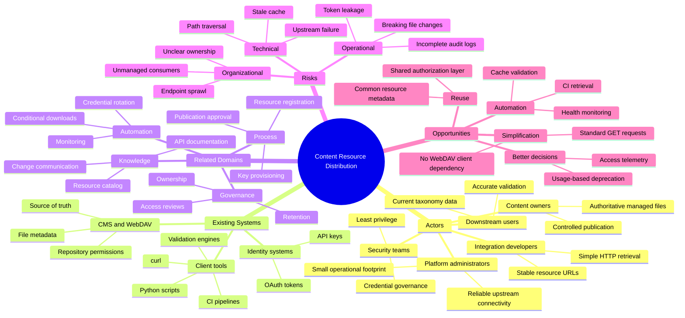
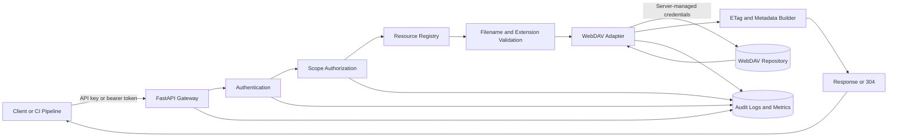
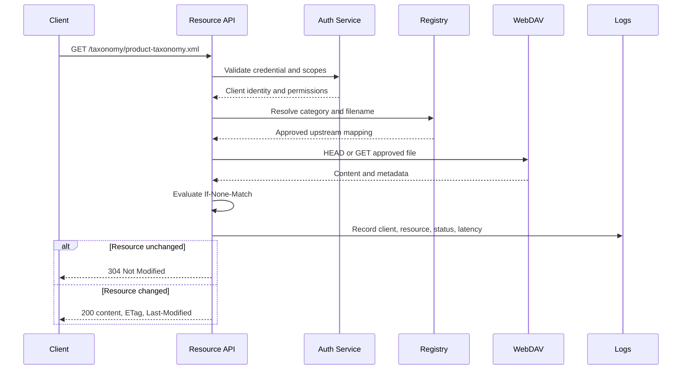

# Scoped Content Resource Middleware API

## 1. Problem

The source material proposes a lightweight, read-only middleware API that exposes selected Schematron rules and taxonomy files without granting clients direct access to the underlying WebDAV repository. The intended API uses authenticated `GET` endpoints, path-level access controls, conditional caching, and centralized audit logs.  

### Working Assumptions

* The WebDAV repository remains the authoritative source for Schematron, taxonomy, and related content resources.
* External scripts, CI/CD pipelines, and approved integrations need machine-readable access but do not need authoring or general repository browsing.
* The first release should remain read-only and expose only explicitly configured resource categories and paths.
* Each environment, such as test, staging, and production, has a distinct API base URL and upstream WebDAV configuration.
* Existing authentication infrastructure can issue API keys or validate OAuth 2.0 bearer tokens.
* The implementation should favor a small operational footprint over a general-purpose content-management API.

### Five Whys Analysis

1. **Why?** Integrations cannot reliably retrieve shared validation and taxonomy files through a simple, supported interface.
2. **Why?** The files currently reside behind WebDAV access patterns designed primarily for interactive tools and repository-level access.
3. **Why?** Direct WebDAV credentials expose a broader surface than individual clients require and create unnecessary client dependencies.
4. **Why?** Access control is tied too closely to the storage protocol rather than to specific resources and integration use cases.
5. **Why?** The system lacks a narrow service boundary between internal content storage and external machine consumers.

### Condensed Problem Analysis

The central problem is not merely that clients need to download files. The problem is that the existing access boundary is defined by the capabilities of WebDAV rather than by the minimum permissions required by each integration. Clients that need one taxonomy or validation rule may otherwise require credentials, tooling, or repository visibility that exceeds their legitimate purpose.

This creates security, support, and operational friction. It also makes it difficult to provide stable URLs, record resource-level access, apply consistent caching, and change the underlying storage mechanism without affecting every consumer.

A thin middleware service would establish a controlled contract between the repository and its machine consumers. The service should expose only approved resources while leaving content creation, version management, and repository administration in the existing CMS and WebDAV systems.

### Problem Statement

The system of interest is the distribution path from CMS-managed resources in WebDAV to scripts, build systems, validation tools, and other approved integrations. The current path creates friction because consumers depend on storage-level authentication and potentially broad repository access. This affects integration developers, platform administrators, security teams, content owners, and downstream users whose workflows depend on current validation and taxonomy resources. Without a scoped interface, the organization will continue to accept unnecessary access risk, inconsistent client implementations, weak resource-level observability, and increasing coupling to WebDAV.

## 2. Context



### Context Analysis

Several actors have different incentives. Integration developers value stable endpoints and low-friction authentication. Security teams value least privilege, traceable access, and revocable credentials. Content owners want files to remain under established CMS governance. Platform administrators want to avoid operating a second content-management system. The proposed middleware works only if it preserves this division of responsibility.

The existing WebDAV repository is both a storage system and an access mechanism. Those concerns should be separated. WebDAV can remain the upstream source while the middleware becomes the supported machine-consumption boundary. This creates an anti-corruption layer: clients use a small resource-oriented contract while internal storage paths, credentials, and protocol details remain hidden.

The workflow must account for more than file transfer. Resources need owners, approved public API names, allowed file types, predictable content types, and rules for removal or replacement. A technically secure endpoint can still fail operationally if a file changes without notice or if nobody owns compatibility with downstream consumers.

Authentication and authorization are separate concerns. Authentication establishes which client is making the request. Authorization determines which categories, files, or path prefixes that client may retrieve. API keys may be sufficient for controlled service integrations, while OAuth bearer tokens may fit environments that already have centralized identity and token issuance.

Caching is important because validation and taxonomy resources may be polled repeatedly while changing infrequently. `ETag`, `Last-Modified`, `If-None-Match`, and `If-Modified-Since` reduce upstream load and unnecessary transfers. Cache behavior must still preserve correctness when files change or are replaced.

Observability should focus on resource consumption rather than only server health. The service should record the client identity, requested resource, response status, transferred bytes, latency, upstream result, and correlation identifier. These records support security investigations, capacity planning, deprecation decisions, and identification of active consumers.

## 3. Solution

### Proposed Solution

Create a small, stateless, read-only Content Resource API that authenticates each request, authorizes access against an explicit resource registry, retrieves approved files from WebDAV using server-managed credentials, and returns either resource metadata or raw file content.

The initial API should expose:

* `GET /api/resources/v1/schematron`
* `GET /api/resources/v1/schematron/{filename}`
* `GET /api/resources/v1/taxonomy`
* `GET /api/resources/v1/taxonomy/{filename}`
* `GET /api/resources/v1/health`

The middleware must not accept arbitrary repository paths. Each resource category should map to a fixed upstream root, allowed file extensions, content-type rules, and authorization scope. This preserves the deliberately small surface described in the draft endpoint design. 

A Python service built with FastAPI is suitable because the problem is primarily an authenticated HTTP gateway with configuration, upstream file retrieval, structured logging, and straightforward testing. The API should remain independent of any graphical interface during the first release.

### Solution Principles

* **Least privilege:** Grant each client access only to named categories or resources required by its integration.
* **Explicit mapping:** Resolve API resource identifiers through a registry rather than accepting arbitrary upstream paths.
* **Read-only by design:** Keep content creation, editing, and deletion in the CMS.
* **Storage abstraction:** Hide WebDAV paths, credentials, and protocol behavior from consumers.
* **Stable contracts:** Version the API independently from internal repository organization.
* **Cache correctness:** Support standard HTTP validators without allowing caches to conceal updates.
* **Operational visibility:** Log resource-level access and upstream failures using consistent identifiers.

### Expected Benefits

* Consumers can retrieve resources with ordinary HTTP clients such as `curl`, Python `requests`, and CI/CD runners.
* The WebDAV repository and its broader directory structure remain inaccessible to external clients.
* Credentials can be scoped, rotated, revoked, and audited per integration.
* Resource access becomes visible through structured logs and metrics.
* Conditional requests reduce bandwidth and load on the upstream repository.
* Internal storage paths can change without forcing updates to every client.
* New categories such as DITAVAL files or templates can be added without creating a general CRUD API.

### Tradeoffs

* The middleware becomes another production service that requires monitoring, patching, deployment, and ownership.
* API keys are operationally simple but require strong storage, rotation, and revocation practices.
* A resource registry adds administration work but is necessary to prevent unrestricted path access.
* Stable endpoints can create compatibility obligations when resource names or formats change.
* Caching improves efficiency but adds complexity around validators, deletion, and upstream inconsistency.
* A thin service avoids unnecessary features, but consumers may later request search, version history, or bulk retrieval that should not be added without revisiting the scope.

## 4. Implementation

### Implementation Overview

Implement the service in phases, beginning with a fixed registry of Schematron and taxonomy resources. Use FastAPI for request handling, a WebDAV adapter for upstream access, and middleware components for authentication, authorization, request tracing, error normalization, and structured logging.

Configuration should define categories rather than arbitrary routes. Each category should include its public name, upstream root, allowed extensions, default content type, authorization scope, and whether listing is permitted. The service should validate every filename before constructing an upstream request.

### Suggested Architecture or Workflow





### Implementation Steps

1. **Define the service contract.** Confirm endpoint names, supported resource categories, filename rules, authentication method, authorization scopes, error schema, response headers, and compatibility expectations.

2. **Create the resource registry.** Map each public category to a fixed WebDAV root, allowed extensions, content types, listing behavior, and required access scope. Store configuration outside application code where practical.

3. **Build the upstream adapter.** Implement WebDAV connection pooling, timeouts, metadata retrieval, streaming downloads, error translation, and safe credential handling.

4. **Implement authentication and authorization.** Validate API keys or bearer tokens on every protected request and enforce category- or resource-level scopes before contacting WebDAV.

5. **Add HTTP cache support.** Generate or propagate stable `ETag` values, return `Last-Modified`, evaluate conditional request headers, and return `304 Not Modified` when appropriate.

6. **Add validation and security controls.** Reject path separators, encoded traversal sequences, unsupported extensions, oversized filenames, unknown categories, and requests that do not resolve to a registered resource.

7. **Add observability.** Emit structured audit events, request metrics, upstream latency, error counts, cache-validation results, and correlation identifiers. Redact all credentials.

8. **Test the security boundary.** Include unit and integration tests for traversal attempts, encoded filenames, scope failures, deleted resources, upstream outages, cache behavior, and credential revocation.

9. **Deploy to a nonproduction environment.** Validate the API with representative `curl`, Python, and CI clients against test copies of the real files.

10. **Pilot with one integration.** Measure retrieval reliability, upstream load, authorization behavior, and support burden before enabling additional clients or resource categories.

### Technical Notes

* Use Python 3.12 or a currently supported organizational standard.
* Use FastAPI with Pydantic settings and an ASGI server such as Uvicorn or Gunicorn with Uvicorn workers.
* Keep WebDAV credentials in a secrets manager or environment-injected secret, never in the resource registry or source repository.
* Prefer streamed responses for file retrieval so the API does not load large resources fully into memory.
* Canonicalize and validate filenames before lookup, but do not normalize arbitrary user-provided paths into acceptable ones.
* Use a registry lookup such as `(category, filename) -> upstream object` instead of concatenating request values into a WebDAV URL.
* Return a consistent JSON error body containing an error code, safe message, and correlation identifier.
* Consider `503 Service Unavailable` or `502 Bad Gateway` for upstream failures rather than treating every WebDAV problem as an internal `500`.
* Protect the health endpoint from disclosing repository paths, credentials, versions, or other sensitive diagnostics.
* Separate liveness from readiness:

  * Liveness confirms the API process is running.
  * Readiness confirms required configuration is loaded and, where appropriate, the upstream dependency is usable.
* Add rate limits per client only after expected request patterns are measured; avoid arbitrary limits that disrupt CI polling.
* Treat listed metadata such as size and modification time as potentially stale between listing and download.
* Define a maximum file size and upstream timeout to prevent resource exhaustion.
* Preserve the source file bytes unless the API contract explicitly requires transformation.
* The problem-to-solution method recommends Python for APIs and backend file processing and Mermaid diagrams where they clarify system behavior; those choices fit this implementation. 

A minimal registry model could resemble:

```python
from dataclasses import dataclass
from pathlib import PurePosixPath
from typing import FrozenSet


@dataclass(frozen=True)
class ResourceCategory:
    name: str
    upstream_root: PurePosixPath
    allowed_extensions: FrozenSet[str]
    required_scope: str
    default_content_type: str
    allow_listing: bool = True


RESOURCE_CATEGORIES = {
    "schematron": ResourceCategory(
        name="schematron",
        upstream_root=PurePosixPath("/published/schematron"),
        allowed_extensions=frozenset({".sch"}),
        required_scope="resources:schematron:read",
        default_content_type="application/xml",
    ),
    "taxonomy": ResourceCategory(
        name="taxonomy",
        upstream_root=PurePosixPath("/published/taxonomy"),
        allowed_extensions=frozenset({".xml", ".json"}),
        required_scope="resources:taxonomy:read",
        default_content_type="application/xml",
    ),
}


def validate_filename(filename: str, category: ResourceCategory) -> str:
    candidate = PurePosixPath(filename)

    if candidate.name != filename or filename in {".", ".."}:
        raise ValueError("Invalid resource filename")

    if candidate.suffix.lower() not in category.allowed_extensions:
        raise ValueError("Unsupported resource type")

    return filename
```

This validation should supplement, not replace, registry-based authorization. The safest implementation registers approved files explicitly or verifies the resolved upstream object remains under the fixed category root.

### Risks and Mitigations

| Risk                                                 | Impact | Mitigation                                                                                                                                         |
| ---------------------------------------------------- | ------ | -------------------------------------------------------------------------------------------------------------------------------------------------- |
| Directory traversal exposes unapproved files         | High   | Never accept repository paths; use fixed category roots, strict filename validation, and registry-based resolution.                                |
| Stolen API key permits unauthorized downloads        | High   | Store keys securely, hash stored key material, support expiration and rotation, restrict scopes, and provide rapid revocation.                     |
| Middleware credentials expose broad WebDAV access    | High   | Store credentials in a secrets manager, use a dedicated read-only upstream account, and restrict that account to published resource roots.         |
| Upstream WebDAV outage blocks consumers              | High   | Use bounded retries, timeouts, readiness checks, clear `502` or `503` responses, and an explicitly governed last-known-good cache where justified. |
| Cached content becomes stale                         | Medium | Use upstream validators, define cache rules, monitor resource age, and test replacement and deletion behavior.                                     |
| Resource changes break downstream validation         | High   | Establish ownership, compatibility rules, versioned filenames where needed, release notes, and deprecation periods.                                |
| Listing endpoints disclose sensitive filenames       | Medium | Allow listing only for approved categories and filter results through the same registry and authorization policy as downloads.                     |
| Logs expose credentials or sensitive paths           | High   | Redact authentication headers, log public identifiers instead of upstream paths, and restrict log access and retention.                            |
| Endpoint scope expands into a general file browser   | High   | Require design review for new categories and reject generic path, search, write, move, or delete operations.                                       |
| Large files or high request volume exhaust resources | Medium | Stream responses, set file-size limits, apply connection limits, measure usage, and introduce client-specific rate controls where needed.          |
| OAuth or API-key policy becomes inconsistent         | Medium | Centralize credential issuance, scope definitions, expiration standards, and access reviews.                                                       |
| Health checks leak internal details                  | Low    | Return minimal status data publicly and keep detailed dependency diagnostics in protected operational tooling.                                     |
| Resource ownership is unclear                        | Medium | Assign an owner and review contact to every registered category and production resource.                                                           |

## 5. Discussion

### Interpretation

The proposed middleware is primarily a boundary-design solution, not a file-serving convenience. Its value comes from changing the unit of access from “repository account” to “approved client retrieving an approved resource.” Authentication, explicit resource mapping, and operational ownership are therefore more important than the number of endpoints.

The design also creates a stable separation between content governance and content distribution. Authors continue working through the CMS, WebDAV remains an internal storage interface, and machine consumers receive a small HTTP contract. This reduces coupling while preserving the current source of truth.

The strongest version of the solution remains intentionally narrow. Features such as writes, arbitrary paths, repository search, file transformation, and version history would change the security model and operational purpose. They should be treated as separate product decisions rather than natural extensions.

### Challenge the Frame

| Challenge Question                                                                               | Why It Matters                                                                                                                                           |
| ------------------------------------------------------------------------------------------------ | -------------------------------------------------------------------------------------------------------------------------------------------------------- |
| What assumption would most change the solution if false?                                         | If consumers need repository browsing, write access, or historical versions, a thin read-only gateway may be too limited.                                |
| What has the analysis made seem inevitable?                                                      | It makes a new middleware service appear necessary, although existing object storage, signed URLs, or gateway capabilities may already satisfy the need. |
| What alternative problem definition might produce a different solution?                          | Defining the problem as “publish immutable build artifacts” could favor object storage rather than a live WebDAV proxy.                                  |
| What constraint is binding: money, time, labor, risk, knowledge, authority, tools, or attention? | Security risk and long-term ownership appear more binding than implementation complexity.                                                                |
| What would make the solution fail in practice?                                                   | Weak resource governance, broad upstream credentials, unmanaged keys, or frequent breaking file changes would undermine the technical boundary.          |
| What is the smallest useful version of success?                                                  | One authenticated client can retrieve one registered Schematron file with correct authorization, caching, logging, and failure behavior.                 |

The solution still appears strong for a small set of read-only, frequently reused resources. Before implementation, it should be compared directly with publishing approved files to object storage because that alternative may reduce runtime dependency on WebDAV.

### Alternatives Considered

| Alternative                                                                | Strength                                                                                                 | Weakness                                                                                                                           |
| -------------------------------------------------------------------------- | -------------------------------------------------------------------------------------------------------- | ---------------------------------------------------------------------------------------------------------------------------------- |
| Direct WebDAV access for each client                                       | Requires little new server code and preserves native repository behavior.                                | Exposes a broader protocol and permission surface, increases credential distribution, and couples clients to repository structure. |
| Publish approved files to object storage with signed or authenticated URLs | Offers strong scalability, simple delivery, caching, and reduced dependency on live WebDAV availability. | Requires a publication or synchronization workflow and may introduce delays or ambiguity about the source of truth.                |
| Use an API gateway to expose WebDAV paths directly                         | Reuses gateway authentication, logging, and rate controls.                                               | Path translation and authorization may remain fragile, and WebDAV-specific behavior can leak through the public contract.          |
| Package resources with each consuming application                          | Eliminates runtime dependency and simplifies retrieval.                                                  | Creates duplication, inconsistent versions, and slow propagation of updates.                                                       |
| Build a full content-management REST API                                   | Could support search, versions, writes, and broader future use cases.                                    | Adds unnecessary complexity, expands the attack surface, and duplicates CMS responsibilities.                                      |

### Open Questions

* Are API keys, OAuth 2.0 tokens, or both required for the first release?
* Must authorization operate at category level, individual-file level, or both?
* Are resource listings required, or can clients use only documented file endpoints?
* How frequently do the files change, and how quickly must updates reach consumers?
* Should `ETag` values come from WebDAV metadata, a content hash, or middleware-managed metadata?
* Is a last-known-good cache permitted when WebDAV is unavailable?
* What maximum resource size and request volume should the service support?
* Who owns each resource category and approves additions, replacements, or removals?
* Do consumers require immutable historical versions as well as the current file?
* What compatibility and deprecation policy applies when a taxonomy or rule file changes?
* Can the upstream WebDAV account be restricted to a dedicated published-resources directory?
* Does the organization already have an API gateway, token issuer, secrets manager, and centralized logging platform that the service must use?

### Recommended Next Step

Run a focused design review and produce a one-page decision record covering three items: the resource registry and ownership model, the authentication and scope model, and the choice between live WebDAV proxying and publication to object storage. Then build a vertical prototype for one Schematron file that demonstrates authentication, authorization, safe resource resolution, conditional retrieval, audit logging, and upstream-failure behavior.
