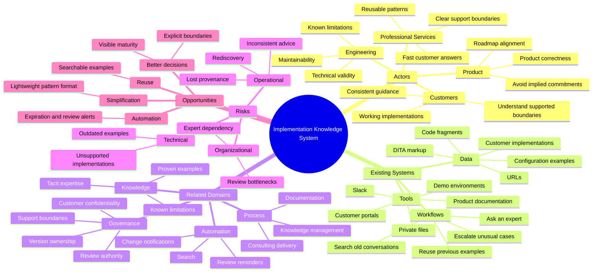
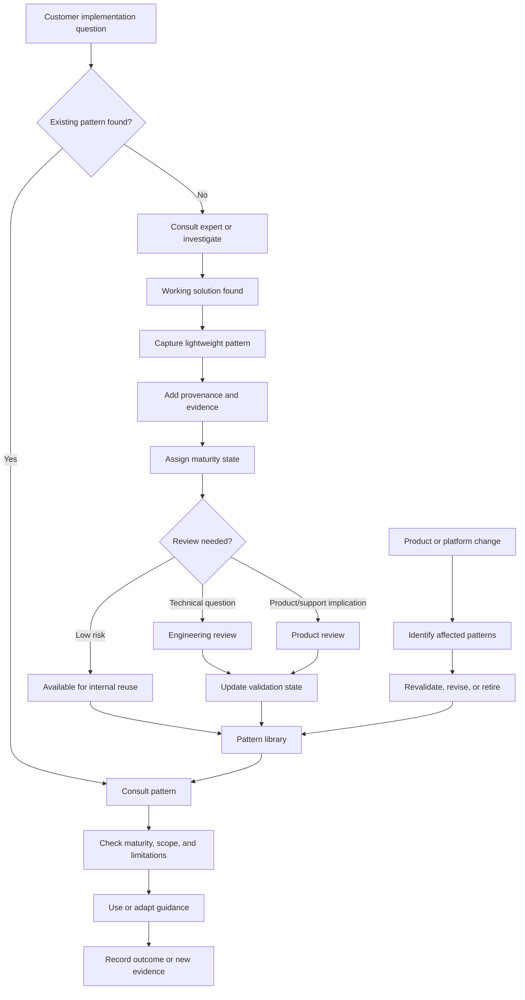
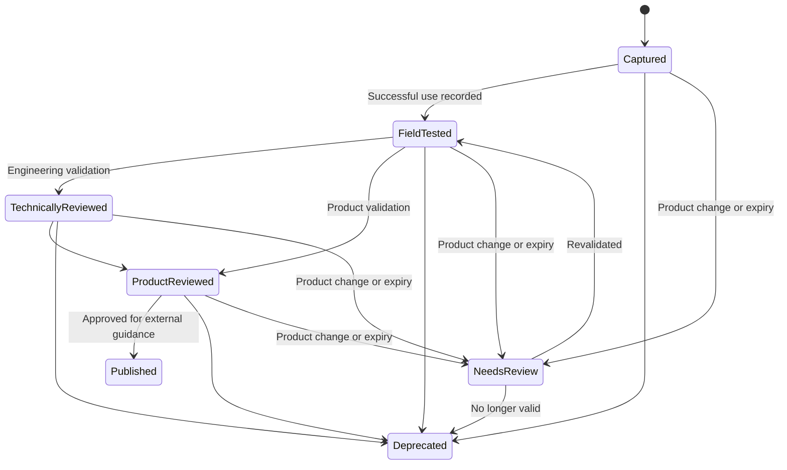

# Govern Informal Implementation Guidance as Shared Institutional Knowledge

## 1. Problem

The source material exposes a contradiction in how implementation knowledge is handled. Customers need practical guidance that goes beyond formal product documentation, and experienced employees already provide that guidance through Slack, working examples, customer environments, remembered implementation details, and direct consultation. In the iframe example, a short Slack exchange supplied the required `<object>` element, the `outputclass="iframe"` setting, a working source example, a rendered Portal example, and an informal statement of the acceptable implementation boundary. 

Functionally, this is already an implementation playbook. The difference is that it is not treated as one: it is not systematically captured, reviewed, versioned, classified, made searchable, or maintained. The existing concern about publishing formal playbooks therefore does not stop implementation guidance from circulating. It pushes that guidance into less visible and less governable channels. 

### Working Assumptions

* Professional Services and consulting teams routinely encounter customer implementation questions that formal product documentation cannot answer completely.
* Product and Engineering are concerned that reusable implementation guidance may imply product support, contain outdated practices, expose customer-specific material, or be interpreted as an official product commitment.
* Employees must still answer these questions for customer work to proceed, so suppressing formal guidance cannot suppress the underlying information flow.
* The iframe exchange is representative of a broader class of small, repeatable implementation patterns rather than an isolated exception.
* The desired outcome is not unrestricted publication. It is a governed mechanism for capturing and reusing the guidance the organization already depends on.

### Five Whys Analysis

1. **Why?** Consultants repeatedly ask colleagues for implementation guidance because product documentation often stops before customer-specific implementation details.
2. **Why?** The missing knowledge exists largely as practitioner experience, previous solutions, examples, and informal decisions rather than maintained institutional guidance.
3. **Why?** Packaging that knowledge into reusable playbooks triggers concerns about correctness, support boundaries, customer confidentiality, ownership, and Product or Engineering approval.
4. **Why?** The organization treats formal artifacts as governable commitments but treats conversational advice as lower-risk, even when both communicate substantially the same implementation guidance.
5. **Why?** There is no lightweight governance model between undocumented expert knowledge and fully approved product documentation, so necessary knowledge sharing falls into Slack, meetings, memory, and customer examples.

### Condensed Problem Analysis

The underlying problem is not a lack of knowledge. The organization already has substantial implementation knowledge and is actively distributing it. The problem is that the knowledge moves through channels that obscure its provenance, maturity, limitations, and maintenance obligations.

The current control model regulates the **artifact** rather than the **information flow**. A packaged playbook attracts scrutiny because it appears official, while substantively equivalent advice can be exchanged informally without comparable review. That creates an illusion of reduced risk while making the actual practice harder to observe and govern. 

This also creates operational dependence on particular employees. A consultant who knows that Tracy has solved an iframe problem can obtain a usable answer; someone who does not know the right person or Slack channel may rediscover the problem independently. The iframe exchange demonstrates how little information may be required to turn expert memory into a reusable pattern. 

### Problem Statement

The system of interest is the flow of implementation knowledge among Professional Services, Product, Engineering, support functions, and customers. Customer-facing teams require practical patterns that extend beyond formal documentation, but the organization lacks a governed intermediate form for capturing those patterns. As a result, valuable guidance is distributed through conversations, individual expertise, existing customer implementations, and isolated examples, producing inconsistent answers, weak traceability, duplicated work, unclear support boundaries, and limited visibility into what the company is already telling customers. If the current model remains unchanged, the organization preserves the appearance of control over formal guidance while accepting greater operational and governance risk in informal guidance.

## 2. Context

### Context Analysis

Several actors have legitimate but different incentives. Consulting needs speed because implementation questions arise during active customer work. Product and Engineering need accuracy and must avoid turning incidental implementation advice into an unintended product promise. Customers need something concrete enough to implement. Any workable system must satisfy all three rather than optimizing only for documentation quality or consulting speed.

The existing workflow favors interpersonal routing. In the iframe exchange, one participant identifies the colleague likely to have relevant experience, the conversation moves to another channel, and Tracy supplies the implementation rule and examples.  This workflow works because experienced employees know the organizational network. It scales poorly because expertise discovery is social rather than systematic.

The information itself also has several dimensions that Slack does not model explicitly. A pattern may be technically valid but unsupported, tested for one Portal configuration but not another, derived from customer work, safe for internal reuse but not external publication, or dependent on a product behavior that may change. A governance system therefore needs more than a binary distinction between “approved” and “not approved.”

The current review concern is understandable. Turning an example into a polished playbook can increase its perceived authority and distribution. But withholding the playbook does not remove the underlying demand. The supplied analysis correctly identifies the resulting displacement: the same knowledge continues moving through channels with weaker provenance, testing, visibility, and maintenance. 

This creates a knowledge-management problem as much as a documentation problem. The valuable asset is not merely the final article. It is the combination of problem, implementation pattern, evidence that it worked, origin, reviewer judgment, limitations, and lifecycle state. Capturing those elements would let the organization distinguish a useful field observation from formally supported product guidance.

The opportunity is therefore to introduce an intermediate knowledge layer: more structured and governable than Slack, but intentionally distinct from official product documentation. This follows the problem-to-solution method's principle of treating the issue as a system of actors, workflows, incentives, tools, information flows, constraints, and interventions rather than an isolated documentation complaint. 

## 3. Solution

### Proposed Solution

Create a governed **Implementation Pattern Library** that captures practical customer-facing implementation guidance already circulating through Professional Services without automatically treating every entry as official product documentation.

Each pattern should be a small, structured record containing the implementation problem, working example, source or provenance, validation evidence, applicability, known limitations, support boundary, owner, maturity level, review status, and reconsideration date.

The key design decision is to separate **capture from endorsement**.

Employees should be able to record a useful pattern quickly without waiting for full Product or Engineering approval. The pattern's status then communicates what is known about it—for example, observed, field-tested, technically reviewed, or product-approved. Review increases the authority of a pattern rather than determining whether institutional memory is allowed to exist.

For the iframe example, the initial pattern might simply record:

* use the `<object>` element;
* apply `outputclass="iframe"`;
* link to or preserve an approved generic example;
* identify where the behavior has been validated;
* record Tracy's stated implementation boundary;
* identify any known Portal or publishing constraints;
* state whether the pattern is merely field-tested or formally supported.

That converts an ephemeral exchange into reusable institutional knowledge without falsely presenting it as canonical product documentation. 

### Solution Principles

* **Capture before perfecting.** Preserve useful knowledge when it appears; do not make full publication review a prerequisite for institutional memory.
* **Make authority explicit.** Every pattern should show provenance, maturity, validation, limitations, and review state so readers know how much confidence to place in it.
* **Govern the information flow, not merely the artifact.** Apply appropriate controls to the guidance employees already exchange rather than assuming informal channels eliminate risk.
* **Separate internal reuse from external publication.** A pattern can be useful institutional knowledge without being approved customer-facing documentation.
* **Prefer evidence over reputation.** “Tracy said this works” can be the provenance of a pattern, but examples, validation conditions, and known constraints should progressively replace reliance on individual authority.

### Expected Benefits

* Consultants can find proven implementation patterns without knowing which employee or Slack channel to ask.
* Product and Engineering gain visibility into implementation advice already circulating and can review the highest-impact patterns rather than every conversation.
* Customers receive more consistent answers with clearer limitations and support boundaries.
* Successful consulting work becomes reusable institutional knowledge instead of disappearing into conversations.
* Provenance and maturity reduce the risk of treating a field workaround as a guaranteed product capability.
* Product changes can be connected to affected patterns and trigger reconsideration.
* Repeated customer questions become signals about documentation gaps, product friction, and possible roadmap opportunities.

### Tradeoffs

* Making informal knowledge visible will reveal inconsistencies that previously remained hidden; this may initially make governance appear worse even though actual control improves.
* A maturity model introduces judgment calls. Teams must avoid treating status labels as bureaucratic gates or assuming that a label replaces technical evaluation.
* Capturing patterns creates maintenance obligations. A stale but searchable pattern may be more dangerous than an inaccessible Slack message unless ownership and expiration are designed into the system.
* Some customer-derived examples cannot safely be reused directly and must be sanitized or recreated.
* Product and Engineering may still need to review high-risk patterns, so the solution reduces review bottlenecks rather than eliminating review.

## 4. Implementation

### Implementation Overview

Start with a narrow pilot around recurring Portal implementation questions. Capture a small set of patterns that are already being shared informally, including the iframe example, and give each one explicit provenance, validation, maturity, limitations, and ownership.

Do not begin by designing a large documentation platform. First prove that a lightweight record can improve discovery and governance without slowing consulting work. The initial repository could use an existing internal knowledge system, Git-backed Markdown, or another searchable store with version history.

### Suggested Architecture or Workflow

A simple lifecycle could be:

### Implementation Steps

1. **Define the minimum pattern schema.** Require title, problem, solution/example, provenance, applicability, limitations, maturity, owner, validation date, and sharing classification.
2. **Backfill 10–20 real examples.** Start with implementation guidance already circulating in Slack or consulting work, including the iframe case. Recreate customer-specific examples where necessary rather than copying sensitive artifacts.
3. **Introduce a small maturity model.** Use a few clearly defined states such as Captured, Field-Tested, Technically Reviewed, Product Reviewed, and Deprecated. Keep external publication as a separate decision.
4. **Embed the library into consulting workflow.** Make search part of answering customer questions, and make “capture the pattern” the normal follow-up when an expert solves a recurring problem.
5. **Measure the pilot.** Track reuse, repeat questions, time to find guidance, patterns requiring escalation, stale records discovered, and patterns that expose product-documentation or product-design gaps.

### Technical Notes

* Use a versioned format such as Markdown or structured records so changes, reviewers, and dates remain auditable.
* Separate the reusable implementation example from its original customer environment. Store sanitized or recreated examples wherever customer confidentiality is uncertain.
* Include machine-readable metadata for `status`, `owner`, `validated_on`, `review_by`, `product_area`, `sharing_scope`, and relevant product versions.
* Search should return maturity and limitations alongside the implementation instructions rather than hiding them in secondary metadata.
* Links to Slack or original examples should serve as provenance, not as the durable implementation artifact. The existing iframe exchange demonstrates why: the answer is useful, but discovery depends on finding a specific conversation. 
* A future integration could notify pattern owners when relevant product areas change, but automation should follow a proven ownership and review process rather than substitute for one.

### Risks and Mitigations

| Risk                                                                       | Impact | Mitigation                                                                                                                 |
| -------------------------------------------------------------------------- | ------ | -------------------------------------------------------------------------------------------------------------------------- |
| Field guidance is mistaken for officially supported functionality          | High   | Display maturity and support status prominently; separate internal pattern status from external publication status.        |
| Customer-specific material is copied into reusable guidance                | High   | Require provenance and sharing classification; sanitize examples before broader reuse.                                     |
| Patterns become stale after product changes                                | High   | Assign owners and review dates; connect patterns to product areas and use expiration or change-triggered review.           |
| Product or Engineering review becomes the same bottleneck under a new name | High   | Allow low-risk capture and internal reuse before formal review; reserve mandatory review for defined risk classes.         |
| Employees continue using Slack instead of the library                      | Medium | Make capture lightweight and integrate search/capture into the existing consulting workflow.                               |
| Too many low-quality patterns reduce trust                                 | Medium | Require minimum evidence, allow ranking by maturity, and retire duplicates or unsuccessful approaches.                     |
| Status labels create false certainty                                       | Medium | Define what each state proves and, equally important, what it does not prove.                                              |
| Governance expands into excessive bureaucracy                              | Medium | Pilot with the smallest viable schema and measure whether each required field materially reduces risk or improves reuse.   |
| The organization discovers contradictory guidance                          | Medium | Treat contradictions as useful signals requiring reconciliation rather than suppressing one version without investigation. |

## 5. Discussion

### Interpretation

The iframe example is useful because it makes the organizational contradiction concrete. The company did not avoid distributing implementation guidance by withholding a formal playbook. The guidance was still delivered: first by locating the right expert, then through Slack, then through a working example and an existing Portal implementation. 

The distinction between “informal answer” and “implementation playbook” is therefore largely a distinction in packaging and governance, not necessarily in informational content. The supplied analysis captures this directly: restricting formal playbooks can create the appearance of control while leaving the real information flow less visible and less controlled. 

That reframes the proposed library. Its strongest justification is not simply “knowledge sharing would be useful.” It is **risk reduction through visibility**. The organization already bears the risks associated with implementation guidance. A governed pattern library gives it mechanisms to see, classify, validate, constrain, maintain, and eventually retire that guidance.

There is also a secondary opportunity. Repeated implementation patterns can reveal where product documentation is insufficient, where the product is difficult to configure, where consulting has discovered an unofficial standard approach, or where customers repeatedly require functionality adjacent to the supported product. The library can therefore become an evidence source for documentation and product decisions rather than merely a consulting reference.

### Challenge the Frame

| Challenge Question                                                                               | Why It Matters                                                                                                                                                                               |
| ------------------------------------------------------------------------------------------------ | -------------------------------------------------------------------------------------------------------------------------------------------------------------------------------------------- |
| What assumption would most change the solution if false?                                         | The proposal depends on informal implementation guidance being widespread rather than exceptional. If the iframe case is rare, a library may be unnecessary overhead.                        |
| What has the analysis made seem inevitable?                                                      | It makes a structured pattern library appear like the natural solution, although better product documentation or stronger escalation workflows could eliminate some pattern demand instead.  |
| What alternative problem definition might produce a different solution?                          | The root problem might be inadequate product documentation, weak expert discovery, unclear support policy, or slow Product/Engineering decision-making rather than knowledge capture itself. |
| What constraint is binding: money, time, labor, risk, knowledge, authority, tools, or attention? | The likely constraint is authority and review capacity, not storage technology. A sophisticated repository will not solve ambiguous approval boundaries.                                     |
| What would make the solution fail in practice?                                                   | Requiring so much review or metadata that consultants return to Slack, or allowing so little review that the library becomes an authoritative-looking collection of stale workarounds.       |
| What is the smallest useful version of success?                                                  | Ten recurring implementation patterns can be found without asking an expert, each shows provenance and limitations, and consultants can safely tell how much confidence to place in them.    |

The solution still appears strong, but only if it is positioned as a lightweight governance layer around an existing information flow rather than as a documentation initiative. The pilot should explicitly test that claim against simpler alternatives before the organization invests in a larger knowledge platform.

### Alternatives Considered

| Alternative                                                                          | Strength                                                  | Weakness                                                                                                                            |
| ------------------------------------------------------------------------------------ | --------------------------------------------------------- | ----------------------------------------------------------------------------------------------------------------------------------- |
| Expand official product documentation to cover all implementation cases              | Gives customers authoritative, maintained guidance        | Product documentation cannot reasonably absorb every contextual consulting pattern, and the full review process may remain too slow |
| Continue expert consultation through Slack                                           | Fast, familiar, and requires no new system                | Preserves expert dependency, inconsistent answers, weak provenance, poor discoverability, and limited governance                    |
| Require Product or Engineering approval before any implementation guidance is reused | Maximizes formal oversight                                | Likely creates a bottleneck and drives necessary guidance back into informal channels                                               |
| Create the governed Implementation Pattern Library                                   | Balances capture, reuse, visibility, and graduated review | Requires ownership discipline and careful distinction between field evidence and official support                                   |

### Open Questions

* How frequently are implementation solutions currently being rediscovered or requested through Slack, meetings, and direct expert consultation?
* Which kinds of implementation guidance require Product review, Engineering review, security review, or no mandatory review before internal reuse?
* What exactly does each maturity state authorize a consultant to do or say to a customer?
* Which customer-derived examples can be retained as provenance, and which must be sanitized or recreated?
* Who owns revalidation when a product change may affect several patterns?
* Should highly mature patterns eventually graduate into official product documentation, remain consulting guidance, or support both destinations?
* Which existing repository can support the pilot without first creating a new platform?

### Recommended Next Step

Run a small evidence-based pilot: identify approximately 10–20 recent Slack or consulting exchanges that contain reusable implementation guidance, convert them into the proposed minimum pattern format, and classify each by provenance, maturity, limitations, and review need. Use that exercise to test the central thesis—whether the organization already has a meaningful informal implementation-guidance system—and to discover the minimum governance model required before designing a permanent library.
